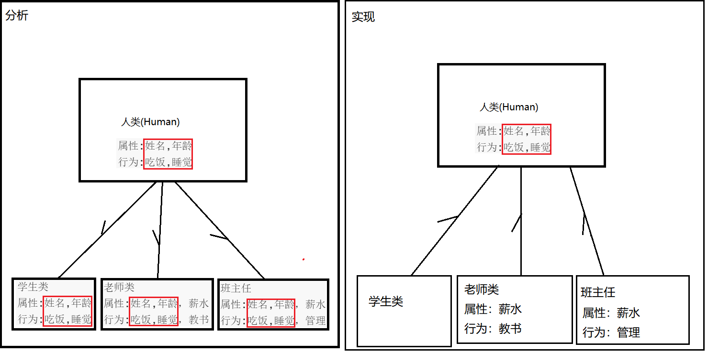

# day01 【复习回顾、继承、抽象类、模板设计模式、final关键字】 

## 今日内容

- 面向对象复习
  - 如何定义类	
  - 封装的理解
  - 构造方法
  - 类的使用
  - this关键字使用
- 继承
  - 继承的概述
  - 继承的格式 
  - 继承中成员的访问规则
  - 方法重写  
  - this和super的使用总结  this代表本类对象的引用    super代表父类对象的引用
  - 继承的内存图解
  - 继承的特点
- 抽象类
  - 抽象类的概述
  - 抽象类的格式
  - 抽象类的注意事项
  - 模板设计模式
- final 关键字
  - final关键字的概述
  - final关键字的使用


## 教学目标

- [ ] 能够写出类的继承格式
- [ ] 能够说出继承的特点
- [ ] 能够说出子类调用父类的成员特点
- [ ] 够说出方法重写的概念
- [ ] 能够说出this可以解决的问题
- [ ] 能够说出super可以解决的问题
- [ ] 描述抽象方法的概念
- [ ] 写出抽象类的格式
- [ ] 写出抽象方法的格式
- [ ] 能够说出父类抽象方法的存在意义
- [ ] 描述final修饰的类的特点
- [ ] 描述final修饰的方法的特点
- [ ] 描述final修饰的变量的特点

# 第一章 复习回顾

## 知识点--如何定义类

### 目标:

- 掌握如何定义一个类以及类中的成员

### 路径:

- 定义类的格式
- 演示类的定义

### 讲解:

#### 1.1.1定义类的格式

```java
修饰符 class 类名{
//类中的五大成分。
    1.成员变量（属性）
    2.成员方法 (行为) 
    3.构造器 （初始化类的对象数据的）
    4.内部类
    5.代码块
}
```

#### 1.1.2演示类的定义

需求：按照类的格式定义如下类

```
学生类
	属性：姓名，年龄
	行为：吃饭，睡觉
```

//学生类代码

```java
public class Student {
    // 1.成员变量（属性）
    String name;
    int age;
    // 2.构造器 （初始化类的对象数据的）
    public Student(){}
    // 3.成员方法 (行为)
    public void eat() {
        System.out.println("吃饭");
    }

    public void sleep() {
        System.out.println("睡觉");
    }

    // 4.内部类
    public class Inner{

    }
    // 5.代码块
    {
        System.out.println("我是代码块");
    }
}

```

### 小结:

```

```


## 知识点--封装

### 目标:

- 掌握类的封装格式

### 路径:

- 封装的概念
- 封装的步骤
- 演示封装

### 讲解:

#### 1.2.1 封装的概念    

封装可以被认为是一个保护屏障，对外隐藏具体的实现细节，防止该类的代码和数据被其他类随意访问。

对外可以被访问的数据，通过提供指定的数据访问接口，供其他类调用。

#### 12.2 封装的步骤

属性的封装只是封装的一种表现形式，方法、类等都时封装的表现形式。

属性的封装：

1. 使用 `private` 关键字来修饰成员变量。
2. 使用`public`修饰getter和setter方法。

#### 1.1.3 演示封装

需求：按照属性的封装定义如下类

```
学生类
	属性：姓名，年龄
	行为：吃饭，睡觉
```

//学生类代码

```java
public class Student {
    //私有化修饰成员变量
    private String name;
    private int age;
    //提供公共的访问方式(获取，修改)
    public String getName(){
        return name;
    }
    public void setName(String n){
        name=n;
    }
    public int getAge(){
        return age;
    }
    public void setAge(int a){
        age=a;
    }
}

```

### 小结:

```java

```

## 知识点--构造方法

### 目标:

- 掌握构造方法的定义和使用

### 路径:

- 构造方法的作用
- 构造方法的格式
- 演示构造方法定义

### 讲解:

#### 1.3.1 构造方法的作用

- 通过调用构造器可以返回一个类的对象
- 构造器可以帮我们把对象的数据（属性和行为等信息）初始化好。

#### 1.3.2 构造方法的格式

构造方法

```java
修饰符 类名(形参列表) {
    // 构造体代码，执行代码
}
```

#### 1.3.3 演示构造方法定义

构造方法根据使用，被分为无参构造、有参构造、满参构造

需求：按照构造方法格式定义如下类

```
学生类
	属性：姓名，年龄
	行为：吃饭，睡觉
```

//学生类

```java
public class Student {
    //私有化修饰成员变量
    private String name;
    private int age;
    //无参构造
    public Student(){

    }
    //有参构造
    public Student(String n){
        name=n;
    }
    public Student(int a){
        age=a;
    }
    //满参构造
    public  Student(String n,int a){
        name=n;
        age=a;
    }
}
```

### 小结:

```java

```

## 知识点--如何通过类创建对象

### 目标:

- 掌握如果通过类创建对象

### 路径:

- 创建对象格式
- 演示创建对象

### 讲解:

#### 1.4.1对象创建格式

```java
类名 对象名称 = new 类名(形参);
```

#### 1.4.2演示创建对象

需求：定义如下类，创建并访问该类相关内容。

```
学生类
	属性：姓名，年龄
	行为：吃饭，睡觉
```

//测试类代码

```
public class Test {
    public static void main(String[] args) {
        //无参构造
        Student s1 = new Student();
        s1.show();
        //有参构造
        Student s2 = new Student("张三");
        s2.show();
        Student s3 = new Student(18);
        s3.show();
        //满参构造
        Student s4 = new Student("张三",18);
        s4.show();
    }
}

```

//学生类代码

```
public class Student {
    //私有化修饰成员变量
    private String name;
    private int age;
    //无参构造
    public Student(){

    }
    //有参构造
    public Student(String n){
        name=n;
    }
    public Student(int a){
        age=a;
    }
    //满参构造
    public  Student(String n,int a){
        name=n;
        age=a;
    }
    //提供公共的访问方式(获取，修改)
    public String getName(){
        return name;
    }
    public void setName(String n){
        name=n;
    }
    public int getAge(){
        return age;
    }
    public void setAge(int a){
        age=a;
    }

    //展示成员内容
    public void show(){
        System.out.println(name+"----"+age);
    }
}
```


### 小结:

```java

```

## 知识点--this关键字的作用

### 目标:

- 学会使用this区分局部变量与成员变量

### 路径:

- this关键字的作用
- this关键字的常见应用
- 演示this关键字

### 讲解:

#### 1.5.1 this关键字的作用

this代表所在类的当前对象的引用（地址值），即代表当前对象。用来区分同名的成员变量和局部变量


#### 1.5.2 this关键字的常见应用

用于区分成员变量与局部变量

- 用于普通的gettter与setter方法

  ​		this出现在实例方法中，谁(哪个对象)调用这个方法，this就代表谁(哪个对象)。

  ​		根据就近原则默认指向成员变量的调用，默认隐含this,this可以不写。

- 用于构造方法

  this出现在构造器中，代表构造器正在初始化的那个对象

#### 1.5.3 演示this关键字

需求：按照还有this的格式定义如下类

```
学生类
	属性：姓名，年龄
	行为：吃饭，睡觉
```

//学生类代码

```java
public class Student {
    private String name;
    private int age;

    public Student() {
    }

    public String getName() {
        return name;
    }

    public void setName(String name) {
        this.name = name;
    }

    public int getAge() {
        return age;
    }

    public void setAge(int age) {
        this.age = age;
    }
}
```

### 小结:

```

```

# 第二章 继承 

## 知识点--概述

### 目标:

- 理解继承的意义，能够说出继承的含义与好处。 


### 路径:

- 继承的引入

- 继承的含义
- 继承的好处

### 讲解:

#### 2.1.1 继承的引入

理解1：生活中的继承关系


理解2：编程中的继承关系

分析下面两个类存在的继承关系

1. 学生类（Student）
   属性:姓名,年龄
   行为:吃饭,睡觉
2. 老师类（Teacher）
   属性:姓名,年龄，薪水
   行为:吃饭,睡觉，教书


```java
//得到父类
人类（Person）
   属性:姓名,年龄
   行为:吃饭,睡觉
```

开发中，存在多个类拥有相同属性和行为的情况下，如果每个类各自定义这些属性和行为，代码会变得臃肿！

所以需要利用继承将相同的内容进行抽取，节省对内存的开支。

**结论**：**向上抽取，向下实现**

- 假如多个类中存在相同属性和行为时，我们可以将这些内容抽取到一个**单独定义**的类中。
- 多个类无需再定义这些共有属性和行为，只要**继承**那一个类即可。
- 继承后，多个类中特有的属性和方法可以在自己的类中实现。
- 建立**继承关系**后，多个类可以称为**子类**，**单独定义**的类称为**父类**、**超类（superclass）**或者**基类**。

#### 2.1.2 继承的含义

**继承**：就是子类继承父类的**属性**和**行为**，使得子类对象可以直接具有与父类相同的属性、相同的行为。

子类可以直接访问父类中的**非私有**的属性和行为。

继承描述的是事物之间的所属关系，这种关系是：`is-a` 的关系。

父类更通用，子类更具体。通过继承，可以使多种事物之间形成一种关系体系。例如，兔子属于食草动物，食草动物属于动物。

#### 2.1.3 继承的好处

1. 提高**代码的复用性**
2. 使类与类之间产生了关系。
3. 多态的前提。

### 小结:

```java

```

## 知识点--继承的定义

### 目标:

- 能够熟练书写继承类

### 路径:

- 继承的格式
- 演示继承的定义

### 讲解:

#### 2.2.1继承的定义

通过 `extends` 关键字，可以声明一个子类继承一个父类

```java
class 父类 {
	...
}
class 子类 extends 父类 {
	...
}
```

#### 2.2.2演示继承定义

需求:按照继承的格式定义如下类

```java
1. 学生类（Student）
   属性:姓名,年龄
   行为:吃饭,睡觉
2. 老师类（Teacher）
   属性:姓名,年龄，薪水
   行为:吃饭,睡觉，教书
```

//父类代码

```
public class Person {
    String name;
    int age;

    public void eat() {
        System.out.println("吃饭");
    }

    public void sleep() {
        System.out.println("睡觉");
    }
}
```

//Student子类

```
public class Student extends Person {

}
```

//Teacher子类

```
public class Teacher extends Person {
    int salary;

    public void teach() {
        System.out.println("讲javaEE");
    }
}

```

//测试类

```
    public static void main(String[] args) {
        //创建Student对象，并使用
        Student s = new Student();
        System.out.println(s.name+"---"+s.age);
        s.name="张三";
        s.age=18;
        System.out.println(s.name+"---"+s.age);
        s.eat();
        s.sleep();
        System.out.println("---------");
        //创建Teacher对象，并使用
        Teacher t =new Teacher();
        System.out.println(t.name+"---"+t.age);
        t.name="jlf";
        t.age=30;
        System.out.println(t.name+"---"+t.age);
        t.eat();
        t.sleep();
        t.teach();
    }
}
```

### 小结

```

```

## 案例演示--继承案例

### 目标:

- 熟练掌握继承的设计

### 路径

- 需求
- 分析
- 实现

### 讲解

##### 2.3.1需求:

请使用继承定义以下类:

```
1. 学生类
   属性:姓名,年龄
   行为:吃饭,睡觉
2. 老师类
   属性:姓名,年龄，薪水
   行为:吃饭,睡觉，教书
3. 班主任
   属性:姓名,年龄，薪水
   行为:吃饭,睡觉，管理
```

##### 2.3.2分析



```
//父类
Human父类
	属性:姓名,年龄
	行为:吃饭,睡觉
```

1. 根据事物共同性，分析老师类，学生类，班主任类，都是属于人类
2. 把相同的属性和行为都定义在人类中，然后继承人类
3. 子类特有的属性和行为就定义在子类中。

##### 2.3.3实现

//父类Human类代码

```
public class Human {
  private String name;
  private int age;

  public Human() {
  }

  public Human(String name, int age) {
    this.name = name;
    this.age = age;
  }

  public String getName() {
    return name;
  }

  public void setName(String name) {
    this.name = name;
  }

  public int getAge() {
    return age;
  }

  public void setAge(int age) {
    this.age = age;
  }

  public void eat() {
    System.out.println("吃饭饭");
  }

    public void sleep() {
    System.out.println("一个人睡");
  }
}
```

//子类Student类代码

```
public class Student extends Human{

}
```

//子类Teacher类代码

```
public class Teacher extends Human {
  private double salary;

  public Teacher() {
  }

  public Teacher( double salary) {
    this.salary = salary;
  }

  public double getSalary() {
    return salary;
  }

  public void setSalary(double salary) {
    this.salary = salary;
  }

  public void teach() {
    System.out.println("我爱讲课");
  }
}
```

//子类BanZhuren类

```
public class BanZhuRen extends Human {
    private double salary;
    public BanZhuRen() {
    }

    public BanZhuRen(double salary) {
        this.salary = salary;
    }
	//省略getter/setter
    public void guanLi(){
        System.out.println("最美班主任:XXX");
    }
}
```

//测试类代码

```
public class Test {
    public static void main(String[] args) {
        Human h = new Human();
        h.setName("人类");
        h.setAge(10000);
        System.out.println("姓名:"+h.getName()+";年龄:"+h.getAge());
        h.eat();
        h.sleep();
        System.out.println("-----------------------------------");
        Student s= new Student();
        s.setName("小明");
        s.setAge(25);
        System.out.println("姓名:"+s.getName()+";年龄:"+s.getAge());
        s.eat();
        s.sleep();
        System.out.println("-----------------------------------");
        Teacher t= new Teacher();
        t.setName("老师");
        t.setAge(30);
        t.setSalary(6666);
        System.out.println("姓名:"+t.getName()+";年龄:"+t.getAge()+";薪水:"+t.getSalary());
        t.eat();
        t.sleep();
        t.teach();
        System.out.println("-----------------------------------");
        BanZhuRen bzr= new BanZhuRen();
        bzr.setName("最美");
        bzr.setAge(18);
        bzr.setSalary(6666);
        System.out.println("姓名:"+t.getName()+";年龄:"+t.getAge()+";薪水:"+t.getSalary());
        bzr.eat();
        bzr.sleep();
        bzr.guanLi();
        System.out.println("-----------------------------------");
    }
}
```


### 小结:

```

```

## 知识点--子类不能继承的内容

### 目标:

- 理解子类对于父类成员的继承权限和使用方法

### 路径:

- 引入
- 演示子类不能继承的内容

### 讲解:

#### 2.4.1 引入

并不是父类的所有内容都可以给子类继承

- **子类不能继承父类的构造器，因为子类有自己的构造器（且构造方法名称需与类名一致）。**

- 子类可以继承父类的私有成员（成员变量，方法），只是子类无法直接访问而已，可以通过继承父类的getter/setter方法间接访问父类的private成员变量。

#### 2.4.3演示子类不能继承的内容

需求：定义如下类，理解子类不能继承的内容。

```
1、Fu类
	属性:priNum,num
2、Zi类

```

//Fu类代码

```
public class Fu {
    private int priNum=999;
    public int num=10;

    public int getPriNum() {
        return priNum;
    }

    public void setPriNum(int priNum) {
        this.priNum = priNum;
    }
}
```

//Zi类代码

```
public class Zi extends  Fu {
}
```

//测试类代码

```
public class Test {
    public static void main(String[] args) {
        //1.子类不能继承父类的构造器，因为子类有自己的构造器
        // Zi z = new Fu();
        Zi z = new Zi();
        System.out.println(z.num);
        // 2.父类私有的成员变量，子类不能直接访问,但是可以通过父类中的get/set间接访问
        // System.out.println(z.priNum);
        System.out.println(z.getPriNum());
    }
}
```

### 小结:

```java

```

## 知识点--继承后成员变量访问规则 

### 目标:

- 掌握继承中成员变量的规则与使用

### 路径:

- 演示继承后成员变量不重名
- 演示继承后成员变量重名问题

### 讲解:

#### 2.5.1 演示继承后成员变量不重名

如果子类父类中出现**不重名**的成员变量，这时的访问是**没有影响的**。

需求：定义如下子父类，理解子父类变量不重名的访问

```
1、Fu类
	属性:fuNum
2、Zi类
 	属性：ziNum
```

Fu类代码

```
public class Fu {
    public int fuNum =999;
}
```

Zi类代码

```
public class Zi extends Fu {
    public int ziNum=10;
}
```

测试类代码

```
public class Test {
    public static void main(String[] args) {
        Zi z = new Zi();
        System.out.println(z.fuNum);
        System.out.println(z.ziNum);
    }
}
```

#### 2.5.2 演示继承后成员变量重名

如果子类父类中出现**重名**的成员变量，使用子类引用指向子类对象，调用的是子类自己的变量。

需求：定义如下子父类，理解子父类变量重名问题

```
1、Fu类
	属性:num
2、Zi类
 	属性：num
 	行为：show
```

Fu类代码

```
public class Fu {
  int num =999;
}
```

Zi类代码

```
public class Zi extends Fu {
    public int num=10;
}
```

测试类代码

```
public class Test {
    public static void main(String[] args) {
        Zi z = new Zi();
        System.out.println(z.num);
    }
}
```

> 小贴士：
>
> Fu 类中的成员变量是非私有的，子类中可以直接访问。若Fu 类中的成员变量私有了，子类是不能直接访问的。
>
> 通常编码时，我们遵循封装的原则，若使用private修饰父类成员变量，可以在父类中提供公共的getXxx方法和setXxx方法。

### 小结:

```java

```

## 知识点--继承后成员方法访问规则 

### 目标:

- 掌握继承中成员方法的规则与使用

### 路径:

- 演示继承后成员方法不重名
- 演示继承后成员方法重名

### 讲解:

#### 2.6.1 演示继承后成员方法不重名

如果子类父类中出现**不重名**的成员方法，这时的调用是**没有影响的**。

对象调用方法时，若子类存在执行子类中的方法，若子类中不存在执行父类中相应的方法。

需求：定义如下子父类，理解子父类方法不重名的访问

```
1、Fu类
	行为:fuShow
2、Zi类
	行为:ziShow
```

Fu类代码

```
class Fu {
	public void fuShow() {
		System.out.println("Fu类中的fuShow方法执行");
	}
}
```

Zi类代码

```
class Zi extends Fu {
	public void ziShow() {
		System.out.println("Zi类中的ziShow方法执行");
	}
}
```

测试类代码

```java
public  class Test {
	public static void main(String[] args) {
		Zi z = new Zi();
		z.fuShow(); 
		z.ziShow();
	}
}
```

#### 2.6.2 演示继承后成员方法重名

如果子类父类中出现**重名**的成员方法，子类对象调用该方法的时候，优先调用子类自己的方法。

需求：定义如下子父类，理解子父类方法重名的访问

```
1、Fu类
	行为:show
2、Zi类
	行为:show
```

Fu类代码

```
class Fu {
	public void show() {
		System.out.println("Fu show");
	}
}
```

Zi类代码

```
class Zi extends Fu {
	public void show() {
		System.out.println("Zi show");
	}
}
```

测试类代码

```
public class Test{
	public static void main(String[] args) {
		Zi z = new Zi();
     	// 如果子类父类中出现重名的成员方法，子类对象调用该方法的时候，优先调用子类自己的方法。
		z.show();  // Zi show
	}
}
```

### 小结:

```

```

## 知识点--方法重写

### 目标:

- 理解什么是重写和重写的基本注意事项

### 路径:

- 方法重写的概念
- 方法重写的使用场景
- 演示方法重写案例
- 重写注解及注意事项
- 演示重写注解及注意事项

### 讲解:

#### 2.7.1方法重写的概述

**方法重写** ：子类成员方法与父类一模一样（返回值类型，方法名和参数列表都相同）。也称为覆写或者覆盖。总结起来就是，**声明不变，重新实现**。

#### 2.7.2 方法重写使用场景

子类继承父类方法，但觉得父类某方法不满足当前需求。则重新定义与父类相同的方法，达到对该功能的增强实现。

#### 2.7.3演示方法重写案例

需求：利用方法重写定义如下两个类。

```
动物类：
	行为：跑(跑得快)，叫(都会叫)
猫：
	行为：跑(跑得快)，叫(喵喵叫)
```

分析：假设动物类中有统一的跑和叫的行为，猫有自己独特的叫声，利用方法重写实现。


动物类代码

```
public class Animal  {
    public void run(){
        System.out.println("动物跑的很快！");
    }
    public void cry(){
        System.out.println("动物都可以叫~~~");
    }
}
```

猫类代码

```
public class Cat extends Animal {
    public void cry() {
        System.out.println("喵喵叫");
    }
    public void show(){
    }
}

```

测试类代码

```
public class Test {
	public static void main(String[] args) {
      	// 创建子类对象
      	Cat ddm = new Cat()；
        // 调用父类继承而来的方法
        ddm.run();
      	// 调用子类重写的方法
      	ddm.cry();
	}
}
```

#### 2.7.4 重写注解及注意事项

@Override:注解，重写注解校验！

重写注解报错的2中情况

1. 方法名不同
2. 形参列表不同

重写的注意事项:

​	方法重写是发生在父子类之间的关系。

​	子类方法覆盖父类方法，必须要保证**权限大于等于父类权限**。

​	返回值类型，方法名，参数列表完全相同。

#### 2.7.5 演示重写注解及注意事项

需求：定义如下子父类，理解子父类方法注解的使用

~~~java
动物类：
	行为：跑(跑得快)，叫(都会叫)
猫：
	行为：跑(跑得快)，叫(喵喵叫)
~~~

//父类代码

~~~java
public class Animal {
    public void run() {
        System.out.println("跑的快");
    }

    public void cry() {
        System.out.println("都会叫");
    }
}

~~~

//子类代码

~~~java
public class Cat extends Animal {
    // @Override
    // public void cry1() {
    //     System.out.println("喵喵叫");
    // }
    // public void cry(int num) {
    //     System.out.println("喵喵叫");
    // }

    @Override
    public void cry() {
        System.out.println("喵喵叫");
    }


    //返回值类型不一样，不会报错,这里加不加注解校验都会报错
    // public int cry() {
    //     System.out.println("喵喵叫");
    //     return 0;
    // }

    // 子类方法覆盖父类方法，必须要保证权限大于等于父类权限；
    // private void run() {
    //     System.out.println("跑的快");
    // }
}

~~~

//测试类代码

~~~java
public class Test {
    public static void main(String[] args) {
        Cat c = new Cat();
        c.cry();
    }
}
~~~

### 小结:

```

```

## 知识点--继承后构造方法访问规则 

### 目标:

- 掌握继承中成员构造方法的规则与使用

### 路径:

- 引入
- 父类构造器访问格式
- 演示父类构造器访问
- 注意事项

### 讲解:

#### 2.8.1 引入

构造器的定义格式：构造器的名字是与类名一致的。所以子类是无法继承父类构造方法的。

构造器的2个作用

- 创建对象
- 初始化对象数据。

子父类初始化过程理解

​		父类成员变量初始化后，才可以给子类使用。

​		想要初始化父类，就需要调用父类的构造方法

​		子类的初始化过程中，必须先执行父类的初始化动作（先有爸爸，再有儿子）

实现方式:

​		子类所有构造器的第一行都会默认先调用父类的无参构造器，再执行自己

#### 2.8.2父类构造器访问格式

```
super()
```

#### 2.8.3演示父类构造器访问

需求：定义如下子父类。理解super访问父类中构造方法的使用

```
1. Fu类
   属性: num
2. Zi类
```

Fu类代码

```java
public class Fu {
    int num;
   public Fu(){
       System.out.println("我是父类的无参构造方法");
   }
}

```

学生类代码

```java
public class Zi extends Fu {
    public Zi() {
        // 默认:所有子类的构造方法第一行都会默认一个super()调用父类的空参构造方法
        //super()//默认的调用父类无参构造方法的操作
        // 首行:在子类的构造方法中调用父类的构造方法一定要放在子类构造方法中的第一行
        // 手动替代默认:如果子类的构造方法中手动调用了父类的构造方法,那么就不会自动调用父类的空参构造方法创建对象；初始化对象数据。
        super();
        System.out.println("我是子类的构造方法");
    }
}

```

测试类代码

```java
public class Test {
    public static void main(String[] args) {
        Zi z = new Zi();
    }
}
```

#### 2.8.4注意事项

- **首行**：在子类的构造方法中调用父类的构造方法一定要放在子类构造方法中的第一行
- **默认**：所有子类的构造方法第一行都会默认一个**super()**调用父类的空参构造方法
- **手动替代默认**：如果子类的构造方法中手动调用了父类的构造方法,那么就不会自动调用父类的空参构造方法

### 小结:

```

```


## 知识点--this和super的使用总结

### 目标:

- 总结super和this 的用法

### 路径:

- 就近原则
- this的3种使用方式
- 演示this的3种使用方式
- this的3种使用方式
- 演示super的3种使用方式

### 讲解:

#### 2.9.1就近原则

变量在使用的时候，优先使用定义的近的变量，谁离得近就指向哪个变量

#### 2.9.2this的3种使用方式

理解this关键字：存储的“当前对象”的引用；

格式:

```java
this.成员变量    	--   本类的
this.成员方法名()  	--   本类的    
this(...)    		--   本类的构造方法
```

#### 2.9.3演示this关键字的三种用法

需求：定义以下类，展示this关键字的3种用法

```
Demo：
	属性：num
	行为:show，method
```

Demo类代码

```java
public class Demo {
    int num=10;
    public Demo(){
        this(100);//死循环，不能调用自己
        // super();//当使用了this调用本类的构造方法，默认的super()就没有了
    }
    public Demo(int num){
        //super();
        this.num=num;
    }
    public void show(){
        int num =999;
        System.out.println("局部变量:"+num);
        //this.成员变量名
        System.out.println("成员变量:"+this.num);
        //this.成员方法名
        this.method();//不加this，一般也默认优先使用本类自己的该方法，所以这里的this加与不加效果一致。
        method();
    }

    public void method(){
        System.out.println("本类中的method方法");
    }
}

```

测试类代码

```java
public class Test {
    public static void main(String[] args) {
        Demo d = new Demo();
        d.show();
    }
}
```

#### 2.9.4super的3种使用方式

理解:super关键字：存储的“父类”的引用；

格式:

```java
super.成员变量    	 --   父类的
super.成员方法名()   --   父类的
super(...)   	   --   父类的构造方法
```

#### 2.9.5演示super的3种使用方式

需求：定义以下类，展示super关键字的3种用法

```java
Fu：
	属性：num
	行为：method
Zi：
	属性：num
	行为：method,show
```

//Fu类代码

~~~java
public class Fu {
    int num = 10;

    public Fu() {
    }

    public Fu(int num) {
        this.num = num;
    }

    public void method() {
        System.out.println("我是父类中的method方法");
    }
}

~~~

//Zi类代码

~~~java
public class Zi extends Fu {
    int num = 55;

    public Zi(){
        super();
    }

    public Zi(int num){
        this.num=num;
    }
    //想要同时给本类的num和父类的num同时赋值
    public Zi(int ziNum,int fuNum){
        // super.num=fuNum;//可以，但是不高级
        super(fuNum);
        this.num=ziNum;
    }
    @Override
    public void method() {
        System.out.println("我是本类中的method方法");
    }

    public void show(){
        int num =999;
        System.out.println("局部变量:"+num);
        System.out.println("本类的成员变量:"+this.num);
        System.out.println("父类的成员变量:"+super.num);

        //使用本类成员方法
        this.method();
        //使用父类的成员方法
        super.method();
    }
}
~~~

//测试类代码

~~~java
public class Test {
    public static void main(String[] args) {
        Zi z = new Zi(555,100);
        z.show();
    }
}
~~~

### 小结:

```

```

## 知识点--绘制继承体系对象的内存图

### 目标:

- 理解继承体系对象的内存图

### 路径:

- 继承体系内存图原理
- 参考代码
- 分析继承体系内存图图解

### 讲解:

#### 2.10.1继承体系内存图原理

原理：创建子类对象时，通过调用父类构造先初始化父类成员空间，再初始化子类内容。


#### 2.10.2参考代码

```java
//测试类代码
public class Test {
    public static void main(String[] args) {
        // 创建一个子类对象
        Zi zi = new Zi();
        // 使用子类对象调用show方法
        zi.show();
        // 使用子类对象调用method方法
        zi.method();
    }
}
//父类代码
public class Fu {
    int num = 10;

    public void method(){
        System.out.println("父类中的method方法");
    }
}
//子类代码
public class Zi extends Fu {
    int num = 20;
    
    public Zi(){
        super();
    }

    public void show(){
        int num = 30;
        System.out.println("访问局部变量num:"+num);
        System.out.println("访问本类成员变量num:"+this.num);
        System.out.println("访问父类成员变量num:"+super.num);
    }

    @Override
    public void method() {
        super.method();
        System.out.println("子类中的method方法");
    }
}

```

#### 2.10.3分析继承体系内存图图解


### 小结:

```

```

## 知识点--继承的特点

### 目标:

- 理解继承的特点

### 路径:

- 演示子类单继承
- 演示父类拥有多个子类
- 演示多层继承

### 讲解:

#### 2.11.1演示子类单继承

Java只支持单继承，不支持多继承。

```java
  // 一个类只能有一个父类，不可以有多个父类。
  class A {}
  class A2 {}
  class B extends A {} // ok
  // class B extends A, A2 {} // error
```

#### 2.11.2演示父类拥有多个子类

一个父类可以有多个子类。

```java
  // 一个父类可以有多个子类
  class A {}
  class B1 extends A {}
  class B2 extends  A {}
```

#### 2.11.3演示多层继承

一个子类可以继承拥有父类的类，称为多层继承。

这样可以同时继承两个类中的内容。

```java
  //子类可以父类的父类中的内容
  class A {}
  class B extends A {}
  class C extends B {}
```

> 小贴士：顶层父类是Object类。所有的类默认继承Object，作为父类。

### 小结:

```java

```


# 第三章 抽象类

## 知识点--概述

### 目标:

- 抽象方法和抽象类的概念

### 路径:

- 抽象方法和抽象类的概念
- 分析抽象方法定义示例

### 讲解:

#### 3.1.1抽象方法和抽象类的概念

抽象方法：父类中的方法，只有方法声明，没有方法主体的方法

- 父类中的方法，被它的子类们重写，子类各自的实现都不尽相同。
- 那么父类的方法声明和方法主体，只有声明还有意义，而方法主体则没有存在的意义了。

抽象类：Java语法规定，包含抽象方法的类就是抽象类。

#### 3.1.2分析抽象方法定义

需求：按照如下类的关系分析

```
动物类
	行为：eat(未知行为)
猫类
	行为：eat(吃鱼)
狗类
	行为：eat(吃骨头)
```

分析：

动物类作为一个非具体事物类，定义eat方法，由动物子类继承动物类。

动物类中有eat方法，但是每种动物吃的都不相同， 此时动物类作为父类，eat方法就没有必要做具体实现。

.png)

### 小结:

```
略
```

## 知识点--抽象方法和抽象类的定义和使用 

### 目标:

- 掌握抽象方法和抽象类的定义和使用 

### 路径:

- 抽象方法和抽象类格式
- 演示抽象类案例1
- 演示抽象类案例2

### 讲解:

#### 3.2.1抽象方法和抽象类格式

abstract 关键字表示：“抽象的”，可以修饰：类、方法 ,被abstract修饰的方法就会变成抽象方法,被abstract修饰的类就会变成抽象类

定义抽象方法格式:

```java
权限修饰符 abstract 返回值类型 方法名(形参);
```

定义抽象类格式:

```java
权限修饰符 abstract class 类名{
	//1.成员变量
	//2.成员方法
	//3.构造方法
	//4.抽象方法
}
```

#### 3.2.2演示抽象类案例1

需求：根据抽象类的理解，定义如下类

```java
动物类
	属性：姓名，年龄
	行为：eat(未知行为)，show
猫类
	属性：姓名，年龄
	行为：eat(吃鱼)
狗类
	属性：姓名，年龄
	行为：eat(吃骨头)
```

动物类代码

```java
public abstract class Animal {
    private String name;
    private int age;

    public Animal() {
    }

    public Animal(String name, int age) {
        this.name = name;
        this.age = age;
    }

    public String getName() {
        return name;
    }

    public void setName(String name) {
        this.name = name;
    }

    public int getAge() {
        return age;
    }

    public void setAge(int age) {
        this.age = age;
    }

    //吃的方法
    public abstract void eat();

    //show
    public void show() {
        System.out.println(name + "---" + age);
    }
}

```

猫类

```java
public class Cat extends Animal {
    public Cat(){}
    public Cat(String name,int age){
        super(name,age);
    }
    @Override
    public void eat() {
        System.out.println("吃鱼");
    }
}

```

狗类

```java
public class Dog extends Animal {

    public Dog() {
    }

    public Dog(String name, int age) {
        super(name, age);
    }

    public void eat() {
        System.out.println("吃骨头");
    }
}

```

测试类代码

```java
public class Test {
    public static void main(String[] args) {
        //定义猫类，并使用
        Cat c = new Cat("小猫", 3);
        c.eat();
        c.show();
        //定义狗类，并使用
        Dog d = new Dog("小狗",4);
        d.eat();
        d.show();
    }
}
```


#### 3.2.3演示抽象类案例2

需求：使用抽象类完成以下类的定义

```tex
1. 管理者(Manager)
   属性:id，姓名，工资
   行为:工作
2. 厨师(Cook)
   属性:id，姓名，工资
   行为:工作
```

分析


//员工类代码

```
public abstract class Employee {
  private int id;
  private String name;
  private double salary;

  public Employee() {
  }

  public Employee(int id, String name, double salary) {
    this.id = id;
    this.name = name;
    this.salary = salary;
  }
	//省略getter/setter
  public abstract void show(){
      System.out.println("姓名："+name+"年龄："+age+"工资："+salary);
  }
  public abstract void work();
}
```

//管理者类代码

```
public class Manager extends Employee {
  public Manager() {
  }

  public Manager(int id, String name, double salary) {
    super(id, name, salary);
  }

  @Override
  public void work() {
    System.out.println("管理人员");
  }
}
```

//厨师类代码

```
public class Cook extends Employee {
  public Cook() {
  }

  public Cook(int id, String name, double salary) {
    super(id, name, salary);
  }

  @Override
  public void work() {
    System.out.println("满汉全席");
  }
}
```

//测试类代码

```
public class Test {
  public static void main(String[] args) {
    //	创建管理者对象
    Manager m = new Manager(1, "boss", 66666);
    //	展示管理者信息
    m.show()
    //  调用管理者对象的work方法
    m.work();
    //  创建厨师对象
    Cook c = new Cook(2, "张厨师", 6666);
    //	展示管理者信息
    c.show()
    //	调用厨师对象的work方法
    c.work();
  }
}
```

> 此时的方法重写，是子类对父类抽象方法的完成实现，我们将这种方法重写的操作，也叫做**实现方法**。

### 小结:

```java

```

## 知识点--抽象类的注意事项

### 目标:

- 抽象类的注意事项

### 路径:

- 抽象类的注意事项

### 讲解:

#### 3.3.1抽象类的注意事项

```java
1. 抽象类不能创建对象，如果创建，编译无法通过而报错。只能创建其非抽象子类的对象。

   > 理解：假设创建了抽象类的对象，调用抽象的方法，而抽象方法没有具体的方法体，没有意义。

2. 抽象类中，可以有构造器，是供子类创建对象时，初始化父类成员使用的。

   > 理解：子类的构造方法中，有默认的super()，需要访问父类构造方法。

3. 抽象类中，不一定包含抽象方法，但是有抽象方法的类必定是抽象类。

   > 理解：未包含抽象方法的抽象类，目的就是不想让调用者创建该类对象，通常用于某些特殊的类结构设计。

4. 抽象类的子类，必须重写抽象父类中**所有的**抽象方法，否则子类也必须定义成抽象类，编译无法通过而报错。 

   > 理解：假设不重写所有抽象方法，则类中可能包含抽象方法。那么创建对象后，调用抽象的方法，没有意义。

5. 抽象类存在的意义是为了被子类继承，抽象类体现的是模板思想。

   > 理解：抽象类中已经实现的是模板中确定的成员，抽象类不确定如何实现的定义成抽象方法，交给具体的子类去实现。
```

### 小结:

```java

```

## 知识点--第一个设计模式：模板模式

### 目标:

- 理解模板设计模式

### 路径:

- 抽象类的意义
- 模板思想
- 演示模板模式

### 讲解:

#### 3.4.1抽象类的意义 

- 抽象类存在的意义是为了被子类继承，否则抽象类将毫无意义。

#### 3.4.2模板思想

- **抽象类体现的是模板思想**，模板是通用的东西。
- 抽象类中可以是**具体的实现**（抽象类中可以有成员变量和**实现方法**），也可以有抽象方法。
- **模板中不能决定的东西定义成抽象方法**，让使用模板（继承抽象类的类）的类去**重写抽象方法实现需求**。

#### 3.4.2演示模板模式案例

需求：按照下述要求，使用代码实现。

```java
现在需要定义新司机和老司机类，新司机和老司机都有开车功能，开车的步骤都一样，只是**驾驶时的姿势有点不同**
`新司机:开门,点火,双手紧握方向盘,刹车,熄火`
`老司机:开门,点火,右手握方向盘左手抽烟,刹车,熄火
```

分析：

//司机的模板类

```
public abstract class Driver {
    public void go() {
        System.out.println("开门");
        System.out.println("点火");
        // 开车姿势不确定?定义为抽象方法
        ziShi();
        System.out.println("刹车");
        System.out.println("熄火");
    }

   public abstract void ziShi();
}
```

//新司机类

```
public class NewDriver extends Driver {
    @Override
    public void ziShi() {
        System.out.println("新司机双手紧握方向盘");
    }
}
```

//老司机类

```
public class OldDriver extends Driver {
    @Override
    public void ziShi() {
        System.out.println("老司机右手握方向盘左手抽烟...");
    }
}
```

//测试类

```
public class Test {
    public static void main(String[] args) {
        NewDriver nd = new NewDriver();
        nd.go();
        System.out.println("------------------");
        OldDriver od = new OldDriver();
        od.go();
    }
}
```

> 模板模式的优势是，模板已经定义了通用架构，使用者只需要关心自己需要实现的功能即可！非常的强大！

### 小结:

```java

```

# 第四章 final关键字

## 知识点--final修饰类

### 目标:

- 理解final修饰类的使用

### 路径:

- final关键字的概述
- final修饰类
- 演示final修饰类

### 讲解:

#### 4.1.1final关键字的概述

Java提供了`final` 关键字，用于修饰**不可改变**内容。

#### 4.1.2final修饰类

- 被修饰的类，不能被继承。例如:String类、Math类、Scanner类...

- 格式:

  ```
  final class 类名 {  
  //类中成员
  }
  ```

#### 4.1.3演示final修饰类

需求：定义如下两个类，演示final修饰类

~~~java
A类
B类
~~~

//A类代码

~~~java
public final class A {
}
~~~

//B类代码

~~~java
//被final修饰的类，子类不能继承
// public class B extends A {
public class B  {
}
~~~

## 知识点--final修饰方法

### 目标:

- 理解final修饰方法的使用

### 路径:

- final修饰方法
- 演示final修饰方法

### 讲解:

#### 4.2.1修饰方法

- 被修饰的方法，不能被重写。

- 格式:

  ```
  修饰符 final 返回值类型 方法名(参数列表){
      //方法体
  }
  ```

#### 4.2.2演示final修饰方法

需求：定义如下两个类，演示final修饰类

~~~java
Fu类
    行为:show
Zi类
    行为:show
~~~

//Fu类代码

~~~java
public class Zi extends Fu {
    //子类不能重写父类中被final修饰的方法
    // public void show() {
    //     System.out.println("子类中的show方法");
    // }
}
~~~

//Zi类代码

~~~java
public class Zi extends Fu {
    //子类不能重写父类中被final修饰的方法
    // public void show() {
    //     System.out.println("子类中的show方法");
    // }
}
~~~

## 知识点--final修饰变量

### 目标:

- 掌握final修饰变量的使用

### 路径:

- final修饰变量
- 演示final修饰变量
- fian关键字思考题

### 讲解:

#### 4.3.1修饰变量

- 被修饰的变量，不能被重新赋值。

- 格式:

  ```
  final 数据类型 变量名=值;
  final 数据类型 变量名; 变量名=值;//先定义，使用前赋值，一旦赋值，不能改变
  ```

- 注意事项:
  - 被final修饰的常量名称，一般都有书写规范，所有字母都**大写**。
  - 变量被final修饰后，只能赋值一次，不能再更改。
  - final修饰成员变量，可以不直接赋值，但需要保证所有构造方法有赋值操作。

#### 4.3.2演示final修饰变量

需求：定义如下类，演示final修饰变量

```
学生类
	属性 country
	行为 show
```

学生类代码

~~~java
public class Student {
    public final String country;

    public Student() {
        country = "china";
    }

    public Student(String country) {
        this.country = country;
    }
    public void show(){
         final  int  num =10;
         //局部变量一旦赋值不能修改
         // num=20;
    }
}
~~~

//测试类代码

```java
public class Test {
    public static void main(String[] args) {
        Student s = new Student();
        //成员变量，一旦赋值，不能修改
        // s.country="中国";
    }
}
```


#### 4.3.3思考题

```java
如下两种写法，哪种可以通过编译？
写法1：
    final int C = 0;
	for (int i = 0; i < 10; i++) {
    	c = i;
    	System.out.println(C);
	}

写法2：
    for (int i = 0; i < 10; i++) {
    final int C = i;
    System.out.println(C);
	}

结论：
    根据 `final` 的定义，写法1报错！写法2，为什么通过编译呢？因为每次循环，都是一次新的变量c。这也是大家需要注意的地方。
```

### 小结:

```

```

 