# day04 【综合练习-教学管理系统】

## 今日内容

- 案例演示
  - 程序启动
  - 测试学员信息模块
  - 测试查增改删
- 设计类
  - 分析Person类中的成员
  - 分析Student类中的成员
  - 分析Teacher类中的成员
  - 分析工具类中的成员
  - 分析启动类的定义
- 实现类
  - 制作父类Person(抽象)
  - 制作子类Student
  - 制作子类Teacher
  - 制作工具类Utils类
- 实现功能(对学生信息的增删查改的功能)
  - 制作启动类
  - 测试系统

## 教学目标

- [ ] 能够编写主菜单
- [ ] 能够定义Person类并应用模板模式
- [ ] 能够定义子类Student类并添加特有成员
- [ ] 能够定义子类Teacher类并添加特有成员
- [ ] 能够理解继承在案例中的使用
- [ ] 能够理解模板模式在案例中的使用
- [ ] 能够定义并使用打印Person的静态方法
- [ ] 能够定义并使用打印ArrayList的静态方法
- [ ] 能够理解静态成员变量和静态方法在案例中的使用
  
  

# 第一章 案例演示

## 知识点--案例演示

### 目标:

- 了解需求，思考实现

### 路径:

- 程序启动
- 测试学员信息管理模块
- 测试【1.添加学员】
- 测试【4.查询学员】
- 测试【2.修改学员】
- 测试【3.删除学员】
- 测试【5.返回】
- 测试退出

### 讲解:

#### 1.1测试【程序启动】

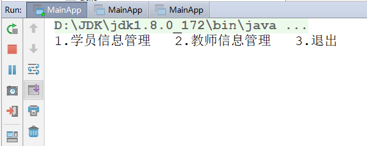

#### 1.2.1 测试【学员信息管理模块】

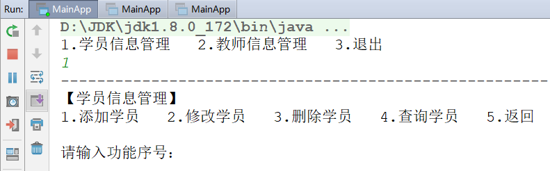

#### 1.2.2 测试【1.添加学员】 

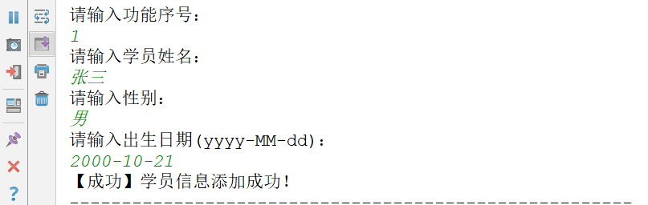

#### 1.2.3 测试【4.查询所有学员】

##### 无数据

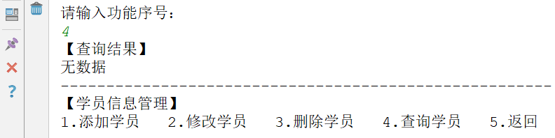

##### 有数据

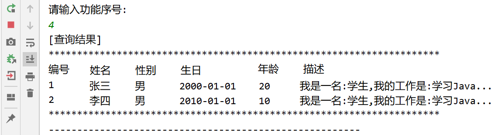

#### 1.2.4 测试【2.修改学员】

##### 输入不存在的编号：

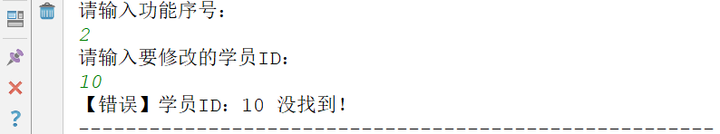

##### 输入存在的编号：

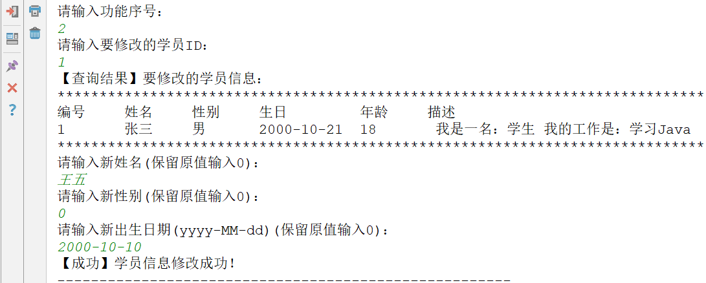

#### 1.2.5 测试【3.删除学员】

##### 输入不存在的编号：

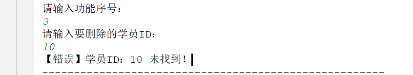

##### 输入存在编号-取消操作：

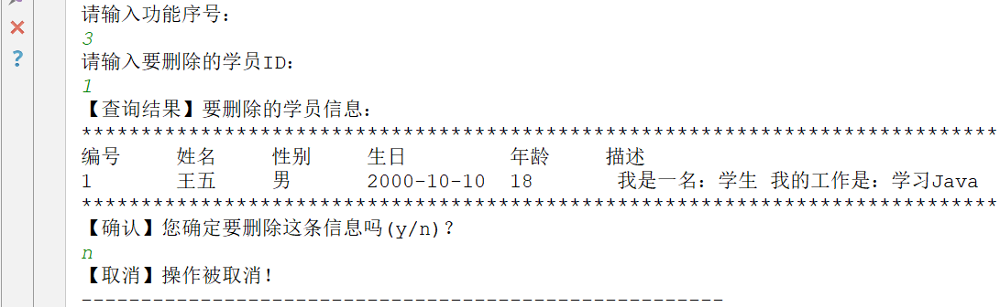

##### 输入存在的编号-执行删除：

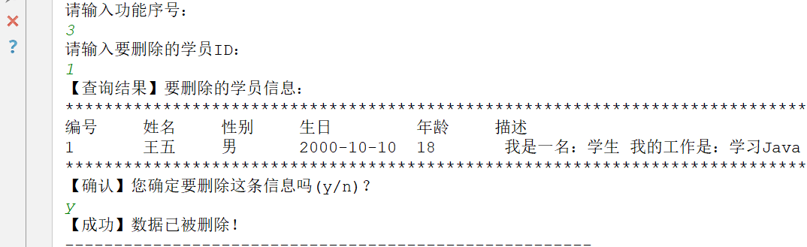

#### 1.2.6测试【5.返回】

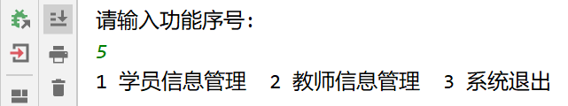

#### 1.3测试【程序退出】

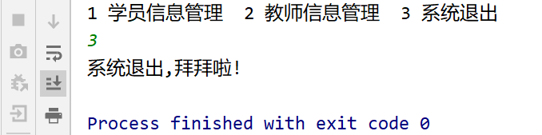

### 小结

```

```

# 第二章 类设计

## 知识点--父类Person(抽象)

### 目标:

- 掌握父类的抽取思想

### 路径:

- 分析Person类中的成员

### 讲解:

#### 2.1分析Person中的成员

- 成员属性：

  - id(编号)
  - name(姓名)
  - sex(性别)
  - birthday(生日)
  - age(年龄-由生日计算得出)

- 构造方法：

  - 无参构造
  - 全参构造

- 成员方法：

  - toString()

- 抽象方法：

  - getType()：由各子类实现，返回各自的"类型"字符串。
  - getWork()：由各子类实现，返回各自的"工作"字符串。

### 小结

```

```


## 知识点--子类Student

### 目标:

- 了解子类的定义原则

### 路径:

- 分析Student类中的成员

### 讲解:

#### 2.2分析Student类中的成员

- 构造方法
  - 无参构造
  - 全参构造(super调用父类全参构造)
- 重写抽象方法
  - 重写getType()
  - 重写getWork()

### 小结

```

```


## 知识点--子类Teacher

### 目标:

- 了解子类的定义原则

### 步骤:

- 分析Teacher类中的成员

### 讲解:

#### 2.3分析Teacher类中的成员

- 构造方法
  - 无参构造
  - 全参构造(super调用父类全参构造)
- 重写抽象方法
  - 重写getType()
  - 重写getWork()

### 小结

```

```


## 知识点--工具类Utils类

### 目标:

- 了解工具类的定义原则

### 路径:

- 分析工具类中的成员

### 讲解:

#### 2.4分析工具类中的成员

- 全局变量
  - 学员ID值(添加学员信息时，编号由此ID加1生成)
  - 教师ID值(添加教师信息时，编号由此ID加1生成)
- 全局方法
  - 根据生日计算年龄的方法
  - 打印一个Person对象的方法；
  - 打印一个ArrayList<Person>集合的方法中所有Person对象的方法；

### 小结

```

```


## 知识点--启动类

### 目标:

- 了解启动类的设计思想

### 步骤:

- 分析启动类的定义

### 讲解:

#### 2.5分析启动类的定义

- 定义启动类：MainApp。
- 定义main方法实现启动程序

### 小结

```

```


# 第三章 类制作

## 知识点--启动类

### 目标:

- 制作Person,Student,Teacher,Utils类

### 步骤:

- 制作父类Person(抽象)
- 制作子类Student
- 制作子类Teacher
- 制作工具类Utils类

### 讲解:

#### 3.1 制作父类Person(抽象)

```java
public abstract class Person {
    private String id;
    private String name;
    private String sex;
    private String birtiday;
    private int age;

    public Person() {

    }

    public Person(String id, String name, String sex, String birtiday, int age) {
        this.id = id;
        this.name = name;
        this.sex = sex;
        this.birtiday = birtiday;
        this.age = age;
    }

    public String getId() {
        return id;
    }

    public void setId(String id) {
        this.id = id;
    }

    public String getName() {
        return name;
    }

    public void setName(String name) {
        this.name = name;
    }

    public String getSex() {
        return sex;
    }

    public void setSex(String sex) {
        this.sex = sex;
    }

    public String getBirtiday() {
        return birtiday;
    }

    public void setBirtiday(String birtiday) {
        this.birtiday = birtiday;
    }

    public int getAge() {
        return age;
    }

    public void setAge(int age) {
        this.age = age;
    }

    @Override
    public String toString() {
        return "Person{" +
                "id='" + id + '\'' +
                ", name='" + name + '\'' +
                ", sex='" + sex + '\'' +
                ", birtiday='" + birtiday + '\'' +
                ", age=" + age +
                '}';
    }

    public abstract String getType();

    public abstract String getWork();
}

```

#### 3.2 制作子类Student

```java
public class Student extends Person {

    public Student() {
    }

    public Student(String id, String name, String sex, String birtiday, int age) {
        super(id, name, sex, birtiday, age);
    }

    @Override
    public String getType() {
        return "学生";
    }

    @Override
    public String getWork() {
        return "学习";
    }
}

```

#### 3.3 制作子类Teacher

~~~java
public class Teacher extends Person {

    public Teacher() {
    }

    public Teacher(String id, String name, String sex, String birtiday, int age) {
        super(id, name, sex, birtiday, age);
    }

    @Override
    public String getType() {
        return "老师";
    }

    @Override
    public String getWork() {
        return "上课";
    }
}

~~~

#### 3.4 制作工具类Utils类

```java
public class Utils {
    //学员id
    public static int sId;
    //老师id
    public static int tId;

    // //定义一个打印单个学生的方法
    //
    // public static void showStudent(){
    //
    // }

    /**
     * 这个方法是用来展示单个学生或老师的信息的
     *
     * @param p
     */
    public static void showPerson(Person p) {
        System.out.println("**********************************************************************");
        System.out.println("编号\t姓名\t性别\t生日\t\t\t年龄\t\t描述");
        System.out.println(p.getId() + "\t" + p.getName() + "\t" + p.getSex() + "\t" + p.getBirthday() + "\t" + p.getAge() + "\t" +
                "我是一名" + p.getType() + "我的工作是:" + p.getWork());
        System.out.println("**********************************************************************");
    }

    //下面的方式是比较好的，但是涉及到了泛型的一些使用问题，所以先不用，等讲完泛型，再回头改进。
    // public static void showAllPerson(ArrayList<Person> array){//传入的如果是  ArrayList<Student> array  编译报错
    //
    // }

    /**
     * 这个方法是用来展示集合中的所有的学生信息的
     *
     * @param array 存放学生的集合
     */
    public static void showAllStudent(ArrayList<Student> array) {
        System.out.println("**********************************************************************");
        System.out.println("编号\t姓名\t性别\t生日\t\t\t年龄\t\t描述");
        for (int i = 0; i < array.size(); i++) {
            Student s = array.get(i);
            System.out.println(s.getId() + "\t" + s.getName() + "\t" + s.getSex() + "\t" + s.getBirthday() + "\t" + s.getAge() + "\t" +
                    "我是一名" + s.getType() + "我的工作是:" + s.getWork());
        }
        System.out.println("**********************************************************************");
    }

    /**
     * 这个方法是根据一个字符串格式的日期得到对应的年龄
     * @param birthday  字符串格式的日期
     * @return 返回的是根据计算得到的年龄
     */
    public static int birthdayToAge(String birthday) {//birthday 2020-12-12
        // 定义年龄变量
        int age = -1;
        // 根据字符串内容获取生日所对应的日期对象
        DateFormat sdf = new SimpleDateFormat("yyyy-MM-dd");
        //异常的处理还没讲，下面的代码先抄着写
        Date birDate = null;
        try {
            birDate = sdf.parse(birthday);
        } catch (ParseException e) {
            e.printStackTrace();
        }
        // 将日期对象转为日历对象
        // void setTime(Date date) 使用给定的 Date设置此日历的时间。
        Calendar birCal = Calendar.getInstance();
        birCal.setTime(birDate);
        // 获取当前的日历对象
        Calendar nowCal = Calendar.getInstance();
        // 判断出生年龄是否合法
        // boolean after(Object when) 判断调用者  是否  在传入 日期的  后面
        // boolean before(Object when) 判断调用者  是否  在传入 日期的  前面
        // if (nowCal.after(birCal)){
        if (birCal.before(nowCal)) {//合法:生日在当前日期前面
            // 计算年龄差
            age = nowCal.get(Calendar.YEAR) - birCal.get(Calendar.YEAR);
            // 判断，出生生日如果在当天之前，则年龄不变，生日在当天之后，则年龄-1.
            int monNum = nowCal.get(Calendar.MONTH) - birCal.get(Calendar.MONTH);
            int dayNum = nowCal.get(Calendar.DAY_OF_MONTH) - birCal.get(Calendar.DAY_OF_MONTH);
            if (monNum < 0 || monNum == 0 && dayNum < 0) {
                age--;
            }

        } else {//不合法
            // 不合法，提示输入有误
            System.out.println("您输入的日期在当前日期之后，请重新输入");
        }

        return age;
    }
}
```

### 小结

```

```


# 第四章 启动类实现

### 目标:

- 制作启动类

### 步骤:

- 主菜单
- 学员信息管理二级菜单
- 添加学员
- 修改学员
- 删除学员
- 查询所有学员
- 测试系统

### 讲解:

#### 4.1 主菜单

```java
 public static void main(String[] args) {
        //定义一个存储学生的集合
        ArrayList<Student> stuArray = new ArrayList<>();

        while (true) {
            System.out.println("1.学生管理系统  2.教师管理系统  3.退出");
            System.out.println("请输入您的选择...");
            Scanner sc = new Scanner(System.in);
            int key = sc.nextInt();
            //根据用户输入的选项做操作
            switch (key) {
                case 1:
                    // System.out.println("进入学生管理系统");
                    studentManager(stuArray);
                    break;
                case 2:
                    System.out.println("进入教师管理系统");
                    break;
                case 3:
                    System.out.println("感谢使用");
                    // break;使用break只能结束switch，想要结束程序需要使用return或System.exit(0)
                    //return;
                    System.exit(0);
                default:
                    System.out.println("您输入的选项有误");
                    //break;
            }
        }
    }
```

#### 4.2.1 学员信息管理二级菜单

```java
public static void studentManager(ArrayList<Student> stuArray) {
        while (true) {
            System.out.println("1.添加学员  2.修改学员  3.删除学员  4.查询学员  5.返回");
            System.out.println("请输入功能序号...");
            Scanner sc = new Scanner(System.in);
            int key = sc.nextInt();
            switch (key) {
                case 1:
                    // System.out.println("执行添加学生操作");
                    addStudent(stuArray);
                    break;
                case 2:
                    // System.out.println("执行修改学生操作");
                    updateStudent(stuArray);
                    break;
                case 3:
                    System.out.println("执行删除学生操作");
                    break;
                case 4:
                    // System.out.println("执行查询学生操作");
                    findAllStudent(stuArray);
                    break;
                case 5:
                    System.out.println("返回");
                    //break; 想要返回上一级界面，需要让当前的方法结束  需要使用return
                    return;
                default:
                    System.out.println("您输入的操作有误");
                    //break;
            }
        }
    }

```
#### 4.2.5 查询所有学员

```java
    public static void findAllStudent(ArrayList<Student> stuArray) {
        //如果集合中没有学生对象，直接显示无数据
        if (stuArray.size() == 0) {
            System.out.println("【无数据】");
        } else {
            //如果集合中有学生对象，展示学生数据
            Utils.showAllStudent(stuArray);
        }

    }
```

#### 4.2.2 添加学员

~~~java
public static void addStudent(ArrayList<Student> stuArray) {
        System.out.println("请输入要添加的学员信息");
        Scanner sc = new Scanner(System.in);
        System.out.println("请输入姓名...");
        String name = sc.nextLine();
        System.out.println("请输入性别...");
        String sex = sc.nextLine();
        System.out.println("请输入生日(格式:2020-12-12)...");
        String birthday = sc.nextLine();

        String sid = Utils.Sid + "";
        int age = Utils.birthdayToAge(birthday);
        //创建学生对象
        Student s = new Student(sid, name, age, sex, birthday);
        //将学生放入集合
        stuArray.add(s);
        //将学员id+1
        Utils.Sid++;
        System.out.println("【成功】学员信息添加成功");
    }
~~~

#### 4.2.3 修改学员

~~~java
public static void updateStudent(ArrayList<Student> stuArray) {
        System.out.println("请输入要修改的学员ID");
        Scanner sc = new Scanner(System.in);
        String sid = sc.nextLine();

        //判断输入的id在集合中是否有对应的学员
        //定义变量，记录找到的学员的位置
        int index = -1;
        //遍历集合，获取每个学员，并判断学员的id是否与输入的id一致
        for (int i = 0; i < stuArray.size(); i++) {
            Student s = stuArray.get(i);
            //在循环中，如果找到了该id所对应的新学员，就将该学员所在的位置赋值给index，并结束循环
            if (s.getId().equals(sid)) {
                index = i;
                break;
            }
        }
        //循环结束后，判断，如果index的值为-1，就说明没找到。
        if (index == -1) {
            //没找到
            System.out.println("【错误】学员ID" + sid + "没找到");
        } else {
            //找到学员
            System.out.println("【查询接口】要修改的学员信息");
            Student s = stuArray.get(index);
            //展示要修改的学员
            Utils.showStudent(s);
            System.out.println("请输入要新姓名");
            String name = sc.nextLine();
            System.out.println("请输入要新性别");
            String sex = sc.nextLine();
            System.out.println("请输入要新生日");
            String birthday = sc.nextLine();

            int age = Utils.birthdayToAge(birthday);
            //因为执行修改操作，所以id不需要发生变化
            //根据上述信息产生新学员
            Student newStu = new Student(sid, name, age, sex, birthday);
            //用新学员将老学员替换
            stuArray.set(index, newStu);
            System.out.println("【成功】学员信息修改成功");
        }

    }
~~~

#### 4.2.4 删除学员

~~~java
    public static void deleteStudent(ArrayList<Student> stuArray) {
        System.out.println("请输入要删除的学员ID");
        Scanner sc = new Scanner(System.in);
        String sid = sc.nextLine();

        //判断输入的id在集合中是否有对应的学员
        //定义变量，记录找到的学员的位置
        int index = -1;
        //遍历集合，获取每个学员，并判断学员的id是否与输入的id一致
        for (int i = 0; i < stuArray.size(); i++) {
            Student s = stuArray.get(i);
            //在循环中，如果找到了该id所对应的新学员，就将该学员所在的位置赋值给index，并结束循环
            if (s.getId().equals(sid)) {
                index = i;
                break;
            }
        }
        //判断index的值，如果是-1,代表没找到
        if (index == -1) {
            //没找到
            System.out.println("学员ID:" + sid + "没找到");
        } else {
            //找到了
            System.out.println("【确认】您要删除这条信息么(y/n)");
            String line = sc.nextLine();
            //判断用户输入的选择，绝对是否删除
            if (line.equals("y")) {
                //要删除
                stuArray.remove(index);
                System.out.println("【成功】数据已被删除");
            } else{
                //不要删除
                System.out.println("操作被取消");
            }
        }
    }
~~~


#### 4.2.6 测试系统

### 小结

```

```

# 第五章 课堂练习

### 5 参考学员管理实现教师管理菜单

