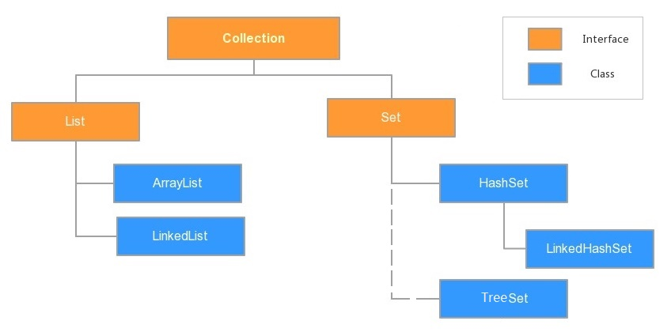

# day05-Collection、迭代器、泛型、数据结构、List、斗地主案例

## 今日内容

- Collection集合
  - 集合
  - 单列集合
  - 常用功能

- 迭代器
  - 基本使用
  - 实现原理
  - 增强for
- 泛型
  - 泛型概述
  - 定义和使用
  - 泛型通配符
- 数据结构
  - 数据结构概述
  - 常见数据结构
  - 树结构
- List集合
  - 概述
  - 常用方法
  - 常用子类
- 综合案例

## 教学目标

- [ ] 能够说出集合与数组的区别

- [ ] 能够使用Collection集合的常用功能

- [ ] 能够使用迭代器对集合进行取元素

- [ ] 能够使用增强for循环遍历集合和数组

- [ ] 能够理解泛型上下限

- [ ] 能够阐述泛型通配符的作用

- [ ] 能够说出常见的数据结构

- [ ] 能够说出数组结构特点

- [ ] 能够说出栈结构特点

- [ ] 能够说出队列结构特点

- [ ] 能够说出单向链表结构特点

- [ ] 能够说出List集合特点

- [ ] 能够完成斗地主的案例


# 第一章 集合

## 知识点----集合概述

### 目标:

- 理解什么是集合

### 步骤:

- 集合的概述
- 集合和数组的区别

### 讲解:

#### 1.1.1集合的概述

集合:是java中提供的一种容器，可以用来存储多个引用数据类型的数据。

集合分类：Java中集合分为单列集合与双列集合。

#### 1.1.2集合和数组的区别

- 长度
  - 数组的长度是固定的
  - 集合的长度是可变的
- 存储范围
  - 数组可以存储基本类型+引用类型
  - 集合只能存储引用类型
- 存储内容
  - 数组需指定存储类型
  - 集合默认存储Object类型(任意内容)，也可以使用泛型指定要存储的内容类型。
  - 开发中无论是数组还是集合，一般情况建议一个集合\数组存储同一种数据类型。

### 小结:

```java

```

## 知识点----单列集合(Collection)概述

### 目标:

- 理解单列集合与单列集合体系结构

### 步骤:

- 单列集合概述
- 单列集合继承体系

### 讲解:

#### 1.2.1 概述

java.util.Collection：单列集合类的根接口，用于存储一系列符合某种规则的元素，以单个对象作为存储元素的集合类型。

#### 1.2.2  单列集合继承体系

`java.util.List`	有序单列集合接口	

- 特点：元素有索引，元素有序(先进先出)、元素可重复
- 常用子类
  ```
  java.util.ArrayList 	数组结构，查询快,增删慢,线程不安全
  java.util.LinkedList    链表结构，查询慢,增删快,线程不安全
  java.util.Vector    	数组结构，查询较快,增删慢,线程安全
  ```

`java.util.Set` 	 无序单列集合接口		   

- 特点：元素无索引，元素无序、元素不可重复
- 常用子类
  ```java
  java.util.HashSet		哈希结构，不可排序
    	|-- java.util.LinkedHashSet		链表+哈希表结构，可排序
  java.util.TreeSet		二叉树结构，可排序
  ```

- 单列集合结构示意图



### 小结:

```java

```

## 知识点----单列集合(Collection)常用功能

### 目标:

- 掌握单列集合常用功能

### 步骤:

- 构造方法
- Collection集合常用功能
- 演示单列集合常用功能

### 讲解:

#### 1.3.1 构造方法

由于Collection是一个接口，不能创建对象，需要使用其子类ArrayLiist等类型来创建对象。

#### 1.3.2Collection集合常用功能

```java
public boolean add(E e)：  把给定的对象添加到当前集合中 。
public boolean remove(E e): 把给定的对象在当前集合中删除。
public boolean contains(Object obj): 判断当前集合是否包含给定的对象。
public boolean isEmpty(): 判断当前集合是否为空。
public int size(): 返回集合中元素的个数。
public Object[] toArray(): 把集合中的元素，存储到数组中
public void clear():清空集合中所有的元素。
```

> tips: 有关Collection中的方法可不止上面这些，其他方法可以自行查看API学习。

#### 1.3.3演示单列集合常用功能

需求：通过ArrayList类演示单列集合常用功能

//测试类代码

```java
public class Test {
    public static void main(String[] args) {
        //创建集合对象
        //不加泛型，代表存储的类型是Object类型，可以存储任意类型数据
        // Collection c  = new ArrayList();
        Collection<String> c = new ArrayList();
        //添加数据
        c.add("姜鹏程");
        // c.add(10);
        // c.add(10.0);
        c.add("欧阳毅文");
        c.add("李震");
        System.out.println(c);
        System.out.println("--------");
        // public boolean remove(E e): 把给定的对象在当前集合中删除
        System.out.println("remove："+c.remove("李震"));
        System.out.println("remove："+c.remove("lizhen"));
        System.out.println(c);
        System.out.println("--------");
        // public boolean contains(Object obj): 判断当前集合是否包含给定的对象
        System.out.println("contains："+c.contains("姜鹏程"));
        System.out.println("contains："+c.contains("jiangpengcheng"));
        System.out.println("--------");
        // public boolean isEmpty(): 判断当前集合是否为空
        System.out.println("isEmpty："+c.isEmpty());
        System.out.println("--------");
        // public int size(): 返回集合中元素的个数
        System.out.println("size："+c.size());
        System.out.println("--------");
        // public Object[] toArray(): 把集合中的元素，存储到数组中
        Object[] orr = c.toArray();
        System.out.println("toArray："+Arrays.toString(orr));
        System.out.println("--------");
        // public void clear():清空集合中所有的元素
        c.clear();
        System.out.println("isEmpty："+c.isEmpty());
        System.out.println("size："+c.size());
    }
}
```

### 小结:

```java
[姜鹏程, 欧阳毅文, 李震]
--------
remove：true
remove：false
[姜鹏程, 欧阳毅文]
--------
contains：true
contains：false
--------
isEmpty：false
--------
size：2
--------
toArray：[姜鹏程, 欧阳毅文]
--------
isEmpty：true
size：0
```


# 第二章 Iterator迭代器

## 知识点----Iterator接口概述与使用

### 目标:

- 掌握迭代器的使用

### 步骤:

- Iterator迭代器概述
- 获取迭代器对象
- 常用方法
- 演示迭代器的使用
- 迭代器的实现原理
### 讲解:

#### 2.1.1 Iterator迭代器概述

**迭代**：*迭代*是重复反馈过程的活动，其目的通常是为了逼近所需目标或结果。

每一次对过程的重复称为一次“*迭代*”，而每一次*迭代*得到的结果会作为下一次*迭代*的初始值。

`java.util.Iterator  `   Collection集合元素的通用获取方式接口。

####  2.1.2 集合中获取迭代器对象方法

```
public Iterator<E> iterator(): 获取集合对应迭代器，遍历集合中的元素
```

设计原理:提供统一获取迭代器的方式，由子类实现该方法，获取属于自己的迭代器。

#### 2.1.3 常用方法

```
public E next()`:返回迭代的下一个元素。
public boolean hasNext():如果仍有元素可以迭代，则返回 true。
```

#### 2.1.4演示迭代器的使用

需求：通过ArrayList类演示迭代器的使用

//测试类代码

```java
public class Test {
    public static void main(String[] args) {
        //创建集合对象
        Collection<String> c = new ArrayList();
        //添加数据
        c.add("a");
        c.add("b");
        c.add("c");
        //通过集合获取迭代器对象
        Iterator<String> it = c.iterator();
        //迭代数据
        /*
        System.out.println(it.hasNext());
        System.out.println(it.next());
        System.out.println(it.hasNext());
        System.out.println(it.next());
        System.out.println(it.hasNext());
        System.out.println(it.next());
        System.out.println(it.hasNext());
        System.out.println(it.next()); //java.util.NoSuchElementException
        */
        while (it.hasNext()) {
            System.out.println(it.next());
        }
    }

}
```
#### 2.1.5  迭代器的实现原理

Iterator迭代器对象在遍历集合时，内部采用指针的方式来跟踪集合中的元素

- 迭代步骤

  - 步骤1：创建迭代器对象，初始化指针，指向0索引位置。
  - 步骤2：hasNext()判断当前指针位置是否有内容。
  - 步骤3：如果有，返回true执行next方法：获取当前位置内容，并将指针后移，回步骤2。
  - 步骤4：如果没有，返回false，表明指针已到末尾，没有可迭代元素，结束迭代。

- 实现原理图解


### 小结:

```java

```

## 知识点----迭代器的常见异常

### 目标:

- 理解迭代器的常见异常

### 步骤:

- 迭代器常见异常
- 演示迭代器常见异常


### 讲解:

#### 2.1.1  迭代器常见异常

- java.util.NoSuchElementException		没有集合元素异常  
  - 迭代过程中，当集合中没有元素，继续使用next方法时，抛出此异常。
- ConcurrentModificationException		并发修改异常
  - 迭代过程中，集合元素数量发生变化，继续使用next方法，抛出此异常。

#### 2.1.2  演示迭代器常见异常

需求：通过ArrayList类演示迭代器常见异常

//测试类代码

```java
public class Test {
    public static void main(String[] args) {
        //创建集合
        Collection<String> c = new ArrayList<>();
        //添加元素
        c.add("abc");
        c.add("def");
        c.add("ghi");
        //获取迭代器对象
        Iterator<String> it = c.iterator();
        //迭代数据
        while (it.hasNext()) {
            // String s =it.next();//实际开发这么干,用一个变量接收，后面重复使用这个变量
            System.out.println("操作1:" + it.next());//java.util.ConcurrentModificationException
            // System.out.println("操作2:" + it.next());//java.util.NoSuchElementException
            c.add("jkl");
            c.add("jkl");
            c.add("jkl");
        }
    }
}

```


### 小结:

```java

```

## 知识点----增强for循环

### 目标:

- 掌握增强for循环的使用

### 步骤:

- 概述
- 增强for循环格式
- 演示增强for循环使用

### 讲解:

#### 2.3.1 概述

- 增强for循环(foreach循环)，是JDK1.5以后出来的一个高级for循环，专门用来遍历数组和Collection集合。
- 内部基于Iterator迭代器实现，所以在遍历的过程中，不能对集合中的元素进行增删操作，否则抛出ConcurrentModificationException并发修改异常 

#### 2.3.2增强for循环格式

```java
for(元素的数据类型  变量 : Collection集合or数组){ 
  	//写操作代码
}
```

#### 2.3.3演示增强for循环使用

需求：通过ArrayList集合演示增强for循环

//测试类代码

```java
public class Test {
    public static void main(String[] args) {
        //创建集合对象
        Collection<String> c = new ArrayList<>();
        //添加数据
        c.add("abc");
        c.add("def");
        c.add("ghi");
        //迭代数据
        for(String s:c){//java.util.ConcurrentModificationException
            System.out.println(s);
            c.add("jkl");
        }
    }
}
```

### 小结:

```java
abc
Exception in thread "main" java.util.ConcurrentModificationException
	at java.base/java.util.ArrayList$Itr.checkForComodification(ArrayList.java:1042)
	at java.base/java.util.ArrayList$Itr.next(ArrayList.java:996)
	at com.itheima03_增强for使用.Test.main(Test.java:26)

```

# 第三章 泛型

## 知识点--泛型概述

### 目标:

- 理解泛型的含义和使用原因

### 步骤:

- 泛型概述
- 泛型在集合中的应用
- 泛型的好处
- 演示泛型的应用

### 讲解:

#### 3.1.1泛型概述

​		JDK5之后，新增了泛型(Generic)语法，可以在类、接口或方法中预支地使用未知的类型。	

​		简单理解：为类、接口或方法提供预定要使用类型限制	

#### 3.1.2 泛型在开发中的应用

​		泛型使开发者在设计API时可以指定类或方法支持泛型，使得API开发与使用变得更为简洁，并得到了编译时期的语法检查。

​		集合中默认以Object类型存储数据，这样不便于管理数据，容易造成转换异常(ClassCastException)通常Collection利用泛型，存储同一类型对象。

#### 3.1.3泛型的好处

- 将运行时期的ClassCastException，转移到了编译时期。
- 避免了类型强转的麻烦。

#### 3.1.4 演示泛型在集合中的应用

需求：使用ArrayList集合存储内容，通过遍历，将元素转回字符串类型

//测试类代码

```java
public class Test {
    public static void main(String[] args) {
        // 将运行时期的ClassCastException，转移到了编译时期
        Collection<String> c = new ArrayList<>();
        c.add("abc");
        // c.add(10);
        // c.add('a');
        show(c);

    }

    public static void show(Collection<String> c) {
        // Iterator it = c.iterator();
        //避免了类型强转的麻烦
        Iterator<String> it = c.iterator();
        while (it.hasNext()) {
            String s = it.next();//java.lang.ClassCastException
        }
    }
}
```

> tips:一般在创建对象时，将未知的类型确定具体的类型。当没有指定泛型时，默认类型为Object类型。

### 小结:

```java

```

## 知识点--泛型的定义及使用

### 目标:

- 理解泛型的定义和使用方式

### 步骤:

- 含有泛型的类格式
- 演示含有泛型的类定义和使用
- 含有泛型的方法格式
- 演示含有泛型的方法定义和使用
- 含有泛型的接口格式
- 演示含有泛型的接口定义和使用

### 讲解:

#### 3.3.1含有泛型的类定义和使用格式

​		泛型是数据类型的一部分，我们将类名与泛型合并一起看做数据类型，定义对象时，确定泛型类型。

定义格式

```java
修饰符 class 类名<代表泛型的变量> { }
```

使用格式

```java
属性类型<泛型类型> 变量名  = new 数据类型<泛型类型>();
属性类型<泛型类型> 变量名  = new 数据类型<>();
```

#### 3.3.2演示含有泛型的类定义和使用

需求：定义带有泛型的类，并将该泛型应用到参数和返回值类型中。

//泛型类代码

```java 
public class GenericsClass<BMW> {

    public void show(BMW bmw) {
        System.out.println(bmw);
    }

    //假设我将来传入的数据类型一定是String
    public BMW get() {
        BMW bmw = (BMW) "abc";
        return bmw;
    }
}

```

//测试类代码

```java
public class Test {
    public static void main(String[] args) {
        // GenericsClass<String> gc = new GenericsClass();
        // GenericsClass<String> gc = new GenericsClass<String>();
        GenericsClass<String> gc = new GenericsClass<>();

        // gc.show(10);
        gc.show("abc");
        String s = gc.get();
        System.out.println(s);
    }
}
//结果
abc
abc

```

#### 3.3.3含有泛型的方法定义和使用格式

含有泛型的方法参数为泛型时才有意义，近似于参数为Object类型的使用，节省了向下转型的过程，在调用方法时，确定泛型类型

定义格式

```java
修饰符  <代表泛型的变量> 返回值类型 方法名(代表泛型的变量  变量名...){  }
```

使用格式

```java
对象.方法名(实参)
```

#### 3.3.4演示含有泛型的方法定义和使用

需求：定义泛型方法，并将该泛型应用到参数和返回值类型中。

//泛型类代码

~~~java
public class GenericsMethod {
    public <BYD> void show(BYD byd){
        System.out.println(byd);
    }
    //假设我将来传入的数据类型一定是String
    public <BYD> BYD get(BYD byd){
        BYD b = (BYD)"abc";
        return b;
    }
}
~~~

//测试类代码

```java
public class Test {
    public static void main(String[] args) {
        GenericsMethod gm = new GenericsMethod();
        gm.show("abc");
        String s = gm.get("abc");
        System.out.println(s);
    }
}
//结果
abc
abc

```

#### 3.3.5含有泛型的接口定义和使用格式

泛型接口约束实现类是含有泛型的类型，实现类要么保留泛型，要么指定泛型的数据类型

定义格式

```java
修饰符 interface 接口名 <代表泛型的变量> { }
```

使用格式1

```java
修饰符 class 类名 implements  接口名 <数据类型> { }
```

> 定义实现类时，确定泛型类型，不写视为Object

使用格式2

~~~java
修饰符 class 类名<代表泛型的变量> implements  接口名 <代表泛型的变量> { }
~~~

> 始终不确定泛型的类型，直到创建对象时，确定泛型的类型

#### 3.3.6演示含有泛型的接口定义和使用

需求：定义泛型接口,将泛型接口应用到方法的返回值类型与参数中

//泛型接口代码

```java
public interface GenericInter<TSL> {
    public void show(TSL tsl);
    public TSL get();
}
```

//泛型接口实现类代码1

```java
public class GenericsInterImpl1 implements GenericInter<String> {

    @Override
    public void show(String s) {
        System.out.println("abc");
    }

    @Override
    public String get() {
        return "abc";
    }
}
```

//泛型接口实现类代码2

```java
public class GenericsInterImpl2<WL> implements GenericInter<WL> {


    public void show(WL bmw) {
        System.out.println(bmw);
    }

    //假设我将来传入的数据类型一定是String
    public WL get() {
        WL wl = (WL) "def";
        return wl;
    }
}
```

//测试类代码

```java
public class Test {
    public static void main(String[] args) {
        //实现类指定了数据类型
        GenericsInterImpl1 gii1 = new GenericsInterImpl1();
        gii1.show("abc");
        String s1 = gii1.get();
        System.out.println(s1);
        System.out.println("--------");
        GenericsInterImpl2<String> gii2 = new GenericsInterImpl2();
        gii2.show("def");
        String s2 = gii2.get();
        System.out.println(s2);
    }
}

//结果
abc
abc
--------
def
def
```

### 小结:

```java

```

## 知识点--泛型通配符

### 目标:

- 理解通配符的使用

### 步骤:

- 概述
- 使用格式
- 泛型受限
- 演示通配符的基本使用
- 泛型通配符的应用
- 演示泛型通配符的应用

### 讲解:

#### 3.4.1 概述

**泛型通配符**:泛型通配符用问号表示(?）

泛型本身不存在继承关系，不可以给已指定泛型的变量接收有其他泛型类型的对象。

```
//Collection<Object> list = new ArrayList<String>()//错误格式，泛型不存在继承关系
```

如果想要使变量在未来接收有泛型定义的对象，又不确定泛型要定义的类型。可以使用泛型通配符。

#### 3.4.2 使用格式

```java
数据类型 <?> 对象名称 
对象名 = 带具体泛型类型的对象
```

#### 3.4.3 受限泛型

限制泛型数据类型的定义区间。

泛型的上限：接收泛型为该泛型数据类型或其子类的对象


```
格式：数据类型 <? extends 泛型数据类型 > 对象名称
```

泛型的下限：接收泛型为`该泛型数据类型`或其`父类`的对象


```
格式： 数据类型 <? super 泛型数据类型 > 对象名称
```

#### 3.4.4演示通配符的基本使用

定义父子孙三个类，在测试类中演示泛型的基本使用及泛型受限的使用

//Ye类代码

```java
public class Ye{

}
```

//Fu类代码

```java
public class Fu extends Ye{

}
```

//Zi类代码

```java
public class Zi extends Fu  {

}
```

//测试类代码

```java
public class Test {
    public static void main(String[] args) {
        Collection<String> c = new ArrayList<>();
        Collection<Object> c2;
        // c2=c;//不同泛型即使有字父类关系，也不能这么写，格式不支持
        // 如果想要使变量在未来接收有泛型定义的对象，又不确定泛型要定义的类型可以使用泛型通配符
        Collection<?> c3;//这里的<?>整体如果不写，效果是一样的
        c3 = c;

        System.out.println("--------");
        Collection<Ye> co1 = new ArrayList<>();
        Collection<Fu> co2 = new ArrayList<>();
        Collection<Zi> co3 = new ArrayList<>();
        //泛型的上限：接收泛型为该泛型数据类型或其子类的对象
        // 需求:c4将来只能接收co2和co3
        Collection<? extends Fu> c4;
        // c4 =co1;
        c4 = co2;
        c4 = co3;
        // 泛型的下限：接收泛型为该泛型数据类型或其父类的对象
        //需求:c4将来只能接收co1和co2
        Collection<? super Fu> c5;
        c5 = co1;
        c5 = co2;
        // c5=co3;
    }
}
```

#### 3.4.5泛型通配符的应用

使用含泛型通配符形式,将拥有泛型的类或接口作为参数

泛型通配符应用方式

```java
形式1：修饰符  返回值 方法名(类名<?> 变量名){}
形式2：修饰符  返回值 方法名(类名<? extends 数据类型>  变量名){}
形式3：修饰符  返回值 方法名(类名<? super 数据类型>  变量名){}
```

#### 3.4.6演示泛型通配符的应用

需求：使用父子孙类演示泛型受限的使用
//父子孙类代码同上

//测试类代码

```java
public class Test {
    public static void main(String[] args) {
        Collection<Ye> co1 = new ArrayList<>();
        Collection<Fu> co2 = new ArrayList<>();
        Collection<Zi> co3 = new ArrayList<>();
        // 形式1：修饰符  返回值 方法名(类名<?> 变量名){}
        showCollection1(co1);
        showCollection1(co2);
        showCollection1(co3);
        // 形式2：修饰符  返回值 方法名(类名<? extends 数据类型>  变量名){}
        // showCollection2(co1);
        showCollection2(co2);
        showCollection2(co3);
        // 形式3：修饰符  返回值 方法名(类名<? super 数据类型>  变量名){}
        showCollection3(co1);
        showCollection3(co2);
        // showCollection3(co3);
    }

    // 形式1：修饰符  返回值 方法名(类名<?> 变量名){}
    public static void showCollection1(Collection<?> c) {
        System.out.println("" + c);
    }

    // 形式2：修饰符  返回值 方法名(类名<? extends 数据类型>  变量名){}
    public static void showCollection2(Collection<? extends Fu> c) {
        System.out.println("" + c);
    }

    // 形式3：修饰符  返回值 方法名(类名<? super 数据类型>  变量名){}
    public static void showCollection3(Collection<? super Fu> c) {
        System.out.println("" + c);
    }
}

```

### 小结:

```java

```

# 第四章 数据结构

## 知识点----数据结构概述

### 目标:

- 了解什么是数据结构

### 步骤:

- 数据结构概述

### 讲解:

#### 4.1数据结构概述

- 数据结构 : **其实就是存储数据和表示数据的方式**。
- 常见的数据结构：堆栈、队列、数组、链表和红黑树 

### 小结:

```

```

## 知识点----常见数据结构

### 目标:

- 了解常见的数据结构

### 步骤:

- 栈结构
- 队列结构
- 数组结构
- 链表结构

### 讲解:

#### 4.2.1栈结构

概念:栈(stack),又称堆栈，它是运算受限的线性表，其限制是仅允许在表的一端进行插入和删除操作，不允许在其他任何位置进行添加、查找、删除等操作。

名词解释
- **压栈**：就是存元素。

  即，把元素存储到栈的顶端位置，栈中已有元素依次向栈底方向移动一个位置。

- **弹栈**：就是取元素。

  即，把栈的顶端位置元素取出，栈中已有元素依次向栈顶方向移动一个位置。

栈结构特点：
- 先进后出（即越早存储的元素，越晚取出来）。
- 栈的入口、出口的都是栈的同一端。

举例：子弹夹

```tex
子弹压进弹夹，先压进去的子弹在下面，后压进去的子弹在上面，当开枪时，先弹出上面的子弹，然后才能弹出下面的子弹
```

原理图


#### 4.2.2队列结构

概念:队列(queue)：,队列结构，它同堆栈一样，也是一种运算受限的线性表，其限制是仅允许在表的一端进行插入，而在表的另一端进行删除。

队列结构特点
- 先进先出（即越早存储的元素，越早取出来）。
- 队列的入口、出口各占一侧。

举例：小火车过山洞

```
车头先进去，车尾后进去；车头先出来，车尾后出来。
```

原理图


#### 4.2.3数组结构

概念:数组(Array):,是有序的元素序列，数组是在内存中开辟一段连续的空间，并在此空间存放元素。

数组结构特点：
- 查找快(通过索引，可以快速访问指定位置的元素)
- 增删元素慢

举例：出租公寓

```tex
有100个房间，从001到100每个房间都有固定编号，通过编号就可以快速找到租房子的人
```

原理图


#### 4.2.4链表结构

概念:链表(LinkedList):,由一系列结点（链表中每一个元素称为结点）组成，结点可以在运行时动态生成。

分类:

- 单向链表:每个单向链表结点包括两个部分：存储数据元素的数据域，存储下一个结点地址的指针域。

- 双向链表。

链表结构特点

- 多个结点之间，通过地址进行连接。
- 查找元素慢：通过连接的节点，依次向后查找指定元素
- 增删元素快：只需要修改连接下一个元素的地址即可

举例：滑旱冰

```java
每个人使用自己的双手拉住前面的人的衣服。
```

单项链表原理图


### 小结:

```java

```


## 知识点----树结构介绍

### 目标:

- 理解二叉树结构

### 步骤:

- 树结构概述
- 二叉树
- 二叉查找树
- 平衡二叉树
- 平衡二叉树平衡原理
- 平衡二叉树插入情况分类 
- 红黑树

### 讲解:

#### 4.3.1树结构概述

树结构特点
- 每一个节点有零个或者多个子节点
- 没有父节点的节点称之为根节点，一个树最多有一个根节点。
- 每一个非根节点有且只有一个父节点

示意图

 

名词解释

| 名词     | 含义                                                         |
| -------- | ------------------------------------------------------------ |
| 节点     | 指树中的一个元素                                             |
| 节点的度 | 节点拥有的子树的个数，二叉树的度不大于2                      |
| 叶子节点 | 度为0的节点，也称之为终端结点                                |
| 高度     | 叶子结点的高度为1，叶子结点的父节点高度为2，以此类推，根节点的高度最高 |
| 层       | 根节点在第一层，以此类推                                     |
| 父节点   | 若一个节点含有子节点，则这个节点称之为其子节点的父节点       |
| 子节点   | 子节点是父节点的下一层节点                                   |
| 兄弟节点 | 拥有共同父节点的节点互称为兄弟节点                           |

#### 4.3.2二叉树

概念:如果树中的**每个节点的子节点的个数不超过2**，那么该树就是一个二叉树。

原理图


#### 4.3.3二叉查找树	

二叉查找树结构特点：
- 左子树上所有的节点的值均小于等于他的根节点的值
- 右子树上所有的节点值均大于或者等于他的根节点的值

原理图


#### 4.3.4平衡二叉树

平衡二叉树特点
- 左右两个子树的高度差的绝对值不超过1，并且左右两个子树都是一棵平衡二叉树
- 避免出现"瘸子"的现象，减少树的高度，提高了搜索效率


​														示例图

#### 4.3.5平衡二叉树平衡原理

平衡二叉树结构中，当有新的节点要插入时，检查是否因插入后而破坏了树的平衡，如果是，则需要做旋转去改变树的结构。

旋转方式:

- 右旋：左子的右子断连旧父，连旧父父，左子升新父。

- 左旋：右子的左子断连旧父，连旧父父，右子升新父。


左旋示例图


#### 4.3.6平衡二叉树插入情况分类 

新节点插入后，需要进行平衡调整，此时将插入元素时的情况分为四种:**左左，左右，右左，右右**

- 左左插入调整原理:
  - 左左: 在平衡的二叉树节点左子树的左子树下，插入新节点，导致高度差为2

  - 调整方式:左左调整，只需要对节点进行右旋即可 

  - 左左调整原理图

     

-  左右插入调整原理:

  - 左右:在平衡的二叉树节点左子树的右子树下，插入新节点，导致高度差为2

  - 调整方式:将左右进行第一次左旋，调整成左左，然后再对左左进行右旋调整。

  - 左右调整原理图(先左旋，后右旋)


- 右左插入调整原理:
  - 右左:在平衡的二叉树节点右子树的左子树下，插入新节点，导致高度差为2

  - 调整方式:将右左进行第一次右旋，调整成右右，然后再对右右进行左旋调整。

  - 右左调整原理图

     

- 右右插入调整原理:
  - 右右:在平衡的二叉树上节点右子树的右子树下，插入新节点，导致高度差为2

  - 调整方式:左左调整，只需要对节点进行左旋即可  

  - 左左调整原理图

     


#### 4.3.6红黑树

概念:红黑树是一种自平衡的二叉查找树，是计算机科学中用到的一种数据结构。1972年由Rudolf Bayer发明，称为平衡二叉B树，1978年Leoj.Guibas和Robert Sedgewick修改为"红黑树"。

红黑树的特性：


-  根节点是黑色，其他节点是红色或黑色。
- 每个红色节点的两个子节点都是黑色。(从每个叶子到根的所有路径上不能有两个连续的红色节点)
- 如果一个节点没有儿子，我们称之为叶子节点，红黑树中，叶子被假定为 null 或空，每个叶节点(Nil)是黑色的；
- 从任一节点到其每个叶子的所有路径都包含相同数目的黑色节点。

红黑树特点：趋近与平衡树，查询速度快。

红黑树平衡原理:		

- ​	红黑树的每一个节点上都有存储位表示节点的颜色，可以是红或者黑
- ​	添加元素原理:每一次插入完毕以后，使用红黑色规则进行校验，如果不满足红黑规则，就需要左旋和右旋来调整树，使其满足红黑规则；

原理图

 


### 小结:

```

```

# 第五章 List接口

## 知识点----List接口概述

### 目标:

- 理解List集合的特点


### 步骤:

- List接口的概述

### 讲解:

#### 5.1.1List接口的概述

`java.util.List`接口继承自`Collection`接口，是单列集合的一个重要分支。

实现了`List`接口的类称为List集合。

List接口特点

- 它是一个元素存取有序的集合
- 它是一个带有索引的集合，通过索引就可以精确的操作集合中的元素（与数组的索引是一个道理）。
- 集合中可以有重复的元素，通过元素的equals方法，来比较是否为重复的元素。

> tips:我们在基础班的时候已经学习过List接口的子类java.util.ArrayList类，该类中的方法都是来自List中定义。

### 小结:

```

```

## 知识点----List接口中常用方法

### 目标:

- 掌握List集合中常用方法使用

### 步骤:

- 常用方法概述
- 演示List接口常用方法

### 讲解:

#### 5.2.1常用方法

- `public void add(int index, E element)`: 将指定的元素，添加到该集合中的指定位置上。
- `public E get(int index)`:返回集合中指定位置的元素。
- `public E remove(int index)`: 移除列表中指定位置的元素, 返回的是被移除的元素。
- `public E set(int index, E element)`:用指定元素替换集合中指定位置的元素,返回修改前的元素。

#### 5.2.2演示List接口常用方法

需求：通过ArrayList类演示常用方法

//测试类代码

```java
public class Test {
    public static void main(String[] args) {
        //创建List集合对象
        List<String> list = new ArrayList();
        //添加元素
        list.add("abc");
        list.add("def");
        System.out.println(list);
        System.out.println("--------");
        // public void add(int index, E element): 将指定的元素，添加到该集合中的指定位置上
        list.add(0,"欧阳毅文");
        System.out.println(list);
        System.out.println("--------");
        // public E get(int index):返回集合中指定位置的元素
        System.out.println(list.get(0));
        System.out.println(list.get(1));
        System.out.println(list.get(2));
        // System.out.println(list.get(3));
        System.out.println("--------");
        //public E remove(int index): 移除列表中指定位置的元素, 返回的是被移除的元素
        list.remove(1);
        System.out.println(list);
        System.out.println("--------");
        // public E set(int index, E element):用指定元素替换集合中指定位置的元素,返回修改前的元素
        list.set(1,"李震");
        System.out.println(list);
    }
}
//结果
[abc, def]
--------
[欧阳毅文, abc, def]
--------
欧阳毅文
abc
def
--------
[欧阳毅文, def]
--------
[欧阳毅文, 李震]
```

### 小结:

```java

```

## 知识点----List的常用子类

### 目标:

- 了解List接口的实现类

### 步骤:

- ArrayList集合
- LinkedList集合常用方法
- 演示LinkedList集合常用方法

### 讲解:

#### 5.3.1ArrayList集合

`java.util.ArrayList`集合数据存储的结构是数组结构。由于日常开发中使用最多的功能为查询数据、遍历数据，所以`ArrayList`是最常用的集合。

但不建议随意地使用ArrayList完成任何需求，并不严谨，需要根据需求考虑。

ArrayList集合特点：查询快,增删慢,线程不安全


#### 5.3.2LinkedList集合

`java.util.LinkedList`集合数据存储的结构是双向链表结构。在开发时，LinkedList集合也可以作为堆栈，队列的结构使用。

双链表原理图


LinkedList集合特点：查询慢,增删快,线程不安全

LinkedList集合常用方法(**了解即可)**

- `public void addFirst(E e)`:将指定元素插入此列表的开头。
- `public void addLast(E e)`:将指定元素添加到此列表的结尾。
- `public E getFirst()`:返回此列表的第一个元素。
- `public E getLast()`:返回此列表的最后一个元素。
- `public E removeFirst()`:移除并返回此列表的第一个元素。
- `public E removeLast()`:移除并返回此列表的最后一个元素。
- `public E pop()`:从此列表所表示的堆栈处弹出一个元素。
- `public void push(E e)`:将元素推入此列表所表示的堆栈。
- `public boolean isEmpty()`：如果列表不包含元素，则返回true。

#### 5.3.3演示LinkedList集合常用方法

需求：演示LinkedList类常用方法

//测试类代码

```java
public class Test {
    public static void main(String[] args) {
        //创建集合对象
        LinkedList<String> list = new LinkedList<>();
        //添加元素
        list.add("bbb");
        list.add("bbb");
        list.add("bbb");
        System.out.println(list);
        System.out.println("--------");
        // public void addFirst(E e):将指定元素插入此列表的开头
        list.addFirst("aaa");
        System.out.println(list);
        System.out.println("--------");
        // public void addLast(E e):将指定元素添加到此列表的结尾
        list.addLast("ccc");
        System.out.println(list);
        System.out.println("--------");
        // public E getFirst():返回此列表的第一个元素
        System.out.println(list.getFirst());
        System.out.println(list);
        System.out.println("--------");
        // public E getLast():返回此列表的最后一个元素
        System.out.println(list.getLast());
        System.out.println(list);
        System.out.println("--------");
        // public E removeFirst():移除并返回此列表的第一个元素
        System.out.println(list.removeFirst());
        System.out.println(list);
        System.out.println("--------");
        // public E removeLast():移除并返回此列表的最后一个元素
        System.out.println(list.removeLast());
        System.out.println(list);
        System.out.println("--------");
        // public E pop():从此列表所表示的堆栈处弹出一个元素
        System.out.println(list.pop());
        System.out.println(list);
        System.out.println("--------");
        // public void push(E e):将元素推入此列表所表示的堆栈
        list.push("ddd");
        System.out.println(list);
        System.out.println("--------");
        // public boolean isEmpty()：如果列表不包含元素，则返回true
        System.out.println(list.isEmpty());
    }
}
//结果
[bbb, bbb, bbb]
--------
[aaa, bbb, bbb, bbb]
--------
[aaa, bbb, bbb, bbb, ccc]
--------
aaa
[aaa, bbb, bbb, bbb, ccc]
--------
ccc
[aaa, bbb, bbb, bbb, ccc]
--------
aaa
[bbb, bbb, bbb, ccc]
--------
ccc
[bbb, bbb, bbb]
--------
bbb
[bbb, bbb]
--------
[ddd, bbb, bbb]
--------
false
```

### 小结:

```java

```


# 第六章 模拟斗地主

## 知识点----模拟斗地主案例

### 目标:

- 掌握斗地主案例思路与实现

### 步骤:

- 需求
- 分析
- 实现

### 6.1需求:

按照斗地主的规则，完成洗牌发牌看牌的动作。

具体规则：使用54张牌,三个玩家参与游戏，三人交替摸牌，每人17张牌，最后三张留作底牌。

### 6.2分析:

- 准备牌：

  - 牌可以设计为一个ArrayList<String>,每个字符串为一张牌。
  - 每张牌由**花色**和**数字**两部分组成，可以使用花色数组与数字数组嵌套迭代完成每张牌的组合。
  - 将每张牌放进一个牌盒集合
  
- 发牌

  - 为每个玩家和剩余底牌各分配一个ArrayList<String>记录牌
  - 将最后3张牌直接存放于底牌中
  - 将剩余牌通过对3取模判断，依次发牌，存入玩家集合中。

- 看牌

  - 打印玩家集合。
  - 打印底牌集合

### 6.3实现:

```java
public class Test {
    public static void main(String[] args) {
        // 准备牌思路
        // 创建集合作为牌盒
        ArrayList<String> cardBox = new ArrayList<>();
        // 创建数组或集合分别存储花色和数字
        String[] colors = {"♠", "♥", "♣", "♦"};
        String[] nums = {"A", "2", "3", "4", "5", "6", "7", "8", "9", "10", "J", "Q", "K"};
        // 使用循环遍历组合出所有牌号增加到牌盒
        for (String cardColro : colors) {
            for (String cardNum : nums) {
                String card = cardColro + cardNum;
                cardBox.add(card);
            }
        }
        // 增加大小王牌号
        cardBox.add("大王");
        cardBox.add("小王");
        //洗牌 Collections 静态 shuffle
        // Collections.shuffle(cardBox);
        //  发牌思路
        // 定义三个集合作为玩家
        ArrayList<String> player1 = new ArrayList<>();
        ArrayList<String> player2 = new ArrayList<>();
        ArrayList<String> player3 = new ArrayList<>();
        // 定义一个集合作为底牌
        ArrayList<String> diPai = new ArrayList<>();
        // 遍历牌盒中的牌号，利用对3取余分发牌
        for (int i = 0; i < cardBox.size(); i++) {//i  0-53
            String card = cardBox.get(i);
            // 将剩余3张牌放到底牌集合中
            if (i >= 51) {
                diPai.add(card);
            }else{
                if (i%3==0){
                    player1.add(card);
                }else if(i%3==1){
                    player2.add(card);
                }else{
                    player3.add(card);
                }
            }
        }
        // 看牌思路
        System.out.println("玩家1:"+player1);
        System.out.println("玩家2:"+player2);
        System.out.println("玩家3:"+player3);
        System.out.println("底牌:"+diPai);
    }
}
//结果
玩家1:[♠A, ♠4, ♠7, ♠10, ♠K, ♥3, ♥6, ♥9, ♥Q, ♣2, ♣5, ♣8, ♣J, ♦A, ♦4, ♦7, ♦10]
玩家2:[♠2, ♠5, ♠8, ♠J, ♥A, ♥4, ♥7, ♥10, ♥K, ♣3, ♣6, ♣9, ♣Q, ♦2, ♦5, ♦8, ♦J]
玩家3:[♠3, ♠6, ♠9, ♠Q, ♥2, ♥5, ♥8, ♥J, ♣A, ♣4, ♣7, ♣10, ♣K, ♦3, ♦6, ♦9, ♦Q]
底牌:[♦K, 大王, 小王]
```

### 小结:

```

```

