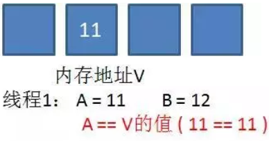
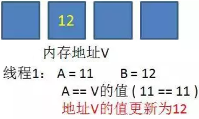
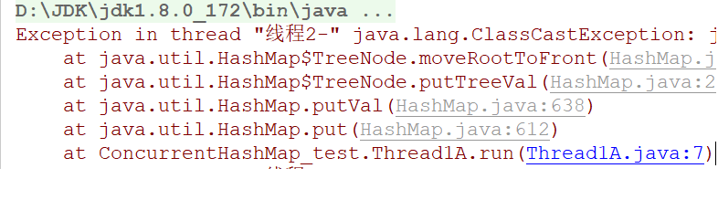
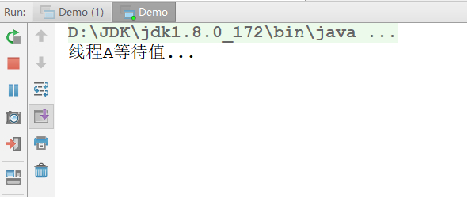
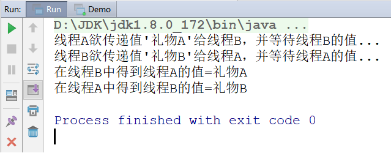

# day08【线程安全、可见性、原子性、并发包、线程池、死锁】

## 今日内容

* 线程安全  
  * 同步代码块
  * 同步方法
  * Lock锁
* 高并发可见性问题
  * JMM(内存模型)
  * volatile关键字解决
  * 锁机制解决
* 高并发原子性问题
* 
* 并发包
  * ConcurrentHashMap 多线程安全的
  * CountDownLatch
  * CyclicBarrier
  * Semaphore
  * Exchanger
* 线程池
  * 线程池的概念
  * 如何创建线程池
  * 如何提交任务到线程池执行
* 死锁 

## 教学目标  

- [ ] 能够解释安全问题的出现的原因

- [ ] 能够使用同步代码块解决线程安全问题

- [ ] 能够使用同步方法解决线程安全问题

- [ ] 能够说出volatile关键字的作用

- [ ] 能够说明volatile关键字和synchronized关键字的区别

- [ ] 能够理解原子类的工作机制

- [ ] 能够掌握原子类AtomicInteger的使用

- [ ] 能够描述ConcurrentHashMap类的作用

- [ ] 能够描述CountDownLatch类的作用

- [ ] 能够描述CyclicBarrier类的作用

- [ ] 能够表述Semaphore类的作用 

- [ ] 能够描述Exchanger类的作用

- [ ] 能够描述Java中线程池运行原理

- [ ] 能够描述死锁产生的原因


# 第一章 线程安全

## 知识点-- 线程安全问题

### 目标

- 能够理解线程安全的问题的原因

### 路径

- 概述
- 演示多线程售票安全问题
- 多线程售票安全问题分析
- 线程同步

### 讲解

#### 1.1.1概述

如果有多个线程同一时间段运行同一段代码。程序最终结果和单线程运行的结果一致，且其他变量的值也和预期也一致，就是线程安全的。

#### 1.1.2演示多线程售票安全问题

需求:假设有100张电影票，需要从4个窗口同时出售这100张票，用线程模拟该场景。

```
分析:
	需要窗口:采用线程对象来模拟；
	需要票，Runnable接口子类来模拟
```

//卖票线程类代码

```java
public class TicketRunnable implements Runnable {
    public int ticket = 100;//表示拥有100张票

    @Override
    public void run() {
        //加入循环，重复的取卖票，知道卖完
        while (true) {
            //如果票数大于0，执行卖票操作
            if (ticket > 0) {
                //卖出第ticket张票
                System.out.println(Thread.currentThread().getName() + "卖出了第" + ticket);
                //卖票需要一点时间，睡一会
                try {
                    Thread.sleep(300);
                } catch (InterruptedException e) {
                    e.printStackTrace();
                }
                //票数就少1张
                ticket--;
            }
        }
    }
}
```

//测试类代码

```java
public class Test {
    public static void main(String[] args) {
        //因为我们认为需要四个窗口共享卖票的操作(四个窗口，共享票)，所以我们在这里使用Runnable的实现类，定义卖票的操作
        //创建卖票的任务(Runnable的实现类对象)
        TicketRunnable tr = new TicketRunnable();
        //因为四个窗口，就相当于四个线程，所以需要定义四个线程对象
        Thread t1 = new Thread(tr,"窗口1:");
        Thread t2 = new Thread(tr,"窗口2:");
        Thread t3 = new Thread(tr,"窗口3:");
        Thread t4 = new Thread(tr,"窗口4:");
        //启动线程，开始卖票
        t1.start();
        t2.start();
        t3.start();
        t4.start();
    }
}
```

#### 1.1.3多线程售票安全问题分析

实际会发生的线程问题：

- 同票：比如5这张票被卖了两
- 不存在的票：比如0票与-1票，是不存在的
- 丢票：未出现的票


这种问题，几个窗口(线程)票数不同步了，这种问题称为线程不安全。

原因总结：共享内容，多个位置使用，包含修改操作

解决思路：哪里有问题，包裹哪里，不让其他线程干预

> 线程安全问题都是由全局变量及静态变量引起的。若每个线程中对全局变量、静态变量只有读操作，而无写操作，一般来说，这个全局变量是线程安全的；若有多个线程同时执行写操作，一般都需要考虑线程同步，否则的话就可能影响线程安全。

#### 1.1.4线程同步

多个线程一段共享操作，一个线程获取执行权限期间，其他线程不能获取这段操作的执行权限。

直到该线程释放权限后，所有线程(含该线程)重新取抢夺CPU资源，完成后续操作。

同步机制三种方式：

1. 同步代码块。
2. 同步方法。
3. 锁机制。

### 小结

```

```

## 知识点--同步代码块

### 目标

- 能够掌握同步代码块解决线程安全问题

### 路径

- 概述
- 演示同步代码块使用

### 讲解

#### 1.2.1概述

**同步代码块**：`synchronized`关键字可以用于方法中的某个区块中，表示只对这个区块的资源实行互斥访问。

格式: 

```java
synchronized(同步锁){
     需要同步操作的代码
}
```

同步锁说明:对象的同步锁只是一个概念,可以想象为在对象上标记了一个锁.

- 锁对象 可以是任意类型。
- 多个线程对象，想要达到线程同步，需要使用同一把锁。

> 注意:在任何时候,最多允许一个线程拥有同步锁,谁拿到锁就进入代码块,其他的线程只能在外等着(BLOCKED:阻塞)。

#### 1.2.2演示同步代码块

需求：使用同步代码块解决卖票线程安全问题

//测试类代码

```
public class Test {
    public static void main(String[] args) {
        //因为我们认为需要四个窗口共享卖票的操作(四个窗口，共享票)，所以我们在这里使用Runnable的实现类，定义卖票的操作
        //创建卖票的任务(Runnable的实现类对象)
        TicketRunnable tr = new TicketRunnable();
        //因为四个窗口，就相当于四个线程，所以需要定义四个线程对象
        Thread t1 = new Thread(tr, "窗口1:");
        Thread t2 = new Thread(tr, "窗口2:");
        Thread t3 = new Thread(tr, "窗口3:");
        Thread t4 = new Thread(tr, "窗口4:");
        //启动线程，开始卖票
        t1.start();
        t2.start();
        t3.start();
        t4.start();
    }
}
```

//卖票线程类代码

```java
public class TicketRunnable implements Runnable {
    public Object lock = new Object();
    public int ticket = 100;//表示拥有100张票

    @Override
    public void run() {
        //加入循环，重复的取卖票，知道卖完
        while (true) {
            synchronized (lock) {
                //如果票数大于0，执行卖票操作
                if (ticket > 0) {
                    //卖出第ticket张票
                    System.out.println(Thread.currentThread().getName() + "卖出了第" + ticket);
                    //卖票需要一点时间，睡一会
                    try {
                        Thread.sleep(300);
                    } catch (InterruptedException e) {
                        e.printStackTrace();
                    }
                    //票数就少1张
                    ticket--;
                }
            }
        }
    }
}
```

当使用了同步代码块后，上述的线程的安全问题，解决了。

### 小结

```java

```

## 知识点--同步方法

### 目标

- 能够掌握同步方法解决线程安全问题

### 路径

- 概述
- 演示同步方法使用
- 静态/非静态同步方法锁
- 演示静态/非静态同步方法锁

### 讲解

#### 1.3.1概述

**同步方法**:synchronized修饰的方法,叫做同步方法,，表示只对这个方法中的资源实行互斥访问。

格式：

```java
public synchronized void method(){
   	可能会产生线程安全问题的代码
}
```

#### 1.3.2演示同步方法

需求：使用同步方法解决卖票线程安全问题

//测试类代码

```
public class Test {
    public static void main(String[] args) {
        //因为我们认为需要四个窗口共享卖票的操作(四个窗口，共享票)，所以我们在这里使用Runnable的实现类，定义卖票的操作
        //创建卖票的任务(Runnable的实现类对象)
        TicketRunnable tr = new TicketRunnable();
        //因为四个窗口，就相当于四个线程，所以需要定义四个线程对象
        Thread t1 = new Thread(tr, "窗口1:");
        Thread t2 = new Thread(tr, "窗口2:");
        Thread t3 = new Thread(tr, "窗口3:");
        Thread t4 = new Thread(tr, "窗口4:");
        //启动线程，开始卖票
        t1.start();
        t2.start();
        t3.start();
        t4.start();
    }
}

```

//卖票线程类代码

```java
public class TicketRunnable implements Runnable {
    public int ticket = 100;//表示拥有100张票

    @Override
    public void run() {
        //加入循环，重复的取卖票，知道卖完
        while (true) {
            sellTicket();
        }
    }

    //定义一个(非静态)同步方法，执行卖票操作。锁:this
    public synchronized void sellTicket() {
        //如果票数大于0，执行卖票操作
        if (ticket > 0) {
            //卖出第ticket张票
            System.out.println(Thread.currentThread().getName() + "卖出了第" + ticket);
            //卖票需要一点时间，睡一会
            try {
                Thread.sleep(300);
            } catch (InterruptedException e) {
                e.printStackTrace();
            }
            //票数就少1张
            ticket--;
        }
    }
}
```

#### 1.3.3静态/非静态同步方法锁

同步锁是谁?

​      对于非static方法,同步锁就是this。  

​      对于static方法,我们使用当前方法所在类的字节码对象(类名.class)。

#### 1.3.4演示静态/非静态同步方法锁

需求:分别用静态/非静态同步方法，执行100次打印操作，证明静态和非静态方法的锁对象。

静态同步方法

~~~java
public class MyStaticThread extends Thread {
    @Override
    public void run() {
        method();
    }

    //静态同步方法
    public static synchronized void method() {//类.class
        for (int i = 0; i < 100; i++) {
            System.out.println(Thread.currentThread().getName() + "在执行第" + i + "次");
        }
    }
}
~~~

非静态同步方法

~~~java
public class MyThread extends Thread {
    @Override
    public void run() {
        method();
    }
    //非静态同步方法
    public synchronized void method(){//this
        for (int i = 0; i < 100; i++) {
            System.out.println(getName() + "在执行第" + i + "次");
        }
    }
}

~~~

测试类代码

```java
public class Test {
    public static void main(String[] args) throws InterruptedException {
        method2();
        // method1();
    }
    //证明了静态同步方法的锁是  类名.class
    public static void method2() throws InterruptedException {
        MyStaticThread mt = new MyStaticThread();
        mt.start();
        //只是为了让MyStaticThread线程，先抢到执行权(先获取锁)
        Thread.sleep(1);
        synchronized (MyStaticThread.class) {
            for (int i = 0; i < 100; i++) {
                System.out.println(Thread.currentThread().getName() + "在执行第" + i + "次");
            }
        }
    }

    //证明了非静态同步方法的锁是  this
    public static void method1() throws InterruptedException {
        MyThread mt = new MyThread();
        mt.start();
        //只是为了让MyThread线程，先抢到执行权(先获取锁)
        Thread.sleep(1);
        synchronized (mt) {
            for (int i = 0; i < 100; i++) {
                System.out.println(Thread.currentThread().getName() + "在执行第" + i + "次");
            }
        }
    }
}
```

### 小结

```java

```

## 知识点--Lock锁

### 目标

- 能够掌握Lock锁解决线程安全

### 路径

- 概述
- 演示Lock锁使用
- 静态方法与非静态方法锁验证

### 讲解

#### 1.4.1概述

`java.util.concurrent.locks.Lock`机制提供了比同步代码块和同步方法更广泛的锁定操作。

由于Lock是一个接口，需要使用其子类ReentrantLock来创建对象，使用具体的功能。

同步代码块/同步方法具有的功能Lock都有,除此之外更强大

Lock锁也称同步锁，加锁与释放锁方法化了，如下：

- `public void lock() `:加同步锁。
- `public void unlock()`:释放同步锁。

#### 1.4.2演示Lock锁的使用

需求：使用Lock锁解决卖票线程安全问题

//测试类代码

~~~java
public class Test {
    public static void main(String[] args) {
        //因为我们认为需要四个窗口共享卖票的操作(四个窗口，共享票)，所以我们在这里使用Runnable的实现类，定义卖票的操作
        //创建卖票的任务(Runnable的实现类对象)
        TicketRunnable tr = new TicketRunnable();
        //因为四个窗口，就相当于四个线程，所以需要定义四个线程对象
        Thread t1 = new Thread(tr,"窗口1:");
        Thread t2 = new Thread(tr,"窗口2:");
        Thread t3 = new Thread(tr,"窗口3:");
        Thread t4 = new Thread(tr,"窗口4:");
        //启动线程，开始卖票
        t1.start();
        t2.start();
        t3.start();
        t4.start();
    }
}

~~~

//卖票线程类代码

```java
public class TicketRunnable implements Runnable {
    public int ticket = 100;//表示拥有100张票
    //创建了一个锁对象
    ReentrantLock lock = new ReentrantLock();

    @Override
    public void run() {
        //加入循环，重复的取卖票，知道卖完
        while (true) {
            lock.lock();
            //如果票数大于0，执行卖票操作
            if (ticket > 0) {
                //卖出第ticket张票
                System.out.println(Thread.currentThread().getName() + "卖出了第" + ticket);
                //卖票需要一点时间，睡一会
                try {
                    Thread.sleep(300);
                } catch (InterruptedException e) {
                    e.printStackTrace();
                }
                //票数就少1张
                ticket--;
            }
            lock.unlock();
        }
    }
}
```

### 小结

```java

```

# 第二章 线程安全:可见性

## 知识点-- 可见性问题

### 目标

- 能够理解什么是可见性问题

### 路径

- 概述
- JMM内存模型理解
- 演示可见性问题
- 可见性问题分析

### 讲解

#### 2.1.1概述

高并发,是多个线程的一种高频运行状态,多线程中的很多问题都是基于高并发的环境而产生.

可见性，表示所有的子线程对于主内存中共享变量的变化保持可见。

#### 2.1.2JMM内存模型

JMM内存模型(Java Memory Model):java虚拟机规范中定义的一种内存模型。描述了Java程序中各种(线程共享)，以及JVM中将变量存储到内存和从内存中读取变量的底层细节。

```
进程中线程的共享变量都存储于主内存，这里所说的变量指的是成员变量和类变量，不包含局部变量(因为局部变量是线程私有的，因此不存在竞争问题)
不同线程的工作内存，会在自己的工作内存保留被共享的变量副本。
各线程对变量的操作(读，取)都必须在自己的工作内存中完成，不能直接读写主内存中的变量。
不同线程之间不能直接访问对方工作内存中的变量，线程间变量的值的传递需要通过主内存完成。
```

.png)


#### 2.1.3 演示可见性问题

需求：通过线程中定义的开关变量演示高并发可见性问题

//线程类代码

```java
public class MyThread extends Thread {
    public boolean flag = false;

    @Override
    public void run() {
        System.out.println("等待3面后，开始修改flag变量");
        try {
            Thread.sleep(3000);
        } catch (InterruptedException e) {
            e.printStackTrace();
        }
        flag = true;
        System.out.println("flag的值已修改为:" + flag);
    }
}
```

//测试类代码

```java
public class Test {
    public static void main(String[] args) {
        MyThread mt = new MyThread();
        mt.start();

        //高速访问falg变量
        while (true) {
            if (mt.flag == true) {
                System.out.println("循环可以结束了");
                break;
            }
        }

        System.out.println("main方法执行完成");
    }
}
```

问题总结：主线程中告诉读取的开关变量的值并没有随着其他线程的执行发生改变。。

#### 2.1.4 可见性问题分析

```java
1. VolatileThread线程从主内存读取到数据放入其对应的工作内存,flag的值为false
2. 此时main方法读取到了flag的值为false,且高速执行循环
3. VolatileThread线程将flag的值更改为true
4. main函数里面的while(true)调用的是系统比较底层的代码，速度快，快到没有时间再去读取主存中的值，导致while(true)读取到的值一直是false。

```


### 小结

```java

```

## 知识点-- 线程同步解决可见性问题

### 目标

- 能够掌握线程同步解决可见性问题

### 路径

- 同步代码块解决可见性问题原理
- 演示同步代码块解决可见性问题

### 讲解

#### 2.2.1同步代码块解决可见性问题原理

```java
当线程释放锁时，JMM会把该线程对应的工作内存中的共享变量刷新到主内存中，以确保之后的线程可以获取到最新的值。
当线程获取锁时，JMM会把该线程对应的本地内存置为无效。从而使得被监视器保护的临界区代码必须要从主内存中去读取共享变量。
```

#### 2.2.2演示同步代码块解决可见性问题

需求：通过同步代码块解决高并发可见性问题

//线程类代码

```java
public class MyThread extends Thread {
    public boolean flag = false;

    @Override
    public void run() {
        System.out.println("等待3面后，开始修改flag变量");
        try {
            Thread.sleep(3000);
        } catch (InterruptedException e) {
            e.printStackTrace();
        }
        flag = true;
        System.out.println("flag的值已修改为:" + flag);
    }
}

```

//测试类代码

```java
public class Test {
    public static void main(String[] args) {
        MyThread mt = new MyThread();
        mt.start();

        //高速访问falg变量
        while (true) {
            synchronized (mt){
                if (mt.flag == true) {
                    System.out.println("循环可以结束了");
                    break;
                }
            }
        }

        System.out.println("main方法执行完成");
    }
}
```


### 小结

```

```

## 知识点-- volatile解决可见性问题

### 目标

- 能够说出volatile关键字的作用

### 路径

- volatile关键字概述
- volatile解决可见性问题原理
- 演示volatile解决可见性问题

### 讲解

#### 2.3.1volatile关键字概述

volatile关键字：标记存在可见性问题变量，确保被修改后的数据被及时读取。

volatile的使用场景:解决开关变量(控制某一段代码执行或者关闭的变量)控制存在的可见性问题，即多个线程操作共享变量，一个线程对其进行修改，其他线程都是读。

使用格式：

```java
权限修饰符 volatile 数据类型  变量名;
```

#### 2.3.2volatile解决可见性问题原理

```java
读内存:当读一个 volatile 变量时，JMM 会把该线程对应的本地内存置为无效。线程之后将从主内存中读取共享变量。
写内存:当写一个 volatile 变量时，JMM 会把该线程对应的本地内存中的共享变量值刷新到主内存。
```

#### 2.3.3演示volatile关键字解决可见性问题

需求：通过volatile关键字解决高并发可见性问题

//子线程代码

```java
public class MyThread extends Thread {
    public volatile boolean flag = false;

    @Override
    public void run() {
        System.out.println("等待3面后，开始修改flag变量");
        try {
            Thread.sleep(3000);
        } catch (InterruptedException e) {
            e.printStackTrace();
        }
        flag = true;
        System.out.println("flag的值已修改为:" + flag);
    }
}

```

//测试类代码

```java
public class Test {
    public static void main(String[] args) {
        MyThread mt = new MyThread();
        mt.start();

        //高速访问falg变量
        while (true) {
            if (mt.flag == true) {
                System.out.println("循环可以结束了");
                break;
            }
        }

        System.out.println("main方法执行完成");
    }
}
```


### 小结

```

```

## 知识点-- volatile与synchronized的区别

### 目标

- 能够理解volatile与synchronized区别

### 路径

- volatile与synchronized的区别

### 讲解

#### 2.4volatile与synchronized的区别

1. 修饰成员不同 
       volatile修饰成员变量和类变量
       同步机制用于方法和代码块
2. 采用机制不同
       使访问被volatile修饰的线程工作内存中该变量副本无效
       同步机制清空工作内存
3. 解决范围不同
       volatile只解决可见性问题
       锁机制解决原子性问题和可见性问题


### 小结

```

```

# 第三章 线程安全:原子性

## 知识点-- 原子性问题

### 目标

- 能够理解什么是原子性问题

### 路径

- 概述
- 演示高并发原子性问题
- 高并发原子性问题分析

### 讲解

#### 3.1.1概述

原子性是指在一组符合一定逻辑的操作，要么所有的操作都得到了执行不被中断，要么所有的操作都不执行，多个操作是一个不可以分割的整体。

​		比如：张三账户给李四1000元。`张三账户扣除1000元`，`李四账户增加1000元`，这两个动作要么都发生，要么都不发生。

#### 3.1.2 演示高并发原子性问题

需求:通过主线程和子线程对一个变量各递增10000次，预期得到结果20000

//子线程代码

```java
public class MyThread extends Thread {
    public int count = 0;

    @Override
    public void run() {
        for (int i = 0; i < 10000; i++) {
            count++;
        }
    }
}
```

//测试类(主线程)代码

```java
public class Test {
    public static void main(String[] args) throws InterruptedException {
        //创建并启动子线程
        MyThread mt = new MyThread();
        mt.start();

        for (int i = 0; i < 10000; i++) {
            mt.count++;
        }
        //为了确保子线程的递增过程一定执行完成，所以在这里加一个睡眠
        Thread.sleep(1000);
        System.out.println("count最终的结果是:" + mt.count);//19863
    }
}
```

执行结果：不保证一定是20000

#### 3.1.3 高并发原子性问题分析

以上问题主要是发生在count++操作上：

count++操作包含3个步骤：

- 从主内存中读取数据到工作内存
- 对工作内存中的数据进行++操作
- 将工作内存中的数据写回到主内存

count++没保障原子性，以上步骤，随时会被另一个线程打断，从而导致不可预计的线程安全问题出现。


1）假设此时x的值是100，线程A需要对改变量进行自增1的操作，首先它需要从主内存中读取变量x的值。由于CPU的切换关系，此时CPU的执行权被切换到了B线程。A线程就处于就绪状态，B线程处于运行状态

2）线程B也需要从主内存中读取x变量的值,由于线程A没有对x值做任何修改因此此时B读取到的数据还是100

3）线程B工作内存中x执行了+1操作，但是未刷新之主内存中

4）此时CPU的执行权切换到了A线程上，由于此时线程B没有将工作内存中的数据刷新到主内存，因此A线程工作内存中的变量值还是100，没有失效。

   A线程对工作内存中的数据进行了+1操作

5）线程B将101写入到主内存

6）线程A将101写入到主内存

**虽然计算了2次，但是只对A进行了1次修改。**

### 小结

```

```

## 知识点-- volatile解决原子性问题

### 目标

- 了解 volatile解决原子性存在的问题

### 路径

- 概述
- 演示volatile解决原子性问题

### 讲解

#### 3.2.1概述

​		多线程环境下，volatile关键字可以保证共享数据的可见性，但是并不能保证对数据操作的原子性（在多线程环境下volatile修饰的变量也是线程不安全的）

#### 3.2.2 演示volatile解决原子性问题

需求：通过volatile尝试解决高并发原子性问题

测试类代码

~~~java
public class Test {
    public static void main(String[] args) throws InterruptedException {
        //创建并启动子线程
        MyThread mt = new MyThread();
        mt.start();

        for (int i = 0; i < 10000; i++) {
            mt.count++;
        }
        //为了确保子线程的递增过程一定执行完成，所以在这里加一个睡眠
        Thread.sleep(1000);
        System.out.println("count最终的结果是:" + mt.count);
    }
}
~~~

//子线程代码

```java
public class MyThread extends Thread {
    public volatile int count = 0;

    @Override
    public void run() {
        for (int i = 0; i < 10000; i++) {
            count++;
        }
    }
}

```

### 小结

```

```

## 知识点-- 线程同步解决原子性问题

### 目标

- 能够掌握线程同步解决原子性问题

### 路径

- 概述
- 演示同步代码块解决高并发原子性问题

### 讲解

#### 3.3.1概述

我们可以给count++操作添加锁，那么count++操作就是临界区的代码，临界区只能有一个线程去执行，所以count++就变成了原子操作。

#### 3.3.2演示同步代码块解决原子性问题

需求：通过同步代码块解决高并发原子性问题

//测试类代码

```java
public class Test {
    public static void main(String[] args) throws InterruptedException {
        //创建并启动子线程
        MyThread mt = new MyThread();
        mt.start();

        for (int i = 0; i < 10000; i++) {
            synchronized (mt) {
                mt.count++;
            }
        }
        //为了确保子线程的递增过程一定执行完成，所以在这里加一个睡眠
        Thread.sleep(1000);
        System.out.println("count最终的结果是:" + mt.count);
    }
}
```

//子线程代码

```java
public class MyThread extends Thread {
    public volatile int count = 0;

    @Override
    public void run() {
        for (int i = 0; i < 10000; i++) {
           synchronized (this) {
                count++;
            }
        }
    }
}

```

### 小结

```

```

## 知识点-- 原子类解决原子性问题

### 目标

- 能够掌握原子类的使用

### 路径

- 原子类概述
- 演示原子类解决高并发原子性问题

### 讲解

#### 3.4.1概述

java.util.concurrent.atomic包(简称Atomic包)，java从JDK1.5开始，提供了一系列，用法简单，性能高效，线程安全的，更新变量的类，统称为原子类。

原子包中的类

```
AtomicInteger 原子类型的int值
AtomicLong 原子类型的long值
AtomicReference 原子类型的对象
AtomicReferenceArray 原子类型的对象数组
AtomicIntegerArray 原子类型的int数组
AtomicLongArray 原子类型的long数组
```

##### AtomicInteger的使用

```java
构造方法
	public AtomicInteger()：	   				初始化一个默认值为0的原子型Integer
	public AtomicInteger(int initialValue)： 初始化一个指定值的原子型Integer
常用功能
	int get():   			 				 获取值
	int getAndIncrement():      			 以原子方式将当前值加1，注意，这里返回的是自增前的值。
	int incrementAndGet():     				 以原子方式将当前值加1，注意，这里返回的是自增后的值。
	int addAndGet(int data):				 以原子方式将输入的数值与实例中的值（AtomicInteger里的value）相加，并返回结果。
	int getAndSet(int value):   			 以原子方式设置为newValue的值，并返回旧值。
```

#### 3.4.2演示原子类解决高并发原子性问题

需求：使用AtomicInteger对解决高并发原子性问题

//测试类代码

~~~java
public class Test {
    public static void main(String[] args) throws InterruptedException {
//创建并启动子线程
        MyThread mt = new MyThread();
        mt.start();

        for (int i = 0; i < 10000; i++) {
            mt.count.getAndIncrement();
        }
        //为了确保子线程的递增过程一定执行完成，所以在这里加一个睡眠
        Thread.sleep(1000);
        System.out.println("count最终的结果是:" + mt.count.get());
    }
}

~~~

//子线程代码

```java
public class MyThread extends Thread {
    public AtomicInteger  count = new AtomicInteger();//0

    @Override
    public void run() {
        for (int i = 0; i < 10000; i++) {
                count.getAndIncrement();//count++
        }
    }
}
```

### 小结

```

```

## 知识点-- CAS机制

### 目标

- 能够理解CAS机制

### 路径

- CAS机制

### 讲解

#### 3.5 CAS机制

**CAS，Compare and Swap即比较并替换**，CAS有三个操作数：内存值V、预期值A、要修改的值B，当且仅当预期值A和内存值V相同时，将内存值修改为B并返回true，如果不相同则证明内存值在并发的情况下被其它线程修改过了，则不作任何修改，返回false，等待下次再修改。

.png)

举例：

1. 在内存地址V当中，存储着值为10的变量。


2. 此时线程1想要把变量的值增加1。对线程1来说，旧的预期值A=10，要修改的新值B=11。


3. 在线程1要提交更新之前，另一个线程2抢先一步，把内存地址V中的变量值率先更新成了11。


4. 线程1开始提交更新，首先进行A和地址V的实际值比较（Compare），发现A不等于V的实际值，提交失败。


5. 线程1重新获取内存地址V的当前值，并重新计算想要修改的新值。此时对线程1来说，A=11，B=12。这个重新尝试的过程被称为自旋。


6. 这一次比较幸运，没有其他线程改变地址V的值。线程1进行Compare，发现A和地址V的实际值是相等的。



7. 线程1进行SWAP，把地址V的值替换为B，也就是12。



### 小结

```

```


## 知识点-- CAS机制与同步机制的区别

### 目标

- 能够理解CAS机制与同步机制的区别

### 路径

- CAS机制与同步机制的区别

### 讲解

#### 3.6CAS机制与同步机制的区别

- 同步机制是从悲观的角度出发：

  总是假设最坏的情况，每次去拿数据的时候都认为别人会修改。

  共享资源每次只给一个线程使用，其它线程阻塞，用完后再把资源转让给其它线程。

  因此Synchronized我们也将其称之为悲观锁，jdk中的ReentrantLock也是一种悲观锁。

- CAS机制是从乐观的角度出发:

  总是假设最好的情况，每次去拿数据的时候都认为别人不会修改。

  不会上锁，但是在更新的时候会判断一下在此期间别人有没有去更新这个数据。

  CAS这种机制我们也可以将其称之为乐观锁。

### 小结

```

```

# 第四章 并发包

## 知识点-- ConcurrentHashMap

### 目标

- 能够描述ConcurrentHashMap类的作用

### 路径

- 演示HashMap线程安全问题
- HashMap线程安全问题分析
- 演示Hashtable解决线程安全问题
- ConcurrentHashMap并发类介绍
- 演示ConcurrentHashMap解决线程安全问题
- Hashtable与ConcurrentHashMap原理区别

### 讲解

#### 4.1.1演示HashMap线程安全问题

需求：使用两个线程，向同一个HashMap集合，各添加数据500000次，预期结果1000000对数据。

//线程类代码

~~~java
public class MyThread  extends Thread{
    public HashMap<String,Integer> hm = new HashMap<>();

    @Override
    public void run() {
        for (int i = 0; i < 50000; i++) {
            hm.put(getName()+i,i);
        }
    }
}
~~~

//测试类代码

~~~java
public class Test {
    public static void main(String[] args) throws InterruptedException {
        //创建线程对象并启动
        MyThread mt = new MyThread();
        mt.start();

        for (int i = 0; i < 50000; i++) {
            mt.hm.put(Thread.currentThread().getName() + i, i);
        }
        //睡一会，确保两个线程的50000次都分别执行完成
        Thread.sleep(1000);
        System.out.println("集合中一共有" + mt.hm.size() + "个数据");
    }
}
~~~

#### 4.1.2HashMap线程安全问题分析

1. 假死：

   

2. 异常：

   

3. 错误结果：

   

#### 4.1.3演示Hashtable解决线程安全问题

需求：为了保证线程安全，可以使用Hashtable替换HashMap。

//线程类代码

```java
public class MyThread extends Thread{
    public Hashtable<String,Integer> ht = new Hashtable<>();

    @Override
    public void run() {
        for (int i = 0; i < 50000; i++) {
            ht.put(getName()+i,i);
        }
    }
}
```

//测试类代码

~~~java
public class Test {
    public static void main(String[] args) throws InterruptedException {
        MyThread mt = new MyThread();
        mt.start();

        for (int i = 0; i < 50000; i++) {
            mt.ht.put(Thread.currentThread().getName() + i, i);
        }

        Thread.sleep(5000);

        System.out.println("集合中最终存储了" + mt.ht.size() + "个数据");
    }
}
~~~


执行结果：数据正常，用时2秒多。


#### 4.1.4ConcurrentHashMap并发类介绍

为什么要需要使用ConcurrentHashMap：

1. HashMap线程不安全，会导致数据错乱
2. 使用线程安全的Hashtable效率低下

#### 4.1.5演示ConcurrentHashMap解决线程安全问题

需求：为了保证线程安全同时并提高效率，可以使用ConcurrentHashMap替换HashMap。

//子线程代码

```java
public class MyThread extends Thread{
    public ConcurrentHashMap<String,Integer> chm = new ConcurrentHashMap<>();

    @Override
    public void run() {
        for (int i = 0; i < 50000; i++) {
            chm.put(getName()+i,i);
        }
    }
}
```

//测试类代码

```java
public class Test {
    public static void main(String[] args) throws InterruptedException {
        //创建线程对象并启动
        MyThread mt = new MyThread();
        mt.start();

        for (int i = 0; i < 50000; i++) {
            mt.chm.put(Thread.currentThread().getName() + i, i);
        }
        //睡一会，确保两个线程的50000次都分别执行完成
        Thread.sleep(1000);
        System.out.println("集合中一共有" + mt.chm.size() + "个数据");

    }
}
```

执行结果：ConcurrentHashMap保证安全同时，速度更快。


#### 4.1.6Hashtable与ConcurrentHashMap原理区别

**HashTable效率低下原因：全局synchronized锁定**

```
	同一个HashTable对象被多个线程访问，一个线程使用该对象同步方法，其他使用该对象同步方法的线程都要被阻塞，在并发量较高的情况下，Hashtable的效率会变的非常慢。
	例如:线程1使用put进行元素添加，线程2不但不能使用put方法添加元素，也不能使用get方法来获取元素，所以竞争越激烈效率越低。
		public synchronized V put(K key, V value) 
		public synchronized V get(Object key)
```


**ConcurrentHashMap高效的原因：CAS + 局部synchronized锁定**


### 小结

```java

```

## 知识点--CountDownLatch

### 目标

- 能够描述CountDownLatch类的作用

### 路径

- 概述
- 演示CountDownLatch的使用

### 讲解

#### 4.2.1概述

CountDownLatch允许一个或多个线程等待其他线程完成操作。

通过一个计数器来实现，每当一个线程完成了自己的任务后，可以调用countDown()方法让计数器-1，当计数器到达0时，就会自动解除CountDownLatch设定的阻塞状态。

CountDownLatch中countdown是倒数的意思，latch则是门闩的含义。整体含义可以理解为倒数的门栓，似乎有一点“三二一，芝麻开门”的感觉。

构造方法:

```java
public CountDownLatch(int count)// 初始化一个指定计数器的CountDownLatch对象
```

重要方法:

```java
public void await() throws InterruptedException// 让当前线程等待
public void countDown()	// 计数器进行减1
```

#### 4.2.2演示CountDownLatch的使用

需求：线程1要执行打印：A和C，线程2执行打印：B，但线程1在打印A后，等待线程2打印完B再打印C。

//线程1代码

~~~java
public class MyThread1 extends Thread {
    public CountDownLatch cdl;

    public MyThread1(CountDownLatch cdl) {
        this.cdl = cdl;
    }

    @Override
    public void run() {
        System.out.println("A");
        //执行C之前等待另一个线程打印B
        //利用CountDownLatch对象，让当前的线程，现处于等待状态
        try {
            cdl.await();//count=0的时候，结束等待
        } catch (InterruptedException e) {
            e.printStackTrace();
        }
        System.out.println("C");
    }
}
~~~

//线程2代码

~~~java
public class MyThread2  extends Thread{
    public CountDownLatch cdl;

    public MyThread2(CountDownLatch  cdl){
        this.cdl=cdl;
    }
    @Override
    public void run() {
        System.out.println("B");
        //告诉另一个线程，这一次操作已经结束(倒数1次)
        cdl.countDown();
    }
}

~~~

//测试类代码

~~~java
public class Test {
    public static void main(String[] args) throws InterruptedException {
        //创建了一个CountDownLatch对象
        //因为线程1的等待，只需要等待线程2一次，所以我们这里的倒计次数就指定为1次。
        CountDownLatch cdl = new CountDownLatch(1);
        //创建线程1和线程2的对象，并将CountDownLatch对象传入线程
        MyThread1 mt1 = new MyThread1(cdl);
        MyThread2 mt2 = new MyThread2(cdl);
        //启动线程
        mt1.start();
        //等3秒钟，3秒钟之后我们在让线程2执行
        System.out.println("3秒钟之后，线程2开始执行，并倒数1次");
        Thread.sleep(3000);
        mt2.start();
    }
}

~~~

### 小结

```java

```

## 知识点--CyclicBarrier

### 目标

- 能够描述CyclicBarrier类的作用

### 路径

- 概述
- 演示CyclicBarrier的使用

### 讲解

#### 4.3.1概述

​		CyclicBarrier的字面意思是可循环使用（Cyclic）的屏障（Barrier）。

​		CyclicBarrier可以让多个线程在同一个屏障（同步点）时被阻塞，直到最后一个线程到达屏障时，屏障才会打开，然后执行被屏障拦截的线程操作。

构造方法：

```java
public CyclicBarrier(int parties, Runnable barrierAction)// 用于在线程到达屏障时，优先执行barrierAction，方便解决更复杂的业务场景
```

重要方法：

```java
public int await()// 每个线程调用await方法告诉CyclicBarrier我已经到达了屏障，然后当前线程被阻塞
```

使用场景

​		CyclicBarrier可以用于多线程计算数据，最后合并计算结果的场景。

​		例如：使用两个线程读取2个文件中的数据，当两个文件中的数据都读取完毕以后，进行数据的汇总操作。

#### 4.3.2演示CyclicBarrier的使用

需求：定义一个开会线程，一个员工线程，演示5名员工开会，等5名员工都到了，会议开始。
//员工线程代码

~~~java
public class PersonThread extends Thread {
    CyclicBarrier cb;

    public PersonThread(CyclicBarrier cb) {
        this.cb = cb;
    }

    @Override
    public void run() {
        System.out.println(getName() + "到了...");
        try {
            cb.await();
        } catch (InterruptedException e) {
            e.printStackTrace();
        } catch (BrokenBarrierException e) {
            e.printStackTrace();
        }
    }
}

~~~

//开会线程代码

~~~java
public class MeetintRunnable implements Runnable {
    @Override
    public void run() {
        System.out.println("开始开会了...");
    }
}

~~~

//测试类代码

~~~java
public class Test {
    public static void main(String[] args) throws InterruptedException {
        /*
        MeetintRunnable mr = new MeetintRunnable();
        new CyclicBarrier(5,mr);
        */
        CyclicBarrier cb = new CyclicBarrier(4, new MeetintRunnable());
        /*
        PersonThread p1 = new PersonThread(cb);
        p1.start();
        */
        // new PersonThread(cb).start();

        for (int i = 0; i < 5; i++) {
            Thread.sleep(500);
            new PersonThread(cb).start();
        }
    }
}

~~~

4). 执行结果：


### 小结

```java

```

## 知识点--Semaphore

### 目标

- 能够表述Semaphore类的作用

### 路径

- 概述
- 演示Semaphore的使用

### 讲解

#### 4.4.1概述

Semaphore的主要作用是控制线程的并发数量,控制指定个线程可以同时访问一个方操作。

构造方法：

```java
public Semaphore(int permits)						permits 表示许可线程的数量
```

重要方法：

```java
//acquire()和release()方法之间的代码为"同步代码"
public void acquire() throws InterruptedException	表示获取许可
public void release()							  表示释放许可
```

#### 4.4.2演示Semaphore的使用

需求：获取线程的开始和结束时间，演示同一时间内，两个线程完成指定任务。

//子线程类代码

~~~java
public class MyThread extends Thread {
    public Semaphore sp;


    public MyThread(Semaphore sp) {
        this.sp = sp;
    }

    @Override
    public void run() {
        //获取许可
        try {
            sp.acquire();
        } catch (InterruptedException e) {
            e.printStackTrace();
        }
        System.out.println(getName() + "获取许可时间:" + System.currentTimeMillis());

        try {
            System.out.println(getName() + "等待3秒:");
            Thread.sleep(3000);
        } catch (InterruptedException e) {
            e.printStackTrace();
        }

        System.out.println(getName() + "释放许可时间:" + System.currentTimeMillis());
        //释放许可
        sp.release();
    }
}
~~~

3). 测试类：

~~~java
public class Test {
    public static void main(String[] args) {
        //创建Semaphore对象
        Semaphore sp = new Semaphore(2);
        //利用循环，创建线程对象，并启动
        for (int i = 0; i < 10; i++) {
            new MyThread(sp).start();
        }
    }
}

~~~

### 小结

```java

```

## 知识点--Exchanger

### 目标

- 能够描述Exchanger类的作用

### 路径

- 概述
- 演示exchange方法的阻塞特性
- 演示exchange方法执行交换
- exchange方法的超时操作
- 演示exchange方法的超时

### 讲解

#### 4.5.1概述

Exchanger（交换者）是一个用于线程间协作的工具类，用于进行线程间的数据交换。

两个线程通过exchange方法交换数据，如果第一个线程先执行exchange()方法，它会一直等待第二个线程也执行exchange方法，当两个线程都到达同步点时，这两个线程就可以交换数据，将本线程生产出来的数据传递给对方。

构造方法：

```java
public Exchanger()
```

重要方法：

```java
public V exchange(V x)// 交换数据的方法  把参数的数据传递给另一条线程,返回另一条线程传递过来的数据
```

使用场景：

​		可以做数据校对工作

​		例如：比如我们需要将纸制银行流水通过人工的方式录入成电子银行流水。为了避免错误，采用AB岗两人进行录入，录入到两个文件中，系统需要加载这两个文件，并对两个文件数据进行校对，看看是否录入一致

#### 4.5.2演示exchange方法的阻塞特性

需求:定义A线程，模拟送出礼物，演示exchange阻塞特性

//子线程A类代码

~~~java
public class MyThreadA extends Thread {
    public Exchanger<String> e;

    public MyThreadA(Exchanger<String> e) {
        this.e = e;
    }

    @Override
    public void run() {
        System.out.println("线程A提交礼物给线程B，并等待线程B回礼...");
        try {
            String giftB = e.exchange("你好线程B，这是我给你的礼物...");//具备阻塞性
            System.out.println("B线程给了A线程回礼:" + giftB);
        } catch (InterruptedException interruptedException) {
            interruptedException.printStackTrace();
        }
    }
}

~~~

//测试类代码

~~~java
public class Test {
    public static void main(String[] args) {
        Exchanger<String> e = new Exchanger<>();
        MyThreadA mta = new MyThreadA(e);
        mta.start();
    }
}
~~~

3).执行结果：




#### 4.5.3演示exchange方法执行交换

需求:定义A、B两个线程，使用Exchange模拟交换礼物

//子线程A类代码

~~~java
public class MyThreadA extends Thread {
    public Exchanger<String> e;

    public MyThreadA(Exchanger<String> e) {
        this.e = e;
    }

    @Override
    public void run() {
        System.out.println("线程A提交礼物给线程B，并等待线程B回礼...");
        try {
            String giftB = e.exchange("你好线程B，这是我给你的礼物...");//具备阻塞性
            System.out.println("B线程给了A线程回礼:" + giftB);
        } catch (InterruptedException interruptedException) {
            interruptedException.printStackTrace();
        }
    }
}

~~~

//子线程B类代码

~~~java
ublic MyThreadB(Exchanger<String> e) {
        this.e = e;
    }

    @Override
    public void run() {

        try {
            //线程B等待3秒后，再将礼物回给线程A
            System.out.println("A线程你好，3秒后，礼物即将抵达...");
            Thread.sleep(3000);
            System.out.println("线程B提交礼物给线程A，并等待线程A回礼...");
            String giftA = e.exchange("你好线程A，这是我给你的礼物...");//具备阻塞性
            System.out.println("B线程给了A线程回礼:" + giftA);
        } catch (InterruptedException interruptedException) {
            interruptedException.printStackTrace();
        }
    }
}

~~~

//测试类代码

~~~java
public class Test {
    public static void main(String[] args) {
        Exchanger<String> e = new Exchanger<>();
        MyThreadA mta = new MyThreadA(e);
        mta.start();
        MyThreadB mtb = new MyThreadB(e);
        mtb.start();
    }
}

~~~

4).执行结果：




#### 4.5.4exchange方法的超时操作

public V exchange(V x, long timeout, TimeUnit unit)

- x - 要交换的对象 
- timeout - 等待的最长时间 
- unit - timeout参数的时间单位(TimeUnit.SECONDS 秒单位)

#### 4.5.5演示exchange方法的超时

需求:定义A、B两个线程，使用Exchange模拟交换礼物的超时处理

//子线程A类代码

~~~java
public class MyThreadA extends Thread {
    public Exchanger<String> e;

    public MyThreadA(Exchanger<String> e) {
        this.e = e;
    }

    @Override
    public void run() {
        System.out.println("线程A提交礼物给线程B，并等待线程B回礼...");
        try {
            String giftB = e.exchange("你好线程B，这是我给你的礼物...", 3, TimeUnit.SECONDS);//具备阻塞性
            System.out.println("B线程给了A线程回礼:" + giftB);
        } catch (InterruptedException interruptedException) {
            interruptedException.printStackTrace();
        } catch (TimeoutException timeoutException) {
            System.out.println("您的礼物回不来了，别等了...");
        }
    }
}

~~~

2).制作测试类：

~~~java
public class Test {
    public static void main(String[] args) {
        Exchanger<String> e = new Exchanger<>();
        MyThreadA mta = new MyThreadA(e);
        mta.start();
    }
}
~~~

3).测试结果：


### 小结

```java

```

# 第五章 线程池

## 知识点-- 线程池概述

### 目标

- 能够描述Java中线程池运行原理

### 路径

- 线程池的思想  
- 线程池的概念
- 线程池的好处

### 讲解

#### 5.1线程池的思想 

我们使用线程的时候就去创建一个线程，这样实现起来非常简便，但是就会有一个问题。

如果并发的线程数量很多，并且每个线程都是执行一个时间很短的任务就结束了，这样频繁创建线程就会大大降低系统的效率，因为频繁创建线程和销毁线程需要时间。

那么有没有一种办法使得线程可以复用，就是执行完一个任务，并不被销毁，而是可以继续执行其他的任务？

在Java中可以通过线程池来达到这样的效果。今天我们就来详细讲解一下Java的线程池。

#### 5.2线程池的概念

**线程池：**其实就是一个容纳多个线程的容器，其中的线程可以反复使用，省去了频繁创建线程对象的操作，无需反复创建线程而消耗过多资源。

由于线程池中有很多操作都是与优化资源相关的，我们在这里就不多赘述。我们通过一张图来了解线程池的工作原理：


#### 5.1.3线程池三个好处

```
1. 降低资源消耗。
   减少了创建和销毁线程的次数，每个工作线程都可以被重复利用，可执行多个任务。
2. 提高响应速度。
   当任务到达时，任务可以不需要的等到线程创建就能立即执行。
3. 提高线程的可管理性。
   可以根据系统的承受能力，调整线程池中工作线线程的数目，防止因为消耗过多的内存，而把服务器累趴下(每个线程需要大约1MB内存，线程开的越多，消耗的内存也就越大，最后死机)。
```

### 小结

```

```

## 知识点-- 线程池实现

### 目标

- 能够掌握线程池的实现方式

### 路径

- 概述
- 演示Runnable方式实现线程池
- Callable类
- 演示Callable方式实现线程池

### 讲解

#### 5.2.1概述

​		Java里面线程池的顶级接口是`java.util.concurrent.Executor`，严格意义上讲`Executor`只是一个执行线程的工具。真正的线程池接口是`java.util.concurrent.ExecutorService`。

​		`java.util.concurrent.Executors`线程工厂类里面提供了一些静态工厂，生成一些常用的线程池。官方建议使用Executors工程类来创建线程池对象。

创建线程池对象：

```
public static ExecutorService newFixedThreadPool(int nThreads)
			返回线程池对象。(创建的是有界线程池,也就是池中的线程个数可以指定最大数量)
```

重要方法

```
public Future<?> submit(Runnable task):获取线程池中的某一个线程对象，并执行
public Future<?> submit(Callable task):获取线程池中的某一个线程对象，并执行
```

Future接口：

```
用来记录线程任务执行完毕后产生的结果,拥有get方法返回结果.
V get()   : 获取计算完成的结果。
```

使用步骤：

1. 创建线程池对象。
2. 创建Runnable/Callable接口实现类对象。(task)
3. 提交Runnable/Callable接口实现类对象。(submit(task))
4. 关闭线程池(一般不做)。

#### 5.2.2演示Runnable实现线程池

需求：使用线程池模拟两个教练教游泳

//任务代码

```java
public class SwimRunnable implements Runnable {
    @Override
    public void run() {
        System.out.println(Thread.currentThread().getName() + "客户需要一个游泳教练");

        //等待3秒钟
        try {
            Thread.sleep(3000);
        } catch (InterruptedException e) {
            e.printStackTrace();
        }
        System.out.println(Thread.currentThread().getName() + "分配了一个游泳教练，教客户游泳...");
        try {
            Thread.sleep(3000);
        } catch (InterruptedException e) {
            e.printStackTrace();
        }
        System.out.println(Thread.currentThread().getName() + "教完客户游泳了...");
    }
}
```

//测试类代码

```java
public class Test {
    public static void main(String[] args) throws ExecutionException, InterruptedException {
        //获取线程池对象
        // public static ExecutorService newFixedThreadPool(int nThreads)
        ExecutorService pool = Executors.newFixedThreadPool(2);
        //创建任务
        SwimRunnable sr = new SwimRunnable();
        //提交任务
        for (int i = 0; i < 10; i++) {
            pool.submit(sr);
            // Future f = pool.submit(sr);
            // System.out.println("f.get():"+f.get());
        }

    }
}
```

#### 5.2.3演示Callable方式实现线程池

需求:使用线程池返回一个随机数(Math.random();)

//任务代码

```java
public class MyCallable implements Callable<Integer> {
    @Override
    public Integer call() throws Exception {
        double random = Math.random() * 100;
        return (int)random;
    }
}

```

//测试类代码

```java
public class Test {
    public static void main(String[] args) throws ExecutionException, InterruptedException {
        //创建线程池对象
        ExecutorService es = Executors.newFixedThreadPool(2);
        //创建任务对象
        MyCallable mc = new MyCallable();
        //提交任务
        for (int i = 0; i < 10; i++) {
            Future<Integer> f = es.submit(mc);
            System.out.println(f.get());
        }
    }
}

```

### 小结

```

```

## 知识点-- 线程池练习

### 需求

使用线程池方式执行任务,返回1-100的和

### 分析

因为需要返回求和结果,所以使用Callable方式的任务

### 实现

创建线程任务实现类，定义求和操作
创建线程池，指定线程数
提交线程任务，获取现承结果对象
获取线程运行返回结果

//任务代码

```java
public class MyCallable implements Callable<Integer> {
    @Override
    public Integer call() throws Exception {
        int  sum =0;
        for (int i = 1; i < 101; i++) {
            sum+=i;
        }
        return sum;
    }
}
```

//测试类

```java
public class Test {
    public static void main(String[] args) throws ExecutionException, InterruptedException {
        // 创建线程池对象
        ExecutorService es = Executors.newFixedThreadPool(1);
        //创建任务
        MyCallable mc = new MyCallable();
        // 提交线程任务，获取现承结果对象
        Future<Integer> f = es.submit(mc);
        // 获取线程运行返回结果
        System.out.println("最终的和是:"+f.get());
    }
}
```

# 第六章 死锁

## 知识点-- 死锁

### 目标

- 能够描述死锁产生的原因

### 路径

- 概述
- 演示死锁代码

#### 6.1概述

什么是死锁

### 讲解

#### 3.1什么是死锁

在多线程程序中,使用了多把锁,造成线程之间相互等待.程序不往下走了。

实际开发应尽量避免线程死锁。

产生死锁的条件

1. 有多把锁
2. 有多个线程
3. 有线程同步嵌套

#### 6.2演示死锁代码

线程

//测试类代码

```java
public class Test {
    public static void main(String[] args) {
        //创建了两把锁
        Object lockA = new Object();
        Object lockB = new Object();
        //创建线程对象并执行
        new Thread("线程1") {
            @Override
            public void run() {
                System.out.println("线程1准备获取A锁");
                synchronized (lockA) {
                    System.out.println("线程1获取A锁，并准备获取B锁");
                    //线程1等待100毫秒，目的是为了让线程2获取B锁
                    try {
                        Thread.sleep(100);
                    } catch (InterruptedException e) {
                        e.printStackTrace();
                    }
                    synchronized (lockB) {
                        System.out.println("线程1获取B锁");
                    }
                }
                System.out.println("线程1执行结束");
            }
        }.start();

        //创建线程对象并执行
        new Thread("线程2") {
            @Override
            public void run() {
                System.out.println("线程2准备获取B锁");
                synchronized (lockB) {
                    System.out.println("线程2获取B锁，并准备获取A锁");


                    synchronized (lockA) {
                        System.out.println("线程2获取A锁");
                    }
                }
                System.out.println("线程2执行结束");
            }
        }.start();
    }
}
```


### 小结

``` JAVA

```