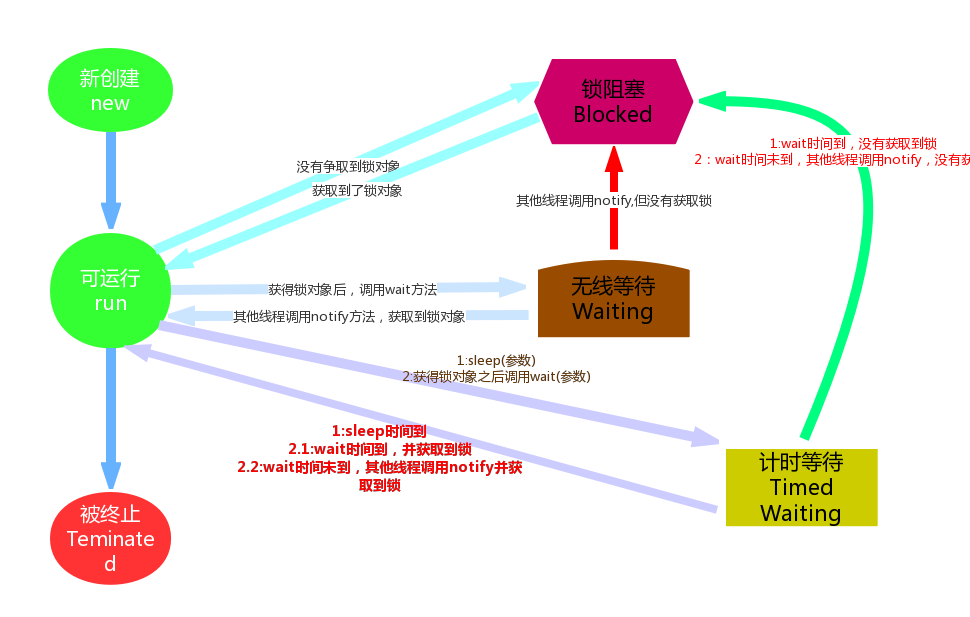

# day09【线程状态、等待与唤醒、Lambda表达式、Stream流】

## 今日内容

* 线程状态
  * 线程6种状态
  * 等待唤醒
* Lambda表达式
  * 面向接口编程
  * 使用格式
  * 使用形式
* Stream流   
  * 理解
  * 获取方式
  * 常用方法
  * 结果收集

## 教学目标 

- [ ] 能够说出线程6个状态的名称
- [ ] 能够理解等待唤醒案例
- [ ] 能够掌握Lambda表达式的标准格式与省略格式
- [ ] 能够通过集合、映射或数组方式获取流
- [ ] 能够掌握常用的流操作
- [ ] 能够将流中的内容收集到集合和数组中

# 第一章 线程状态

## 知识点--  线程状态

### 目标

- 能够说出线程6个状态的名称

### 路径

- 线程状态概述
- 演示睡眠方法
- 演示无限等待
- 演示等待和唤醒

### 讲解

#### 1.1.1线程状态概述

当线程被创建并启动以后，它既不是一启动就进入了执行状态，也不是一直处于执行状态。

在API中`java.lang.Thread.State`这个枚举中给出了六种线程状态：

| 线程状态                                | 导致状态发生条件                                             |
| --------------------------------------- | ------------------------------------------------------------ |
| 新建:NEW                                | 线程刚创建，并未启动(未调用start方法)。<br />MyThread t = new MyThread()只有线程对象，没有线程特征。 |
| 可运行:Runnable<br />线程就绪(经典教法) | 线程启动后(调用start方法)，具备执行资格，等待cpu提供执行权限<br />线程在java虚拟机，可能正在运行，也可能没有。 |
| 锁阻塞:Blocked                          | 线程试图获取对象锁，该对象锁被其他线程持有，该线程出于锁阻塞状态；<br />当该线程持有锁时，该线程将变成Runnable状态。 |
| 无限等待:Waiting                        | 一个线程等待另一个线程执行(唤醒)动作时，该线程出于无限等待状态，该状态不能自动唤醒。<br />当收到唤醒通知，该线程若获取锁将变成Runnable状态，未获取锁将进入锁阻塞。<br />常见功能:Object-wait() 、Object-notify()、Object-notifyAll() |
| 计时等待:Timed Waiting                  | 一个线程在指定时间内，等待另一个线程执行(唤醒)动作，该线程出于计时等待状态<br />当时间超时或收到唤醒通知，该线程若获取锁将变成Runnable状态，未获取锁将进入锁阻塞。<br />常见功能:Object-wait(long time)   Thread-sleep(long time) |
| Teminated(被终止)                       | 因为run方法正常退出而死亡，或者因为没有捕获的异常终止了run方法而死亡。 |



线程状态相关中的方法:

```
Thread类的计时等待方法.
		public static void  sleep(long time)  让当前线程进入到睡眠状态，到毫秒后自动醒来继续执行。
Object类的等待唤醒方法
		public void wait()  让当前线程进入到等待状态 此方法必须锁对象调用.
		public void notify()  唤醒当前锁对象上等待状态的线程  此方法必须锁对象调用.
```

#### 1.1.2演示睡眠方法

需求：通过测试类演示sleep方法的使用

//测试类

```java
public class Test {
    public static void main(String[] args) throws InterruptedException {
        System.out.println("睡上3秒钟...");
        Thread.sleep(3000);
        System.out.println("3秒钟到了...");
    }
}
```

> 这时我们发现主线程执行到sleep方法会休眠1秒后再继续执行。
>

#### 1.1.3演示无限等待

需求：通过测试类演示无限等待

//测试类代码

```java
public class Test {
    public static void main(String[] args) throws InterruptedException {
        Object lock = new Object();
        System.out.println("开始睡...");
        //注意:所谓的锁，一定是要放到同步操作里面的，被作为锁对象的内容，才是锁
        synchronized (lock){
            lock.wait();//java.lang.IllegalMonitorStateException
        }
        System.out.println("睡醒了...");
    }
}
```

#### 1.1.4演示等待和唤醒

需求：通过测试类创建两个线程演示等待唤醒

//主线程

```java
public class Test {
    public static void main(String[] args) throws InterruptedException {
        //需要确保先睡着，再去唤醒，所在在唤醒的线程中，需要唤醒的操作，一定要在等待状态发生之后。
        //又因为，当前线程执行了等待状态之后，就不会再向下执行，所以需要把唤醒的线程优先开启
        //同时，为了能够唤醒当前线程，执行唤醒操作的线程的锁与当前线程是锁，必须是同一把
        MyThread mt = new MyThread();
        mt.start();

        System.out.println("开始睡...");
        //注意:所谓的锁，一定是要放到同步操作里面的，被作为锁对象的内容，才是锁
        synchronized ( mt.lock){
            mt.lock.wait();//java.lang.IllegalMonitorStateException
        }
        System.out.println("睡醒了...");
    }
}

```

//子线程

~~~java
public class MyThread extends Thread {
    Object lock = new Object();

    @Override
    public void run() {
        try {
            System.out.println("3秒后唤醒线程");
            Thread.sleep(3000);
        } catch (InterruptedException e) {
            e.printStackTrace();
        }
        //唤醒主线程中的锁的等待状态
        synchronized (lock) {
            //唤醒操作
            lock.notify();
        }
    }
}
~~~


### 小结

```java

```

## 案例--  等待唤醒案例（包子铺卖包子）

### 需求:

利用等待唤醒机制，在多线程环境下，演示如何有效利用资源开展包子的生产和消费过程。

### 分析:


```java
包子类定义开关变量，标记包子的状态。
(无包子)包子铺线程生产包子，(有包子)吃货线程消费包子。
通过判断包子的状态，控制包子铺线程和吃货线程交替任务执行。

步骤:
包子类:包子状态为true,表示有包子，为false表示无包子。
吃货线程
    没包子时，包子状态为false，吃货线程进入等待(将执行权交给包子铺做包子)。
    有包子时，包子状态为true，吃货线程吃完包子，包子状态为false，唤醒包子铺线程
包子铺线程
    有包子时，包子状态为true，包子铺线程进入等待(将执行权交给吃货吃包子)。
    没包子时，包子状态为false，包子铺线程生产包子，包子状态为true，唤醒吃货线程。

```


### 实现:

//包子资源类代码

```java
public class BaoZi {
    private boolean flag;//如果为true 代表有包子，如果为false,代表没包子
    private String piEr;
    private String xianEr;
    public BaoZi() {
    }
    public BaoZi(String piEr, String xianEr) {
        this.piEr = piEr;
        this.xianEr = xianEr;
    }

    public boolean isFlag() {
        return flag;
    }

    public void setFlag(boolean flag) {
        this.flag = flag;
    }

    public String getPiEr() {
        return piEr;
    }

    public void setPiEr(String piEr) {
        this.piEr = piEr;
    }

    public String getXianEr() {
        return xianEr;
    }

    public void setXianEr(String xianEr) {
        this.xianEr = xianEr;
    }

    @Override
    public String toString() {
        return "BaoZi{" +
                "piEr='" + piEr + '\'' +
                ", xianEr='" + xianEr + '\'' +
                '}';
    }
}
```

//吃货线程类代码

```java
public class ChiHuo extends Thread {
    BaoZi bz;

    public ChiHuo(BaoZi bz) {
        this.bz = bz;
    }

    @Override
    public void run() {
       while (true){
           synchronized (bz) {
               if (bz.isFlag() == false) {//代表没有包子
                   try {
                       bz.wait();
                   } catch (InterruptedException e) {
                       e.printStackTrace();
                   }
               }
               //吃包子
               System.out.println("吃货线程开始吃包子...");
               System.out.println("包子:" + bz.toString());
               try {
                   Thread.sleep(3000);
               } catch (InterruptedException e) {
                   e.printStackTrace();
               }
               System.out.println("包子被吃完了...");
               bz.setFlag(false);
               bz.notify();
           }
       }
    }
}
```

//包子铺线程类代码

```java
public class BaoZiPu extends Thread {
    BaoZi bz;

    public BaoZiPu(BaoZi bz) {
        this.bz = bz;
    }

    @Override
    public void run() {
        int index = 0;
        while (true) {
            synchronized (bz) {
                // if (bz.isFlag()==true)
                if (bz.isFlag()) {
                    try {
                        bz.wait();
                    } catch (InterruptedException e) {
                        e.printStackTrace();
                    }
                }
                //做包子
                System.out.println("做包子中...");
                try {
                    Thread.sleep(3000);
                } catch (InterruptedException e) {
                    e.printStackTrace();
                }
                if (index % 2 == 0) {
                    bz.setPiEr("糯米皮");
                    bz.setXianEr("红豆馅");
                } else {
                    bz.setPiEr("玉米皮");
                    bz.setXianEr("肉馅");
                }
                index++;
                bz.setFlag(true);
                bz.notify();
            }
        }
    }
}

```

//测试类代码

```java
public class Test {
    public static void main(String[] args) {
        //创建包子对象
        BaoZi bz = new BaoZi();
        //创建包子铺线程，并启动
        new BaoZiPu(bz).start();//匿名对象
        //创建吃货线程，并启动
        new ChiHuo(bz).start();
    }
}
```

### 小结:

```

```

# 第二章  Lambda表达式

## 知识点-- Lambda表达式概述

### 目标

- 理解Lambda表达式的基本知识  

### 路径

- 引入
- 函数式编程思想
- 使用Lambda的前提
- 演示面向对象编程

### 讲解

#### 2.1.1引入 

它是一个JDK8开始一个新语法。它是一种“代替语法”。

Lambda表达式,替换以前的接口对象实现 ，本质是一个匿名内部类的简易实现。

#### 2.1.2编程思想

“面向对象”的编程思想:必须依靠对象,通过对象调用方法来完成功能

```
例如:在调用Thread()的构造方法：
1).先定义Runnable实现类；2).创建实现类对象；3).传入实现类对象；
```

函数式编程思想：在写法上要比较简洁，注重代码的实现过程。         

```
例如:在调用Thread()的构造方法
不需要定义实现类;不需要创建具体的子类对象;只需要传入一个“方法”即可。
```

#### 2.1.3演示"面向对象”编程

需求：通过Runnable做100次循环遍历，分别演示面向对象编程(自定义实现类、匿名内部类)与函数式编程。

//接口实现类代码

```java
public class MyRunnable implements Runnable {
    @Override
    public void run() {
        for (int i = 0; i < 100; i++) {
            System.out.println(Thread.currentThread().getName() + "第" + i + "次运行");
        }
    }
}

```

//测试类代码

```java
public class Test {
    public static void main(String[] args) {
        //自定义实现类
        // MyRunnable mr1 = new MyRunnable();
        // Thread t1 = new Thread(mr1, "线程1");
        // t1.start();
        //匿名内部类
        // Runnable mr2 = new Runnable() {
        //     @Override
        //     public void run() {
        //         for (int i = 0; i < 100; i++) {
        //             System.out.println(Thread.currentThread().getName() + "第" + i + "次运行");
        //         }
        //     }
        // };
        // Thread t2 = new Thread(mr2, "线程2");
        // t2.start();
        // 匿名内部类简化
        // Thread t3 = new Thread(new Runnable() {
        //     @Override
        //     public void run() {
        //         for (int i = 0; i < 100; i++) {
        //             System.out.println(Thread.currentThread().getName() + "第" + i + "次运行");
        //         }
        //     }
        // }, "线程3");
        // t3.start();
        // 函数式编程
        Thread t4 = new Thread(() -> {
            for (int i = 0; i < 100; i++) {
                System.out.println(Thread.currentThread().getName() + "第" + i + "次运行");
            }
        }, "线程4");
        t4.start();
    }
}
```

### 小结

```

```

## 知识点-- Lambda表达式标准格式

### 目标

- 掌握Lambda表达式的标准格式

### 路径

- 使用Lambda的前提
- Lambda的标准定义格式
- Lambda的格式应用场景
- 演示Lambda的标准格式应用

### 讲解

#### 2.2.1使用前提

必须具有接口，且要求接口中有且仅有一个抽象方法。

无论是JDK内置的Runnable、 Comparator接口还是自定义的接口，只有当接口中的抽象方法存在且唯一时，才可以使用Lambda。

注意: 有且仅有一个抽象方法的接口，称为**函数式接口**

@FunctionalInterface注解:检查一个接口是否是函数式接口

#### 2.2.2标准定义格式

格式：(参数类型 参数名)->{代码语句}

格式说明:

- ()内的语法与传统方法参数列表一致：无参数则留空，多个参数则用逗号分隔。
- `->`是新引入的语法格式，代表指向动作。
- {}内的语法与传统方法体要求基本一致。

#### 2.2.3应用方式

方式1“无参、无返回值”

方式2“有参、有返回值”

#### 2.2.4演示Lambda的标准格式

需求：通过Lambda的标准格式完成Collections中的自定义排序功能与Runnable接口的使用。

~~~java
ublic class Test {
    public static void main(String[] args) {
        // Collections中的自定义排序
        List<Integer> list = new ArrayList<>();
        list.add(3);
        list.add(1);
        list.add(2);
        System.out.println(list);
        //匿名内部类实现
        /*
        Collections.sort(list, new Comparator<Integer>() {
            @Override
            public int compare(Integer o1, Integer o2) {
                return o1 - o2;//升序
            }
        });
        */

        //Lambda表达式实现
        Collections.sort(list, (Integer o1, Integer o2) -> {
            return o1 - o2;
        });
        System.out.println(list);
        // Runnable接口的使用
        //匿名内部类
        /*
        Thread t =new Thread(new Runnable() {
            @Override
            public void run() {
                System.out.println("匿名内部类实现多线程");
            }
        });
        t.start();
        */
        //Lambda表达式实现
        Thread t = new Thread(()->{
            System.out.println("Lambda表达式实现多线程");
        });
        t.start();
    }
}
~~~

### 小结

```

```


## 知识点-- Lambda的省略格式

### 目标

- 掌握Lambda表达式的省略格式

### 路径

- Lambda的省略格式
- 演示Lambda的省略格式使用

### 讲解

#### 2.3.1Lambda的省略格式

格式说明:

1. 小括号内参数的类型可以省略；
2. 如果小括号内有且仅有一个参数，则小括号和参数类型可以一起省略；
3. 如果大括号内有且仅有一个语句，则可以同时省略一对大括号，语句后的分号，return关键字；

#### 2.3.2演示Lambda的省略格式

需求:在一个接口中定义一个对新闻消息的处理方法，在测试类中定义一个方法，接收一个消息集合与新闻接口的实现类对象。通过Lambda的省略格式完成上述需求。

//新闻接口

```
@FunctionalInterface
public interface NewInter {
    public String message(String message);
}

```

//新闻接口实现类

```
public class NewsInterImpl implements NewInter {
    @Override
    public String message(String message) {
        return message + "已被处理";
    }
}
```

//测试类代码

```java
public class Test {
    public static void main(String[] args) {
        String oldMessage = "我是一则老消息";
        //通过匿名内部类来实现
     /*
     getMessage(new MyInter() {
            @Override
            public String doMessage(String oldMessage) {
               *//* String newMessage = oldMessage + ":该消息已被处理";
                return newMessage;*//*
                return oldMessage + ":该消息已被处理";
            }
        }, oldMessage);
        */
        //Lambda表达式标准格式
        /*
        String newMessage = getMessage((String oldMessagee) -> {
            return (oldMessagee + ":该消息已被处理");
        }, oldMessage);
        System.out.println(newMessage);
        */
        //Lambda表达式省略格式
        String newMessage = getMessage(oldMessagee ->
                        (oldMessagee + ":该消息已被处理")
                , oldMessage);
        System.out.println(newMessage);
    }

    public static String getMessage(MyInter mi, String oldMessage) {
        String newMessage = mi.doMessage(oldMessage);
        return newMessage;
    }
}
```

### 小结

```

```

## 知识点-- Lambda的应用场景

### 目标

- 理解Lambda应用场景

### 路径

- Lambda的应用场景
- 演示Lambda的应用场景

### 讲解

#### 2.4Lambda的应用场景

用变量的形式

在调用方法时，作为“实参” 

作为方法的“返回值”

#### 2.4.2演示Lambda的应用场景

需求:使用Runnable接口演示Lambda的三种应用场景。

//测试类代码

```java
public class Test {
    public static void main(String[] args) {
        // 用变量的形式
        new Thread(new Runnable() {
            @Override
            public void run() {
                System.out.println("匿名内部类");
            }
        }).start();//匿名对象+匿名内部类
        Runnable r2 = () -> {
            System.out.println("Lambda表达式1");
        };
        new Thread(r2).start();//匿名对象+Lambda
        // 在调用方法时，作为“实参”
        startThread(() -> {
            System.out.println("Lambda表达式2");
        });
        // 作为方法的“返回值”应用方式
       Runnable r3 = getRunnable();
       new Thread(r3).start();
    }

    public static void startThread(Runnable r) {
        new Thread(r).start();
    }

    public static Runnable getRunnable() {
        /*
        Runnable r = () -> {
            System.out.println("Lambda表达式1");
        };
        return r;*/
        return () -> {
            System.out.println("Lambda表达式3");
        };
    }
}

```

### 小结

```java

```

# 第三章 Stream

## 知识点-- Stream引入

### 目标

- 理解Stream流的作用

### 路径

- 引言
- 演示集合数据筛选过滤案例

### 讲解

#### 3.1.1引言

`java.util.stream.Stream<T>`是Java 8新加入的最常用的流接口。（不是函数式接口）

JDK8中为了支持Lambda，制作了一些应用—Stream就是一个典型的应用。

Stream流：是一个接口，功能类似于迭代器，但更强大，可以对数据进行过滤、筛选、汇总等操作。

#### 3.1.2演示集合数据筛选过滤案例

需求：使用集合与Stream流中的方法完成下列需求

```java
1.定义一个集合，存储若干姓名 
2.将List集合中姓张的的元素过滤到一个新的集合中
3.然后将过滤出来的姓张的元素中过滤出长度为3的元素,存储到一个新的集合中
```

//测试类代码

```java
public class Test {
    public static void main(String[] args) {
        // 定义一个集合，存储若干姓名
        List<String> list = new ArrayList<>();
        list.add("张三");
        list.add("李四");
        list.add("王五");
        list.add("赵六");
        list.add("孙七");
        list.add("周八");
        list.add("张三丰");
        //使用集合普通方式来完成
        /*
        // 将List集合中姓张的的元素过滤到一个新的集合中
        List<String> list1 = new ArrayList<>();
        for (String name : list) {
            if (name.startsWith("张")) {
                list1.add(name);
            }
        }
        // 然后将过滤出来的姓张的元素中过滤出长度为3的元素,存储到一个新的集合中
        List<String> list2 = new ArrayList<>();
        for (String name : list1) {
            if (name.length() == 3) {
                list2.add(name);
            }
        }
        //展示结果
        for (String name : list2) {
            System.out.println(name);
        }
        */
        //使用Stream方式来完成
        // 将List集合中姓张的的元素过滤到一个新的集合中
        // 然后将过滤出来的姓张的元素中过滤出长度为3的元素,存储到一个新的集合中
        Stream<String> stream = list.stream();
        stream.filter((name) -> name.startsWith("张")).filter((name) -> name.length() == 3).forEach((name) ->
                System.out.println(name)
        );
    }
}
```

直接阅读代码的字面意思即可完美展示无关逻辑方式的语义：**获取流、过滤姓张、过滤长度为3、逐一打印**。

代码中并没有体现使用线性循环或是其他任何算法进行遍历，我们真正要做的事情内容被更好地体现在代码中。

### 小结

```

```

## 知识点-- 流式思想

### 目标

- 理解Stream中的流式思想的特点

### 路径

- 流式思想概述
- Stream流的特点

### 讲解

#### 3.2.1流式思想概述

Stream流，类似于车间的流水线，每次操作流，都可以将结果发送给下一个操作。


当需要对多个元素进行操作（特别是多步操作）的时候，考虑到性能及便利性，我们应该首先拼好一个“模型”步骤方案，然后再使用它。


这张图中展示了过滤、映射、跳过、计数等多步操作，这是一种集合元素的处理方案，而方案就是一种“函数模型”。图中的每一个方框都是一个“流”，调用指定的方法，可以从一个流模型转换为另一个流模型。而最右侧的数字3是最终结果。

这里的`filter`、`map`、`skip`都是在对函数模型进行操作，集合元素并没有真正被处理。只有当终结方法`count`执行的时候，整个模型才会按照指定策略执行操作。而这得益于Lambda的延迟执行特性。

#### 3.2.2Stream流的特点

- Stream流是**一次性**的,不能重复使用，当执行流的某个方法，这个流将将失效，并将结果存储到**新流**中。
- Stream流不会存储数据
- Stream流不会修改数据源
- Stream流搭建的函数模型，只有终结方法存在,前面的延迟性方法才会执行。
  - 终结方法: Stream流中返回值类型不是Stream方法
  - 延迟方法: Stream流中返回值类型是Stream方法

### 小结

```

```


## 知识点-- 获取Stream流

### 目标

- 掌握获取Stream流的方式

### 路径

- 演示根据Collection获取流
- 演示根据Map获取流
- 演示根据数组获取流

### 讲解

#### 3.3.1获取方式

- `java.util.Collection`接口中加入了default方法`stream`用来获取流，所以其所有实现类均可获取流。
- `java.util.Map`接口不是`Collection`的子接口，且K-V数据结构不符合流元素的单一特征，需分别根据其键和值的集合获取流对象。
- 数组对象没有方法，所以`Stream`接口中提供了静态方法`of`获取数组对应的流。

#### 3.3.2演示获取流的3种情况

需求：分别获取Collection、Map及数组的Stream流对象

//测试类代码

```java
public class Test {
    public static void main(String[] args) {
        //获取单列集合的Stream流
        ArrayList<String> list = new ArrayList<>();
        Stream<String> stream1 = list.stream();
        //获取双列集合的Stream流
        HashMap<String, String> hm = new HashMap<>();
        //获取双列集合的键的Stream流
        Set<String> keys = hm.keySet();
        Stream<String> stream2 = keys.stream();
        //获取双列集合的值的Stream流
        Collection<String> values = hm.values();
        Stream<String> stream3 = values.stream();
        //获取数组的Stream流

        Stream<Integer> Stream4 = Stream.of(1, 2, 3);

        int[] arr = {1, 2, 3};
        Stream<int[]> Stream5 = Stream.of(arr);


    }
}
```

> 备注：`of`方法的参数其实是一个可变参数，所以支持数组。

### 小结

```

```

## 知识点-- Stream流常用功能

### 目标

- 能够掌握常用的流操作

### 路径

- 概述
- 常用方法介绍
- 演示常用功能

### 讲解

#### 3.4.1概述

流模型的操作很丰富，这里介绍一些常用的API，这些方法可以被分成两种：

- **终结方法**：返回值类型不再是`Stream`接口的方法，支持链式调用。
- **非终结方法**(函数拼接方法)：返回值类型仍然是`Stream`接口的方法，不支持链式调用。

#### 3.4.2常用方法

```java
方法名 	作用		分类	链式调用	详解
count	统计个数	终结		否	 long count(); 
											返回流中的元素个数。
forEach	逐一处理	终结		否	 void forEach(Consumer<? super T> action); 
											对此流的每个元素进行操作
filter	过滤		非终结		是	  Stream<T> filter(Predicate<? super T> predicate); 
											返回经过筛选，满足的条件的元素组成的流
limit	取前n个	非终结		是	 Stream<T> limit(long maxSize);
											返回由此流(包含)第maxSize个之前的元素组成的流
skip	跳过前n    非终结		是	 Stream<T> skip(long n);
											返回由此流(不含)第n个之后元素组成的流
map		映射		非终结		是	  <R> Stream<R> map(Function<? super T, ? extends R> mapper);
											返回流中旧元素经指定规则转换后的心元素组成的流
concat	组合		非终结		是	  static <T> Stream<T> concat(Stream<? extends T> a, Stream<? extends T> b)
                            				返回将两个流中的元素合并到一其组成的流
```

> 备注：本小节之外的更多方法，请自行参考API文档。

#### 3.4.3演示常用功能

需求:演示 Stream流常用功能

//测试类代码

```java
public class Test {
    public static void main(String[] args) {
        //通过Stream流的of方法，将一组数据添加的Stream流对象
        Stream<Integer> stream1 = Stream.of(1, 2, 3);
        // long count()
        System.out.println(stream1.count());
        System.out.println("--------");
        // void forEach(Consumer<? super T> action)
        //stream has already been operated upon or closed
        //因为一个流对象，只能使用1次，在上已经使用流对象获取了该流中数据的个数
        /*
        stream1.forEach((Integer i)->{
            System.out.println(i);
        });*/
        Stream<Integer> stream2 = Stream.of(1, 2, 3);
        stream2.forEach((Integer i) -> {
            System.out.println(i);
        });
        System.out.println("--------");
        // Stream<T> filter(Predicate<? super T> predicate)
        Stream<Integer> stream3 = Stream.of(1, 2, 3);
        Stream<Integer> stream4 = stream3.filter((Integer i) -> {
            return i >= 1;
        });
        System.out.println(stream4.count());
        System.out.println("--------");
        // Stream<T> limit(long maxSize)
        Stream<Integer> stream5 = Stream.of(1, 2, 3);
        stream5.limit(2).forEach((Integer i) -> {
            System.out.println(i);
        });
        System.out.println("--------");
        // Stream<T> skip(long n)
        Stream<Integer> stream6 = Stream.of(1, 2, 3);
        stream6.skip(1).forEach((Integer i) -> {
            System.out.println(i);
        });
        System.out.println("--------");
        // <R> Stream<R> map(Function  mapper)
        Stream<Integer> stream7 = Stream.of(1, 2, 3);
        stream7.map((Integer i) -> { return i * 10; }).forEach((Integer i) -> {
            System.out.println(i);
        });
        System.out.println("--------");
        //    static <T> Stream<T> concat(Stream  a, Stream  b)
        Stream<Integer> stream8 = Stream.of(1, 2, 3);
        Stream<Integer> stream9 = Stream.of(4, 5, 6);
        Stream.concat(stream8, stream9).forEach((Integer i) -> {
            System.out.println(i);
        });
    }
}

```

#### 小结

```

```

## 案例--Stream案例

需求：使用集合与Stream流两种方式，利用循环，实现如下需求

```
0. 定义两个ArrayList集合，代表两个队伍，存储多个姓名，依次进行以下操作
1. 第一个队伍只要名字为3个字的成员姓名；
2. 第一个队伍筛选之后只要前2个人；
3. 第二个队伍只要姓张的成员姓名；
4. 第二个队伍筛选之后不要前2个人；
5. 将两个队伍合并为一个队伍；
6. 根据姓名创建`Person`对象并存储到集合；
7. 打印整个队伍的Person对象信息。
```

### 分析：

根据集合与Stream流的特性实现该功能

### 实现

//Person类代码

~~~java
public class Person {
    String name;

    public Person(String name) {
        this.name = name;
    }

    @Override
    public String toString() {
        return "Person{" +
                "name='" + name + '\'' +
                '}';
    }
}
~~~

//测试类

```java
public class Test {
    public static void main(String[] args) {
        //0. 定义两个ArrayList集合，代表两个队伍，存储多个姓名，依次进行以下操作
        List<String> listOne = new ArrayList<>();
        listOne.add("迪丽热巴");
        listOne.add("宋远桥");
        listOne.add("苏星河");
        listOne.add("老子");
        listOne.add("庄子");
        listOne.add("孙子");
        listOne.add("洪七公");
        List<String> listTwo = new ArrayList<>();
        listTwo.add("古力娜扎");
        listTwo.add("张无忌");
        listTwo.add("张三丰");
        listTwo.add("赵丽颖");
        listTwo.add("张二狗");
        listTwo.add("张天爱");
        listTwo.add("张三");
        // 第一个队伍只要名字为3个字的成员姓名；
        // 第一个队伍筛选之后只要前2个人；
        Stream<String> streamOne = listOne.stream().filter((String name) -> {
            return name.length() == 3;
        }).limit(2);
        // 第二个队伍只要姓张的成员姓名；
        // 第二个队伍筛选之后不要前2个人；
        Stream<String> streamTwo = listTwo.stream().filter((String name) -> {
            return name.startsWith("张");
        }).skip(2);
        // 将两个队伍合并为一个队伍；
        Stream<String> streamAll = Stream.concat(streamOne, streamTwo);
        // 根据姓名创建Person对象并存储到集合；
        // 打印整个队伍的Person对象信息。
        streamAll.map((String name)->{return  new Person(name);}).forEach((Person p)->{
            System.out.println(p);
        });
        /*
        // 第一个队伍只要名字为3个字的成员姓名；
        List<String> listOneA = new ArrayList<>();
        for (String name : listOne) {
            if (name.length() == 3) {
                listOneA.add(name);
            }
        }
        // 第一个队伍筛选之后只要前2个人；
        List<String> listOneB = new ArrayList<>();
        for (int i = 0; i < listOneA.size(); i++) {
            if (i < 2) {
                String name = listOneA.get(i);
                listOneB.add(name);
            }
        }
        // 第二个队伍只要姓张的成员姓名；
        List<String> listTwoA = new ArrayList<>();
        for (String name : listTwo) {
            if (name.startsWith("张")) {
                listTwoA.add(name);
            }
        }
        // 第二个队伍筛选之后不要前2个人；
        List<String> listTwoB = new ArrayList<>();
        for (int i = 0; i < listTwoA.size(); i++) {
            if (i >= 2) {
                String name = listTwoA.get(i);
                listTwoB.add(name);
            }
        }
        // 将两个队伍合并为一个队伍；
        List<String> listAll = new ArrayList<>();
        for (String name : listOneB) {
            listAll.add(name);
        }
        for (String name : listTwoB) {
            listAll.add(name);
        }
        // 根据姓名创建Person对象并存储到集合；
        List<Person> listAllPerson = new ArrayList<>();
        for (String name : listAll) {
            Person p = new Person(name);
            listAllPerson.add(p);
        }
        // 打印整个队伍的Person对象信息。
        for (Person p : listAllPerson) {
            System.out.println(p);
        }
        */
    }
}
```

## 知识点-- 收集Stream流结果

### 目标

- 能够掌握收集Stream结果

### 路径

- 概述
- 演示常用功能

### 讲解

#### 3.5.1 概述

对流操作完成之后，如果需要将其结果进行收集，例如获取对应的集合、数组等，如何操作？

```
方法名 	作用   		  分类   链式调用	详解
collect  收集结果到集合中	终结	 否		R collect(Collector<T,A, R> coll)：转换为指定的集合，R代表最终转为的集合的具体类型
toArray	 收集结果到数组中	终结	 否		Object[] toArray()：转换为Object数组
```

`java.util.stream.Collectors`类提供一些方法，可以作为`Collector`接口的实例。

```
public static <T> Collector<T, ?, List<T>> toList()：转换为List集合。
public static <T> Collector<T, ?, Set<T>> toSet()：转换为Set集合。
```


#### 3.5.2演示收集Stream结果

需求：演示将流中的数据转换到集合与数组中

//测试类代码

```java
public class Test {
    public static void main(String[] args) {
        //将数据收集到集合中
        //收集到List集合
        Stream<Integer> stream = Stream.of(1, 2, 3);
        List<Integer> list = stream.collect(Collectors.toList());
        System.out.println(list);
        //收集到Set集合
        Stream<Integer> stream2 = Stream.of(1, 2, 3);
        Set<Integer> set = stream2.collect(Collectors.toSet());
        System.out.println(set);
        //将数据收集到数组
        Stream<Integer> stream3 = Stream.of(1, 2, 3);
        Object[] objects = stream3.toArray();
        System.out.println(Arrays.toString(objects));
        //将数据收集到数组
        int[] arr = {1, 2, 3};
        Stream<int[]> stream4 = Stream.of(arr);
        Object[] objects1 = stream4.toArray();
        // Object[] objects1 ={arr};
        System.out.println(Arrays.toString(objects1));
    }
}
```

### 小结

```java

```

