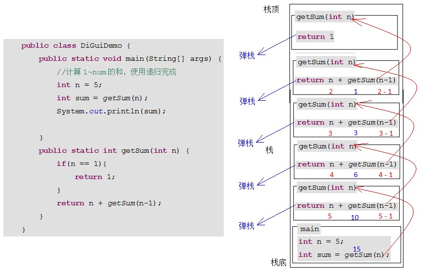

# day10【File类、递归、IO流、字节流、字符流】

## 今日内容

- File类
  - 构造方法
  - 常用方法
  - 目录遍历
- 递归
  - 求和
  - 求阶乘
  - 文件搜索
- IO流概述
  - 理解
  - 分类
  - 体系结构
- 字节流
  - 输入
  - 输出
- 字符流
  - 输入
  - 输出

## 教学目标  

- [ ] 能够说出File对象的创建方式

- [ ] 能够使用File类常用方法

- [ ] 能够辨别相对路径和绝对路径

- [ ] 能够遍历文件夹

- [ ] 能够解释递归的含义

- [ ] 能够使用递归的方式计算5的阶乘

- [ ] 能够说出使用递归会内存溢出隐患的原因

- [ ] 能够说出IO流的分类和功能

- [ ] 能够使用字节输出流写出数据到文件

- [ ] 能够使用字节输入流读取数据到程序

- [ ] 能够理解读取数据read(byte[])方法的原理

- [ ] 能够使用字节流完成文件的复制

- [ ] 能够使用FileWriter写数据的5个方法

- [ ] 能够说出FileWriter中关闭和刷新方法的区别

- [ ] 能够使用FileWriter写数据实现换行和追加写
- [ ] 能够使用FileReader读数据一次一个字符

- [ ] 能够使用FileReader读数据一次一个字符数组


# 第一章 File类

## 知识点-- 构造方法

### 目标

- 能够说出File对象的创建方式

### 路径

- 概述
- 构造方法
- 演示构造方法的使用
- 路径的分类
- 演示绝对路径和相对路径

### 讲解

#### 1.1.1概述

java.io.File 类是文件和目录路径名的抽象表示，主要用于文件和目录的创建、查找和删除等操作。

常用构造方法

public File(String pathname)  ：通过将给定的**路径名字符串**转换为抽象路径名来创建新的 File实例。  

public File(String parent, String child)  ：从**父路径名字符串和子路径名字符串**创建新的 File实例。

public File(File parent, String child) ：从**父抽象路径名和子路径名字符串**创建新的 File实例。  

#### 1.1.2演示构造方法的使用

需求：演示三种构造方法表示D盘aaa目录下的a.txt文件

//测试类代码

```java
public class Test {
    public static void main(String[] args) {
        // public File(String pathname)
        File f1 = new File("D:\\temp");//\是转义字符
        System.out.println(f1);
        // public File(String parent, String child)
        String  f2="D:\\";
        File f3 = new File(f2, "temp");
        System.out.println(f3);
        // public File(File parent, String child)
        File f4 = new File("D:\\");
        File f5 = new File(f4, "temp");
        System.out.println(f5);
    }
}
```

> 小贴士：
>
> 1. 一个File对象代表硬盘中实际存在的一个文件或者目录。
> 2. 无论该路径下是否存在文件或者目录，都不影响File对象的创建。

#### 1.1.3路径的分类

- **绝对路径**：从盘符开始的路径，这是一个完整的路径。
- **相对路径**：相对于项目目录的路径，这是一个便捷的路径，开发中经常使用。

#### 1.1.4演示绝对路径和相对路径

需求：演示相对路径和绝对路径表示当前模块下的a.txt文件

//测试类代码

```java
public class Test {
    public static void main(String[] args) {
        //项目路径:E:\2.dataforteach\code\javase2code
        // 绝对路径
        String path = "E:\\2.dataforteach\\code\\javase2code\\day10_01File\\a.txt";
        File file1 = new File(path);
        System.out.println(file1);
        //相对路径
        String path2 = "day10_01File\\a.txt";
        File file2 = new File(path2);
        System.out.println(file2.getAbsolutePath());//获取完整路径
    }
}

```

### 小结

```

```

## 知识点-- 常用方法

### 目标

- 能够使用File类常用方法

### 路径

- 常用方法介绍
- 演示File类中的方法

### 讲解

#### 1.2.1 常用方法介绍

创建功能

~~~java
public boolean createNewFile() ：当且仅当具有该名称的文件尚不存在时，创建一个新的空文件，该文件的父级目录需要先存在。
public boolean mkdir() ：创建由此File表示的目录，该目录的父级目录需要先存在。
public boolean mkdirs() ：创建由此File表示的目录，包括任何必需但不存在的父目录。
~~~

获取功能

```java
public String getAbsolutePath()  ：返回此File的绝对路径名字符串。
public String getPath()  	：将此File转换为路径名字符串。 
public String getName()  	：返回由此File表示的文件或目录的名称。  
public long length()  		：返回由此File表示的文件的长度。 
```

判断功能

~~~java
public boolean exists() ：此File表示的文件或目录是否实际存在。
public boolean isDirectory() ：此File表示的是否为目录。
public boolean isFile() ：此File表示的是否为文件。
~~~

删除功能

```java
public boolean delete() ：删除由此File表示的文件或目录。  
```

#### 1.2.2演示File类中的方法

需求：演示相对路径，演示File类中的方法。

//测试类代码

```java
public class Test {
    public static void main(String[] args) throws IOException {
        //相对路径  项目\\day10_01File\\aaa\\a.txt
        //相对路径  项目\\day10_01File\\aaa
        //相对路径  项目\\day10_01File\\aaa\\bbb\\ccc

        // 创建功能
        // public boolean createNewFile()
        File f1 = new File("day10_01File\\aaa\\a.txt");
        System.out.println(f1.createNewFile());//系统找不到指定的路径
        // public boolean mkdir()
        File f2 = new File("day10_01File\\aaa");
        System.out.println(f2.mkdir());
        // public boolean mkdirs()
        File f3 = new File("day10_01File\\aaa\\bbb\\ccc");
        System.out.println(f3.mkdirs());
        System.out.println("--------");
        // 获取功能
        // public String getAbsolutePath()
        System.out.println(f1.getAbsolutePath());
        System.out.println(f2.getAbsolutePath());
        System.out.println(f3.getAbsolutePath());
        // public String getPath()
        System.out.println(f1.getPath());
        System.out.println(f2.getPath());
        System.out.println(f3.getPath());
        // public String getName()
        System.out.println(f1.getName());
        System.out.println(f2.getName());
        System.out.println(f3.getName());
        // public long length()
        System.out.println(f1.length());
        System.out.println(f2.length());
        System.out.println(f3.length());
        // 判断功能
        // public boolean exists()
        System.out.println(f1.exists());
        System.out.println(f2.exists());
        System.out.println(f3.exists());
        File f4 = new File("mmm");
        System.out.println(f4.exists());
        // public boolean isDirectory()
        System.out.println(f1.isDirectory());
        System.out.println(f2.isDirectory());
        System.out.println(f3.isDirectory());
        // public boolean isFile()
        System.out.println(f1.isFile());
        System.out.println(f2.isFile());
        System.out.println(f3.isFile());
        // public boolean delete()
        System.out.println(f1.delete());//true
        System.out.println(f2.delete());//false  想要删除某个文件夹，必须把文件夹下面的内容都删除
        System.out.println(f3.delete());//true
        File f5 = new File("mmm");
        System.out.println(f5.delete());//false
    }
}
```

> API中说明：length()，表示文件的长度。但是File对象表示目录，则返回值未指定。

> API中说明：delete()方法，如果此File表示目录，则目录必须为空才能删除。

### 小结

```java

```

## 知识点-- 目录的遍历

### 目标

- 能够遍历文件夹

### 路径

- 方法介绍

- 演示目录的便利

### 讲解

#### 1.3.1方法介绍

- public String[] list() ：返回一个String数组，表示该File目录中的所有子文件或目录。
- public File[] listFiles() ：返回一个File数组，表示该File目录中的所有的子文件或目录。  

#### 1.3.2演示目录的遍历

需求：演示获取D盘下所有文件和目录

//测试类代码

```java
public class Test {
    public static void main(String[] args) {
        File f = new File("D:\\");
        // public String[] list()
        String[] list = f.list();
        System.out.println(Arrays.toString(list));
        // public File[] listFiles()
        File[] files = f.listFiles();
        System.out.println(Arrays.toString(files));
    }
}

```

> 小贴士：
>
> 调用listFiles方法的File对象，表示的必须是实际存在的目录，否则返回null，无法进行遍历。

### 小结

```

```


# 第二章 递归

## 知识点-- 递归

### 目标

- 能够解释递归的含义

### 路径

- 概述
- 演示递归基本实现
- 演示递归累计求和
- 分析递归累计求和
- 演示递归求阶乘
- 演示文件搜索

### 讲解

#### 2.1概述

**递归**：指在当前方法内调用自己的这种现象。

- 出口：递归的结束条件，确定什么时候结束递归。
- 规律：确定什么时候进行递归调用。

递归格式

```java
public static void 方法名(形参){
    方法名(实参);
}
```

#### 2.2演示递归基本实现

需求：控制一个方法重复执行1000次

//测试类代码

```java
public class Test {
    public static void main(String[] args) {
        method(1000);
    }

    public static void method(int count) {
        System.out.println("第"+count+"次执行");
        if (count == 0) {
            return;
        }
        count--;
        method(count);
    }
}

```

#### 2.3演示递归累计求和

需求：计算1 ~ n的和

分析：num的累和 = num + (num-1)的累和，所以可以把累和的操作定义成一个方法，递归调用。

//测试类代码

```java
public class Test {
    public static void main(String[] args) {
        int sum = getSum(5);
        System.out.println(sum);
    }

    public static int getSum(int n) {
        // getSum(n-1) 1~(n-1)的总和
        //1~(n-1)的总和  +   n  就是1~n的总和

        // 出口: n=1   和就是1本身
        if (n == 1) {
            return 1;
        }
        return n + getSum(n - 1);
    }
}

```

#### 2.4分析递归累计求和



> 小贴士：递归一定要有条件限定，保证递归能够停止下来，次数不要太多，否则会发生栈内存溢出。

#### 2.5演示递归求阶乘

需求:使用递归实现5的阶乘运算。

~~~java
阶乘：所有小于及等于该数的正整数的积。
     n的阶乘：n! = n * (n-1) *...* 3 * 2 * 1 
理解：这与累加求和类似,只不过换成了乘法运算，同学们可以自己练习，需要注意阶乘值符合int类型的范围。
     推理得出：n! = n * (n-1)!
~~~

//测试类代码

```java
public class Test {
    public static void main(String[] args) {
        int multiply = getMultiply(5);
        System.out.println(multiply);
    }

    public static int getMultiply(int n) {
        if (n == 1) {
            return 1;
        }
        return n * getMultiply(n - 1);
    }
}
```

#### 2.6 演示文件搜索

需求：使用递归搜索指定目录中的.java 文件。

分析：

```
规律:
    遇到目录，递归调用
    遇到(满足条件的)文件，直接打印
出口:
    遇到(满足条件的)文件，直接打印
```

//测试类代码

```java
public class Test {
    public static void main(String[] args) {
        // File f = new File(".");
        File f = new File("E:\\1.forteach\\javase2_113code");
        showJavaFile(f);
    }

    public static void showJavaFile(File file) {

        // 判断当前路径对应的实体是否是目录
        if (file.isDirectory()) {
            // 打印展示的目录
            System.out.println("当前操作的目录:" + file.getAbsolutePath());
            //         如果是目录，获取目录下所有的文件和目录
            File[] files = file.listFiles();
            //         遍历所有的文件和目录
            for (File f1 : files) {// 所有的文件和目录File对象
                //             如果当前路径是一个目录，则利用递归展示该目录下的内容
                if (f1.isDirectory()) {
                    showJavaFile(f1);
                    //         判断如果当前路径是一个文件,且以.java作为后缀名，则打印该文件名
                } else if (f1.isFile()) {
                    String name = f1.getName();
                    if (name.endsWith(".java")) {
                        System.out.println(name);
                    }
                }
            }
        } else {
            System.out.println("您当前要操作的不是目录，是一个文件");
        }
    }
}

```

### 小结

```

```

# 第三章 IO流

## 知识点-- IO流概述

### 目标

- 能够说出IO流的分类和作用

### 路径

- 什么是IO流
- IO流的分类
- IO流的流向说明图解
- 顶级父类们

### 讲解

#### 3.1.1什么是IO流

生活中，你肯定经历过这样的场景。当你编辑一个文本文件，忘记了ctrl+s ，可能文件就白白编辑了。

当你电脑上插入一个U盘，把一个视频，拷贝到你的电脑硬盘里。那么数据都是在哪些设备上的呢？键盘、内存、硬盘、外接设备等等。

```java
把视屏从优盘拷贝到电脑，我们把这种数据的传输，看做是一种数据的流动。
按照流动的方向，以内存为基准，分为输入input 和输出output 。
即流向内存是输入流，流出内存的输出流。
```

#### 3.1.2IO的分类

Java中I/O操作主要是指使用java.io包下的内容，进行输入、输出操作。**输入**也叫做**读取**数据，**输出**也叫做作**写出**数据。

根据数据的流向分为：**输入流**和**输出流**。

- **输入流** ：把数据从其他设备上读取到内存中的流。 
- **输出流** ：把数据从内存 中写出到其他设备上的流。

根据数据的类型分为：**字节流**和**字符流**。

- **字节流** ：以字节为单位，读写数据的流。
- **字符流** ：以字符为单位，读写数据的流。

#### 3.1.3IO的流向说明图解


#### 3.1.4顶层父类们

```
字节流: 字节输入流(InputStream)   字节输出流(OutputStream) 
字符流：字符输入流(Reader)        字符输出流(Writer) 
```

### 小结

```java

```

## 知识点-- 字节流概述

### 目标

- 理解什么是字节流

### 路径

- 一切皆为字节
- 分类

### 讲解

#### 3.2.1一切皆为字节

一切文件数据(文本、图片、视频等)存储时，都是以一个个字节(二进制)形式保存，传输时也一样
字节流可以传输任意文件数据
无论使用什么样的流对象，底层传输的始终为二进制数据

#### 3.2.2分类

字节输入流:以字节的形式从硬盘读取到内存中。读取的目的是为了拿到数据做某种事情，处理完这些数据将从内存消失。

字节输出流:以字节的形式从内存写出到硬盘中。输出的目的是为了将数据持久保存，处理完这些数据将持久的被存储。

## 知识点-- 字节输出流

### 目标

- 掌握字节输入流的读操作

### 路径

- 字节输出流介绍
- 演示字节输出流的基本使用
- 数据追加续写
- 演示数据追加续写
- 写出换行
- 演示写出换行

### 讲解

#### 3.3.1 字节输出流介绍

java.io.OutputStream 抽象类表示字节输出流所有类的超类,规定了字节信息写到目的地的共性方法。

java.io.FileOutputStream 文件输出流，字节输出流常用子类，用于将数据写出到文件。

构造方法:

```
public FileOutputStream(File file)：创建文件输出流以写入由指定的 File对象表示的文件。 
public FileOutputStream(String name)： 创建文件输出流以指定的名称写入文件。  
```

> 创建一个输出流对象时，指定的路径下，如果没有这个文件，会创建该文件，有这个文件，会清空这个文件的数据。
>

常用方法

```java
public void close()：关闭此输出流并释放与此流相关联的任何系统资源。  
public void flush()：刷新此输出流并强制任何缓冲的输出字节被写出。  
public void write(int b)：将指定的字节写入此输出流。
public void write(byte[] b)：将 b.length字节从指定的字节数组写入此输出流。  
public void write(byte[] b, int off, int len)：从指定字节数组,按照偏移量写入len个字节
```

> 小贴士：close方法，当完成流的操作时，必须调用此方法，释放系统资源。
>

#### 3.3.2演示字节输出流的基本使用

需求：演示字节输出流的基本使用。

//测试类代码

```java
public class Test {
    public static void main(String[] args) throws IOException {
        //public FileOutputStream(File file)
        //绝对路径
        // File f1=new File("E:\\1.forteach\\javase2_113code\\day10_03IO流\\a1.txt");
        //相对路径
        File f1 = new File("day10_03IO流\\a1.txt");
        FileOutputStream fos1 = new FileOutputStream(f1);
        // public FileOutputStream(String name)
        // String f1 ="E:\\1.forteach\\javase2_113code\\day10_03IO流\\a1.txt";
        // String f1 ="day10_03IO流\\a1.txt";
        // FileOutputStream fos1 = new FileOutputStream(f1);
        // public void write(int b)
        fos1.write(97);
        // public void write(byte[] b)
        byte[] bys = {98, 99, 100, 101};
        fos1.write(bys);
        // public void write(byte[] b, int off, int len)
        byte[] bys2 = {102, 103, 104, 105};
        fos1.write(bys2, 0, 2);//包左不包右
        // public void flush()
        // fos1.flush();
        // public void close()
        fos1.close();//关闭并刷新
    }
}
```

#### 3.3.3数据追加续写

追加续写:创建输出流对象，之前数据会被清空。想要保留目标文件中原来的数据，需要使用特定的构造方法。

构造方法:

```
public FileOutputStream(File file, boolean append)： 创建文件输出流以写入由指定的 File对象表示的文件。  
public FileOutputStream(String name, boolean append)： 创建文件输出流以指定的名称写入文件。  
append的值，true 表示追加数据，false 表示清空原有数据。
```

#### 3.3.4演示数据追加续写

需求：在已经存在ab的文件中，补充写入cde

//测试类代码

```java
public class Test {
    public static void main(String[] args) throws IOException {
        File f1 = new File("day10_03IO流\\a2.txt");
        FileOutputStream fos1 = new FileOutputStream(f1);
        byte[] bys1 = {97, 98};
        fos1.write(bys1);
        fos1.close();
        // public FileOutputStream(File file, boolean append)
        // File f2 = new File("day10_03IO流\\a2.txt");
        // FileOutputStream fos2 = new FileOutputStream(f1);//没有设置追加写入，原数据会被清空
        // FileOutputStream fos2 = new FileOutputStream(f1,true);
        // public FileOutputStream(String name, boolean append)
        String f2 = "day10_03IO流\\a2.txt";
        FileOutputStream fos2 = new FileOutputStream(f2, true);
        byte[] bys2 = {99, 100, 101};
        fos2.write(bys2);
        fos2.close();
    }
}
```

#### 3.3.5写出换行

换行:在指定数据之后换行，可以按照如下方式操作

```
回车符\r和换行符\n ：
      回车符：回到一行的开头（return）。
      换行符：下一行（newline）。
系统中的换行：
      Windows系统里，每行结尾是 回车+换行 ，即\r\n；
      Unix系统里，每行结尾只有 换行 ，即\n；
      Mac系统里，每行结尾是 回车 ，即\r。从 Mac OS X开始与Linux统一。
```

#### 3.3.6演示写出换行

需求:将abcde中每个字符单独写一行

//测试类代码

```java
public class Test {
    public static void main(String[] args) throws IOException {
        FileOutputStream fos = new FileOutputStream("day10_03IO流\\a3.txt");
        byte[] bys = "\r\n".getBytes();
        fos.write(97);
        fos.write(bys);
        fos.write(98);
        fos.write(bys);
        fos.write(99);
        fos.close();
    }
}
```

## 知识点-- 字节输入流

### 目标

- 掌握字节输出流的写操作

### 路径

- 字节输入流介绍
- 演示字节输入流的基本使用

### 讲解

#### 3.4.1 字节输入流介绍

java.io.InputStream抽象类表示字节输入流所有类的超类，规定了读取字节信息到内存的共性方法。

java.io.FileInputStream 文件输入流，字节输入流常用子类，将数据读取到内存中。

构造方法:

```
FileInputStream(File file)：创建文件输入流以读取，由指定的File对象表示要连接的文件。
FileInputStream(String name)：创建文件输入流以读取，由指定的文件路径名表示要连接的文件。
```

> 创建一个流对象时，必须传入文件路径，且该路径下，如果没有该文件,会抛出FileNotFoundException

常用方法

```java
public void close() ：关闭此输入流并释放与此流相关联的任何系统资源。    
public int read()： 从输入流读取数据的下一个字节。 
public int read(byte[] b)： 从输入流中读取一些字节数，并将它们存储到字节数组b中。
```

> 小贴士：close方法，当完成流的操作时，必须调用此方法，释放系统资源。
>

#### 3.4.2演示字节输入流的基本使用

需求：演示字节输入流的基本使用(文件内容为“abcde”)

//测试类代码

```java
public class Test {
    public static void main(String[] args) throws IOException {
        // FileInputStream(File file)
        // File f1 = new File("day10_03IO流\\b1.txt");
        // FileInputStream fis = new FileInputStream(f1);//java.io.FileNotFoundException
        // FileInputStream(String name)
        FileInputStream fis = new FileInputStream("day10_03IO流\\b1.txt");
        // public int read()
        // System.out.println(fis.read());
        // System.out.println(fis.read());
        // System.out.println(fis.read());
        int by = -1;
        while ((by = fis.read()) != -1) {//read读到的数据不等于-1，返回true
            System.out.println(by);
        }
        fis.close();
        System.out.println("-------");
        FileInputStream fis2 = new FileInputStream("day10_03IO流\\b1.txt");
        // public int read(byte[] b)
        byte[] bys = new byte[2];
        // System.out.println(fis2.read(bys));
        // System.out.println(Arrays.toString(bys));
        // System.out.println(fis2.read(bys));
        // System.out.println(Arrays.toString(bys));
        // System.out.println(fis2.read(bys));
        // System.out.println(Arrays.toString(bys));
        // System.out.println(fis2.read(bys));
        // System.out.println(Arrays.toString(bys));
        int len=-1;
        while((len=fis2.read(bys))!=-1){//读到的结果不等于-1，代表读到了数据
            System.out.println(new String(bys,0,len));
        }
    }
}
```

> 小贴士：
>
> 1. 虽然读取了一个字节，但是会自动提升为int类型。
> 2. 流操作完毕后，必须释放系统资源，调用close方法，千万记得。
>
>    3.使用数组读取，每次读取多个字节，减少了系统间的IO操作次数，从而提高了读写的效率，建议开发中使用。

## 案例-图片复制

### 需求

将已存在的图片，从一个目录中，复制到另一个目录中。

### 分析


### 实现

```java
public class Test {
    public static void main(String[] args) throws IOException {
        //创建输入流指向源数据路径
        FileInputStream fis = new FileInputStream("day10_03IO流\\hyrz.jpg");
        //创建输出流指向目的地路径
        FileOutputStream fos = new FileOutputStream("day10_03IO流\\hyrz" + System.currentTimeMillis() + ".jpg");
        //定义数组
        byte[] bys = new byte[8];
        //定义记录读取个数的变量
        int len = -1;
        //使用循环读取并写出数据
        while ((len = fis.read(bys)) != -1) {
            fos.write(bys, 0, len);
        }
        //关闭输入流
        fis.close();
        //关闭输出流
        fos.close();
    }
}
```

> 小贴士：流的关闭原则：先开后关，后开先关。
>


## 知识点-- 字符流概述

### 目标

- 能够理解什么是字符流

### 路径

- 字符数据完整性
- 分类
- 演示字节流读取字符内容问题

### 讲解

#### 3.5.1字符数据完整性

一个中文字符可能占用多个字节存储。
使用字节流读取文本文件时，如果遇到中文字符时，可能不会显示完整的字符。
所以Java提供一些字符流类，以字符为单位读写数据，专门用于处理文本文件。

#### 3.5.2分类

字符输入流:以字符的形式从硬盘读取到内存中。读取的目的是为了拿到数据做某种事情，处理完这些数据将从内存小时。

字符输出流:以字符的形式从内存写出到硬盘中。输出的目的是为了将数据持久保存，处理完这些数据将持久的被存储。

#### 3.5.3演示字节流读取字符内容问题

需求：演示字节流读取字符内容问题

//测试类代码

```java
public class Test {
    public static void main(String[] args) throws IOException {
        FileInputStream fis = new FileInputStream("day10_03IO流\\b2.txt");
        byte[] bys = new byte[2];
        int len = -1;
        len = fis.read(bys);
        System.out.println(new String(bys, 0, len));
        len = fis.read(bys);
        System.out.println(new String(bys, 0, len));
        len = fis.read(bys);
        System.out.println(new String(bys, 0, len));
        fis.close();
        FileOutputStream fos = new FileOutputStream("day10_03IO流\\a4.txt");
        byte[] bytes = "黑马程序员".getBytes();
        fos.write(bytes, 0, 2);
        fos.close();
    }
}
```

#### 

## 知识点-- 字符输入流

### 目标

- 掌握字符输入流的读操作

### 路径

- 字节输入流介绍
- 字符输入流基本使用

### 讲解

#### 3.6.1字符输入流介绍

java.io.Reader抽象类表示字符输入流的所有类的超类，规定了读取字符信息到内存中的共性方法。

java.io.FileReader 文件输入流，字符输入流常用子类，(使用系统默认的字符编码和默认字节缓冲区)将数据读取到内存中。

构造方法:

```java
FileReader(File file)： 创建一个新的 FileReader ，给定要读取的File对象。   
FileReader(String fileName)： 创建一个新的 FileReader ，给定要读取的文件的名称。 
```

> 小贴士：
>
> 1. 字符编码：字节与字符的对应规则。Windows系统的中文编码默认是GBK编码表。
>
>    idea中UTF-8
>
> 2. 字节缓冲区：一个字节数组，用来临时存储字节数据。

常用方法

```java
- public void close() ：关闭此流并释放与此流相关联的任何系统资源。    
- public int read()： 从输入流读取一个字符。 
- public int read(char[] cbuf)： 从输入流中读取一些字符，并将它们存储到字符数组 cbuf中 。
```

#### 3.6.2字符输入流基本使用

需求：演示字符输入流基本使用(文件内容为“你好啊”)

//测试类代码

```java
public class Test {
    public static void main(String[] args) throws IOException {
        // FileReader(File file)
        // File f1 = new File("day10_03IO流\\b3.txt");
        // FileReader fr = new FileReader(f1);
        // FileReader(String fileName)
        FileReader fr = new FileReader("day10_03IO流\\b3.txt");
        // public int read()
        // int ch1 = fr.read();
        // System.out.println(ch1);
        // System.out.println((char)ch1);
        // // System.out.println((char)fr.read());
        // int ch2 = fr.read();
        // System.out.println(ch2);
        // System.out.println((char)ch2);
        // int ch3 = fr.read();
        // System.out.println(ch3);
        // System.out.println((char)ch3);
        int ch = -1;
        while ((ch = fr.read()) != -1) {
            System.out.println((char) ch);
        }
        fr.close();
        System.out.println("--------");
        FileReader fr2 = new FileReader("day10_03IO流\\b3.txt");
        // public int read(char[] cbuf)
        char[] chs = new char[2];
        // System.out.println(fr2.read(chs));
        // System.out.println(new String(chs));
        // System.out.println(fr2.read(chs));
        // System.out.println(new String(chs));
        // System.out.println(fr2.read(chs));
        // System.out.println(new String(chs));
        // System.out.println(fr2.read(chs));
        // System.out.println(new String(chs));
        int len = -1;
        while ((len = fr2.read(chs)) != -1) {
            System.out.println(new String(chs, 0, len));
        }
        fr.close();
    }
}

```

## 知识点-- 字符输出流

### 目标

- 掌握字符输出流的写操作

### 路径

- 字符输出流介绍
- 字符输出流的基本使用
- 追加续写
- 演示追加续写
- 演示写出换行

### 讲解

#### 3.7.1字符输出流介绍

java.io.Writer 抽象类表示字符输出流的所有类的超类，规定了将字符信息写出到目的地共性方法。

java.io.FileWriter文件输出流，字符输出流常用子类，(使用系统默认的字符编码和默认字节缓冲区)将数据写出到文件。

构造方法:

```java
FileWriter(File file)： 创建一个新的 FileWriter，给定要读取的File对象。   
FileWriter(String fileName)： 创建一个新的 FileWriter，给定要读取的文件的名称。
```

> 当你创建一个流对象时，必须传入一个文件路径。该路径下，如果没有这个文件，会创建该文件。如果有这个文件，会清空这个文件的数据。

常用方法

```java
public void close() ：关闭此输出流并释放与此流相关联的任何系统资源。  
public void flush()  ：刷新此输出流并强制任何缓冲的输出字符被写出。  
public void write(int c) ：写出一个字符。
public void write(char[] cbuf)：将 cbuf.length字符从指定的字符数组写出此输出流。  
public void write(char[] b, int off, int len) ：从指定的字符数组写出 len字符，从偏移量 off开始输出到此输出流。  
public void write(String str) ：写出一个字符串。
public void write(String str, int off, int len) ，每次可以写出一个字符串的指定范围
```

> 小贴士：close方法，当完成流的操作时，必须调用此方法，释放系统资源。

#### 3.7.2演示字符输出流的基本使用

需求：演示字符输出流的基本使用及关闭和刷新在字符流中的区别

//测试类代码

```java
public class Test {
    public static void main(String[] args) throws IOException {
        // FileWriter(File file)
        // File f1 = new File("day10_03IO流\\a5.txt");
        // FileWriter fw = new FileWriter(f1);
        // FileWriter(String fileName)
        FileWriter fw = new FileWriter("day10_03IO流\\a5.txt");
        // public void write(int c)
        fw.write('黑');
        // public void write(char[] cbuf)
        char[] chs = {'马', '程', '序', '员'};
        fw.write(chs);
        // public void write(char[] b, int off, int len)
        char[] chs2 = {'你', '好', '啊'};
        fw.write(chs2, 0, 2);
        // public void write(String str)
        fw.write("你值得拥有...");
        // public void write(String str, int off, int len)
        fw.write("你是最棒的", 2, 3);
        //字符流写完数据，必须要刷新
        //public void flush()
        //如果你的文件内容过大，在一定的次数之后，必须要刷新，以防内存溢出
        // fw.flush();

        // public void close()
        fw.close();
    }
}
```

#### 3.7.3追加续写

追加续写:创建输出流对象，之前数据会被清空。想要保留目标文件中原来的数据，需要使用特定的构造方法。

构造方法

```java
public FileWriter(File file, boolean append)： 创建字符输出流写入由指定的 File对象表示的文件。  
public FileWriter(String name, boolean append)： 创建字符输出流以指定的名称写入文件。  
append的值，true 表示追加数据，false 表示清空原有数据。
```

#### 3.7.4演示追加续写

需求：在已经存在"黑马"的文件中，补充写入"程序员"

//测试类代码

```java
public class Test {
    public static void main(String[] args) throws IOException {
        //通过追加写入的形式指向文件，创建字节输出流对象
        FileWriter fos = new FileWriter("day10_03IO流\\h.txt", true);
        // FileWriter fos = new FileWriter(new File("day10_03IO流\\b1.txt"),true);
        char[] chs = "程序员".toCharArray();
        fos.write(chs);
        fos.close();
    }
}
```

> 小贴士：字符流，只能操作文本文件，不能操作图片，视频等非文本文件。
>
> 当我们单纯读或者写文本文件时  使用字符流 其他情况使用字节流

#### 3.7.5演示写出换行

需求:将“黑马程序员”中每个字符单独写一行

//测试类代码

~~~java
public class Test {
    public static void main(String[] args) throws IOException {
        FileWriter fos = new FileWriter("day10_03IO流\\i.txt");
        char[] chs = "黑马程序员".toCharArray();
        for (int i = 0; i < chs.length; i++) {
            char b = chs[i];
            fos.write(b);
            //写出一个换行标记到文件中
            fos.write("\r\n");
        }
        fos.close();
    }
}
~~~

### 小结

```java

```

