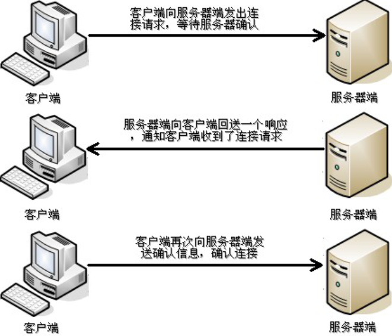
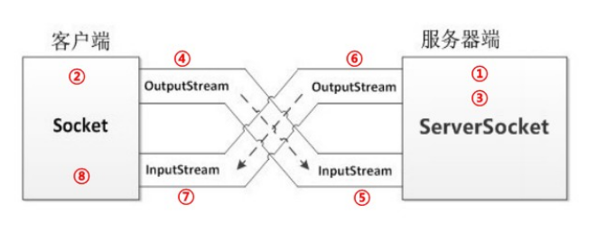

# day12【网络编程和NIO】

## 今日内容

- 网络编程入门
  - 软件结构
  - 网络通信协议
  - 网络编程三要素 
- UDP通信程序
  - 发送和接收
- TCP通信程序
  - 发送和回写
  - 案例1:客户端发送字符串数据给服务端
  - 案例2:服务端回写字符串数据给客户端
  - 案例3:客户端上传文件到服务端
  - 案例4:模拟B\S软件结构的服务器


## 教学目标

- [ ] 能够辨别UDP和TCP协议特点

- [ ] 能够说出TCP协议下两个常用类名称

- [ ] 能够编写TCP协议下字符串数据传输程序

- [ ] 能够理解TCP协议下文件上传案例

- [ ] 能够理解TCP协议下BS案例


# 第一章 网络编程入门

## 知识点 -- 1.1 软件结构

### 目标

- 了解常用软件接口设计


### 路径

- 概述
- C/S  客户端\服务器
- B/S  浏览器\服务器

### 讲解

#### 1.1.1 概述

网络编程，就是在一定的协议下，实现计算机在网络中进行通信的程序。

设计软件的时候, 大致分为两种结构, 一种叫做C/S, 一种叫做B/S。

#### 1.1.2 C/S软件结构(客户端\服务器) 

C/S结构 ：全称为Client/Server结构，是指客户端和服务器结构。常见程序有ＱＱ、迅雷等软件。

优点:分解服务器压力

缺点:需要下载客户端，服务器更新客户端也要更新


#### 1.1.3 B/S软件结构(浏览器\服务器)

B/S结构 ：全称为Browser/Server结构，是指浏览器和服务器结构。常见浏览器有谷歌、火狐等。

优点:不需要下载客户端软件，只需要服务器更新

缺点:增加服务器压力


### 小结

```

```

## 知识点 -- 1.2 网络通信协议

### 目标

- 理解什么是通信协议


### 路径

- 通信协议
- 协议分类

### 讲解

#### 1.2.1 通信协议

网络通信协议：通信协议是计算机必须遵守的规则，只有遵守这些规则，计算机之间才能进行通信。

协议对数据传输格式、传输速率、传输步骤等做了统一规定，通信双方须同时遵守，完成数据交换。 

这就好比在道路中行驶的汽车一定要遵守交通规则一样。


TCP/IP协议： 传输控制协议/因特网互联协议( Transmission Control Protocol/Internet Protocol)，是Internet最基本、最广泛的协议。

定义了计算机如何连入因特网，以及数据如何在它们之间传输的标准。

内部包含一系列用于处理数据通信的协议，采用4层分层模型，每一层都呼叫下一层提供的协议来完成需求。


#### 1.2.2 协议分类

通信的协议还是比较复杂的，`java.net` 包中包含的类和接口，它们提供低层次的通信细节。我们可以直接使用这些类和接口，来专注于网络程序开发，而不用考虑通信的细节。

`java.net` 包中提供了两种常见的网络协议的支持：TCP/UDP

TCP：传输控制协议 (Transmission Control Protocol)。是面向连接的通信协议，即传输数据之前，在发送端和接收端建立逻辑连接，然后再传输数据，它提供了两台计算机之间可靠无差错的数据传输。

- 三次握手：TCP协议中，发送数据准备阶段，客户端与服务器之间的三次交互，保证连接的可靠。
  - 第一次握手，客户端向服务器端发出连接请求，等待服务器确认。
  - 第二次握手，服务器端向客户端回送一个响应，通知客户端收到连接请求。
  - 第三次握手，客户端再次向服务器端发送确认信息，确认连接。
- 由于这种面向连接的特性，TCP协议可以保证传输数据的安全，所以应用十分广泛，例如下载文件、浏览网页等。

整个交互过程如下图所示。 



**UDP**：用户数据报协议(User Datagram Protocol)是一个**面向无连接**的协议。传输数据时，不需要建立连接，不管对方端服务是否启动，直接将数据、数据源和目的地都封装在数据包中，直接发送。每个数据包的大小限制在64k以内。

它是不可靠协议，因为无连接，所以传输速度快，但是容易丢失数据。日常应用中,例如视频会议、QQ聊天等。

### 小结

```

```


## 知识点 -- 1.3 网络编程三要素

### 目标

想实现网络编程, 只有协议是不够的, 还需要其他内容的帮助, 那么都有哪些必要的要素呢?

### 路径

- 网络编程三要素
- InetAddress类
- 演示InetAddress类使用

### 讲解

#### 1.3.1 网络编程三要素

​	利用`协议`+`IP地址`+`端口号` 三元组合，可以标识网络中的进程，进程间就可以利用这个标识与其它进程进行通信交互。

##### 协议

​		计算机网络通信必须遵守的规则，定义了统一的传输速率、传输格式、传输步骤等。

##### IP地址

​		IP地址：指互联网协议地址(Internet Protocol Address），俗称IP。

​		IP地址用来给网络中的计算机设备做唯一编号。假如把“个人电脑”比作“一台电话”，“IP地址”就相当于“电话号码”。

​		资料显示，全球IPv4地址在2011年2月分配完毕。为扩大地址空间，拟通过IPv6重新定义地址空间，号称可以为全世界的每一粒沙子编上一个网址。

- **IP地址分类 **
  - IPv4：4组32位的0~255之间的十进制数，形式为a.b.c.d，可表示42亿个。例如`192.168.65.100` 。
  - IPv6：8组128位的0~65535之间的十六进制数，形式为aaaa:bbbb:cccc:dddd:eeee:ffff:gggg:hhhh。例如`ABCD:EF01:2345:6789:ABCD:EF01:2345:6789`。

- **特殊的IP地址**

  本机IP地址：`127.0.0.1`、`localhost` 。

- **常用Doc命令**

  ```
  查看本机IP地址：ipconfig
  检查网络是否连通：ping 空格 IP地址、ping 220.181.57.216、ping www.baidu.com
  ```

##### 端口号

​		网络通信,本质是两个进程(程序)的通信。每台计算机都有很多进程,网络通信需要区分这些进程。

​		**IP地址**可以唯一标识网络中的设备，**端口号**可以唯一标识设备中的进程(程序)。

​		**端口号：用两个字节表示的整数，取值范围是0~65535**。

​		0~1023的端口号用于一些知名网络服务和应用，普通应用程序需要使用1024以上端口号。

​		如果端口号被另外一个服务或应用所占用，会导致当前程序启动失败。

#### 1.3.2 InetAddress类

​		InetAddress类：此类表示Internet协议(IP）地址。

##### 获取对象

- static InetAddress getLocalHost() ；获得本地主机IP地址对象
- static InetAddress getByName(String host)；根据主机名获得对应的IP地址对象

##### 常用方法

- String getHostName()；根据InetAddress对象获得主机名
- String getHostAddress()；根据InetAddress对象获得IP地址字符串

#### 1.3.3 演示InetAddress类使用

需求：通过地址类(InetAddress)获取本地主机信息与百度主机信息

测试类代码

```java
public class Test {
    public static void main(String[] args) throws UnknownHostException {
        //获取本地ip地址对象
        InetAddress id1 = InetAddress.getLocalHost();
        System.out.println(id1);
        System.out.println(id1.getHostName());
        System.out.println(id1.getHostAddress());
        System.out.println("--------");
        //获取百度ip地址对象
        InetAddress id2 = InetAddress.getByName("baidu.com");
        System.out.println(id2);
        System.out.println(id2.getHostName());
        System.out.println(id2.getHostAddress());
    }
}
```


### 小结

```

```

# 第二章 UDP通信程序

## 知识点 -- 2.1 UDP协议概述

### 目标

- 理解UDP协议使用的流程和方法


### 路径

- UDP概述
- UDP协议的特点
- UDP协议的使用场景
- UDP协议相关的两个类

### 讲解

#### 2.1.1 用户数据报协议(UDP:User Datagram Protocol)概述

UDP是无连接通信协议，即在数据传输时，数据的发送端和接收端不建立逻辑连接。

UDP协议消耗资源小，通信效率高，通常都会用于音频、视频和普通数据的传输例		

如视频会议，因为这种情况即使偶尔丢失一两个数据包，也不会对接收结果产生太大影响。

由于UDP的面向无连接性，不能保证数据的完整性，在传输重要数据时不建议使用UDP协议。

UDP通信过程如下图所示：


#### 2.1.2 UDP协议的特点

- 面向无连接
- 发送端只管发送，不确认对方是否能收到。
- 基于数据包形式传输数据
- 每次发送的数据包限制64K以内
- 速度快，不可靠

#### 2.1.3 UDP协议的使用场景

   * 即时通讯
* 在线视频
* 网络语音电话

#### 2.1.4 UDP协议相关的类

* DatagramPacket  数据包对象
    ```java
    作用：用来封装要发送或要接收的数据
    构造方法
    	DatagramPacket(byte[] buf, int length, InetAddress address, int port):创建发送端数据包对象
        	buf：要发送的内容，字节数组
    		length：要发送内容的长度，单位是字节
    		address：接收端的IP地址对象
    		port：接收端的端口号
      	DatagramPacket(byte[] buf, int length)：创建接收端数据包对象
    		buf：用来存储接收到内容
    		length：能够接收内容的长度
    常用方法
        int getLength() 获得实际接收到的字节个数
    	InetAddress getAddress() 获取ip地址对象
    ```

* DategramSocket  发送对象
     ```java
     作用：用来发送或接收数据包
     构造方法
         DatagramSocket() 创建发送端的Socket对象，系统会随机分配一个端口号。
         DatagramSocket(int port) 创建接收端的Socket对象并指定端口号
     常用方法
       	void send(DatagramPacket dp) 发送数据包
     	void receive(DatagramPacket p) 接收数据包
     ```

### 小结

```

```

## 案例 - 2.2 演示UDP通信程序

### 需求

需求：演示本地的一个程序发送数据，一个程序接收数据。

### 分析

- 先编写接收端的代码
- 再编写发送端的代码

### 实现

//UDP发送端代码实现

```java
public class UDPSend {
    public static void main(String[] args) throws IOException {
        //创建套接字对象
        DatagramSocket ds = new DatagramSocket();
        //将数据封装到数组
        byte[] bys = "黑马程序员".getBytes();
        InetAddress id = InetAddress.getLocalHost();
        int port = 8888;
        //创建数据包
        DatagramPacket dp = new DatagramPacket(bys, bys.length, id, port);
        //发送数据
        ds.send(dp);
        //关闭套接字资源
        ds.close();
    }
}
```

//UDP接收端代码实现

```java
public class UDPReceive {
    public static void main(String[] args) throws IOException {
        //创建套接字对象
        DatagramSocket ds = new DatagramSocket(8888);
        //创建接收数组
        byte[] bys = new byte[1024];
        //创建数据包对象
        DatagramPacket dp = new DatagramPacket(bys, bys.length);
        //接收数据
        ds.receive(dp);
        //获取接收的数据
        String id = dp.getAddress().getHostAddress();
        System.out.println("客户端id=" + id);
        String content = new String(bys, 0, dp.getLength());
        System.out.println("客户端数据=" + content);
        int port = dp.getPort();
        System.out.println("客户端端口=" + port);
        //关闭套接字资源
        ds.close();
    }
}
```

# 第三章 TCP通信程序

## 知识点 -- 3.1 TCP协议概述

### 目标

- 理解TCP协议使用的流程和方法.


### 路径

- TCP概述

- TCP协议的特点

- TCP协议的使用场景

- TCP协议相关的类

  


### 讲解

#### 3.1.1 传输控制协议(TCP: Transfer Control Protocol)概述

TCP协议是面向连接的通信协议，传输数据前先在客户端和服务器端建立逻辑连接，再传输数据。

它提供了两台计算机之间可靠无差错的数据传输。

TCP通信过程如下图所示：



#### 3.1.2 TCP协议的特点

- 面向连接的协议
- 客户端通过三次握手后，发送数据
- 通过四次挥手断开连接
- 基于IO流形式传输数据
- 传输数据大小无限制
- 速度慢，数据安全可靠

#### 3.1.3 TCP协议的使用场景

   * 文件上传和下载
* 邮件发送和接收
* 远程登录

#### 3.1.4 TCP协议相关的类

- Socket 一个该类的对象就代表一个客户端程序。

  ```java
  构造方法
  	public Socket(String host, int port)根据ip地址字符串和端口号创建客户端Socket对象
  	注意事项：执行该方法，就会立即连接指定的服务器程序，如果不成功，抛出异常。如果成功，则表示三次握手通过。
  常用方法
     	OutputStream getOutputStream(); 获得字节输出流对象
  	InputStream getInputStream();获得字节输入流对象
  ```

* ServerSocket  一个该类的对象就代表一个服务器端程序。

  ```java
  构造方法
  	public  ServerSocket(int port)：根据端口创建服务端ServerSocket对象
  常用方法
  	Socket accept():获得服务端Socket对象
  ```

### 小结

```

```


## 案例 - 3.2 演示TCP通信程序

### 需求

使用TCP完成客户端和服务器互相发送一句话

### 分析

1. 客户端向服务器发送数据
2. 服务器接收客户端发送的数据
3. 服务器向客户端回写数据
4. 客户端接收服务器回写的数据

### 实现

//客户端代码

```java
public class TCPClient {
    public static void main(String[] args) throws IOException {
        //创建客户端套接字对象
        Socket client = new Socket(InetAddress.getLocalHost().getHostAddress(), 8888);
        //获取套接字对应的输出流
        OutputStream os = client.getOutputStream();
        //写出数据
        byte[] bys = "hi,我是客户端".getBytes();
        os.write(bys);
        //获取套接字对应的输入流
        InputStream is = client.getInputStream();
        //读取服务器端返回的数据
        byte[] rbys = new byte[1024];
        int len = is.read(rbys);
        System.out.println("服务器反馈的数据=" + new String(rbys, 0, len));
        //关闭套接字资源
        client.close();
    }
}
```

//服务器端代码

```java
public class TCPServer {
    public static void main(String[] args) throws IOException {
        //创建服务器对象
        ServerSocket serverScoket = new ServerSocket(8888);
        //获取服务器与客户端连接的套接字对象
        Socket server = serverScoket.accept();
        //获取套接字对应的输入流
        InputStream is = server.getInputStream();
        //读取数据
        byte[] bys = new byte[1024];
        int len = is.read(bys);
        System.out.println("客户端的数据="+new String(bys, 0, len));
        //获取套接字对应的输出流
        OutputStream os = server.getOutputStream();
        //反馈数据给客户端
        byte[] wbys = "数据以收到".getBytes();
        os.write(wbys);
        //关闭套接字资源
        server.close();
        //关闭服务器 服务器一般保持常开状态
        server.close();
    }
}
```

# 第四章 综合案例

## 案例 - 4.1 文件上传

### 需求

使用TCP协议, 通过客户端向服务器上传一个文件

### 分析


1. 【客户端】输入流，从硬盘读取文件数据到程序中。
2. 【客户端】输出流，写出文件数据到服务端。
3. 【服务端】输入流，读取文件数据到服务端程序。
4. 【服务端】输出流，写出文件数据到服务器硬盘中。
5. 【服务端】获取输出流，回写数据。
6. 【客户端】获取输入流，解析回写数据。
7. 程序优化：存放文件名、1对多处理、提高处理速度、提高读写速度

### 实现

//服务器端代码

```java
public class FileUpload_Server {
    public static void main(String[] args) throws IOException {
        System.out.println("服务器启动...");
        //创建服务器对象
        ServerSocket serverSocket = new ServerSocket(8888);
        //获取服务端套接字对象
        //程序优化2:出于一对多的考虑，需要在结束一次客户端对接后，重新开始连接下一个客户端
        while (true) {
            Socket server = serverSocket.accept();
            //程序优化3:为了提高处理速度，避免客户端等待过久，可以给每一个客户端提单独开辟一个线程，负责与客户端对接
            new Thread(new Runnable() {
                @Override
                public void run() {
                    try {
                        //获取输入流对象，读取数据
                        InputStream is = server.getInputStream();
                        //定义输出流对象，将文件存储到指定位置
                        //程序优化1:存放文件名使用动态的方式指定，一面之前的内容被覆盖
                        FileOutputStream fos = new FileOutputStream("day12_04综合案例\\image_upload" + System.currentTimeMillis() + ".jpg");
                        //程序优化4:为了提高读写速度,可以使用缓冲流进行读写
                        BufferedOutputStream bos = new BufferedOutputStream(fos);
                        BufferedInputStream bis = new BufferedInputStream(is);
                        //读取客户端写出的数据，写入本地
                        byte[] bys = new byte[1024];
                        int len = -1;
                        while ((len = bis.read(bys)) != -1) {
                            bos.write(bys, 0, len);
                        }
                        //反馈给客户端，上传成功
                        OutputStream os = server.getOutputStream();
                        os.write("上传成功".getBytes());
                        //关闭资源
                        fos.close();
                        server.close();
                        System.out.println("文件上传完毕");
                        // serverSocket.close();//实际开发一般不关
                    } catch (IOException e) {
                        e.printStackTrace();
                    }
                }
            }).start();
        }
    }
}
```

//客户端代码

```java
public class FileUpload_Client {
    public static void main(String[] args) throws IOException {
        //创建客户端套接字对象
        Socket client = new Socket("localhost", 8888);
        //获取套接字对应的输出流
        OutputStream os = client.getOutputStream();
        //获取文件对应的输入流
        FileInputStream fis = new FileInputStream("day12_04综合案例\\image.jpg");
        //读取本地数据，并写出到网络中
        byte[] bys = new byte[1024];
        int len = -1;
        while ((len = fis.read(bys)) != -1) {
            os.write(bys, 0, len);
        }
        //告诉服务器端，数据上传完毕
        client.shutdownOutput();
        //获取服务器点的反馈
        InputStream is = client.getInputStream();
        byte[] rbys = new byte[1024];
        int len2 = is.read(rbys);
        System.out.println("服务器端反馈:" + new String(rbys, 0, len2));
        //关闭资源
        fis.close();
        client.close();
    }
}
```

## 案例 - 4.2 模拟B\S服务器

### 需求

模拟网站服务器，使用浏览器访问自己编写的服务端程序，查看网页效果。

**访问效果：**


### 分析

1. 准备页面数据，web文件夹。
2. 我们模拟服务器端，ServerSocket类监听端口，使用浏览器访问，查看网页效果

**图解：**


### 实现

**浏览器工作原理是遇到图片会开启一个线程进行单独的访问,因此在服务器端需要加入线程技术。**

```java
public class TCPServer {
    public static void main(String[] args) throws IOException {
        //创建服务器对象
        ServerSocket serverSocket = new ServerSocket(8888);
        while (true) {
        //创建与客户端的连接
            Socket server = serverSocket.accept();
            //启动服务器端操作
            new Thread(new WebRunnable(server)).start();
        }
    }
}
```

```java
public class WebRunnable implements Runnable {
    private Socket server = null;
    public WebRunnable(Socket server) {
        this.server = server;
    }
    @Override
    public void run() {

        try {
            //通过套接字对象缓冲字符输入流
            InputStream is = server.getInputStream();
            InputStreamReader isr = new InputStreamReader(is);
            BufferedReader br = new BufferedReader(isr);
            //读取浏览器提交的内容
            String content = br.readLine();
            System.out.println(content);//GET /web/index.html HTTP/1.1
            //通过得到的访问地址，拼接出要访问的文件地址
            String[] contents = content.split(" ");//[GET, /web/index.html, HTTP/1.1]
            String path = "day12_04综合案例" + contents[1];
            //获取套接字的输出流
            OutputStream os = server.getOutputStream();
            //获取文件对应的输入流对象
            FileInputStream fis = new FileInputStream(path);
            //将信息返回给浏览器
            os.write("HTTP/1.1 200 OK\r\n".getBytes());
            os.write("Content-Type:text/html\r\n".getBytes());
            os.write("\r\n".getBytes());
            byte[] bys = new byte[1024];
            int len = -1;
            while ((len = fis.read(bys)) != -1) {
                os.write(bys, 0, len);
            }
            fis.close();
            server.close();
        } catch (IOException e) {
            e.printStackTrace();
        }
    }
}
```

