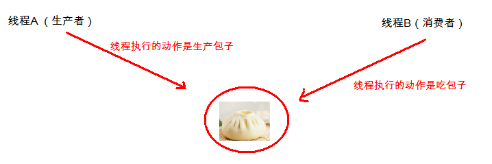

# day09【线程状态、等待与唤醒、Lambda表达式、Stream流】

## 今日内容

* 线程池的使用----->必须掌握
* 死锁
* 多线程
  * 线程的状态------>必须掌握
  * 等待唤醒机制------>必须掌握
* Lambda表达式
  * Lambda表达式的使用场景------>建议掌握
  * Lambda表达式的格式(标准\省略)------>建议掌握
* Stream流
  * 流式思想的概述	
  * 使用Stream流------>建议掌握
    * 获取流-->操作流-->收集结果

# 第一章 线程池

## 4.1 线程池的概念 

#### 线程池的思想


我们使用线程的时候就去创建一个线程，这样实现起来非常简便，但是就会有一个问题：

如果并发的线程数量很多，并且每个线程都是执行一个时间很短的任务就结束了，这样频繁创建线程就会大大降低系统的效率，因为频繁创建线程和销毁线程需要时间。

那么有没有一种办法使得线程可以复用，就是执行完一个任务，并不被销毁，而是可以继续执行其他的任务？

在Java中可以通过线程池来达到这样的效果。

#### 线程池概念

- **线程池：**其实就是一个容纳多个线程的容器，其中的线程可以反复使用，省去了频繁创建线程对象的操作，无需反复创建线程而消耗过多资源。

由于线程池中有很多操作都是与优化资源相关的，我们在这里就不多赘述。我们通过一张图来了解线程池的工作原理：


#### 线程池的好处

1. 降低资源消耗。减少了创建和销毁线程的次数，每个工作线程都可以被重复利用，可执行多个任务。
2. 提高响应速度。当任务到达时，任务可以不需要的等到线程创建就能立即执行。
3. 提高线程的可管理性。可以根据系统的承受能力，调整线程池中工作线线程的数目，防止因为消耗过多的内存，而把服务器累趴下(每个线程需要大约1MB内存，线程开的越多，消耗的内存也就越大，最后死机)。

## 4.2 线程池的使用

- 概述:  真正的线程池接口是java.util.concurrent.ExecutorService。

- 创建线程池: 

  - Executors线程池工具类,里面提供了一些静态方法, 可以用来生成一些常用的线程池
    - `public static ExecutorService newFixedThreadPool(int nThreads)获取线程池指定线程数量`

- 使用线程池: ExecutorService线程池接口:
  
  - `public Future<?> submit(Runnable task):获取线程池中的某一个线程对象，并执行任务`
  - `public <T> Future<T> submit(Callable<T> task):获取线程池中的某一个线程对象，并执行任务`
    - Future用来封装返回值,封装后的返回值可以通过Future的get()方法获取
      - 对于线程池提交的任务是实现Runnable的任务,那么这个返回值Future其实没有啥用处
        - 因为Future封装的是任务中run方法的返回值,而Runnable中的run方法没有返回值,所以Future没有意义
      - 对于线程池提交的任务是实现Callable的任务,那么这个返回值Future就有用
      - 因为Callable的任务方法: `V call() ` 有返回值,执行完call方法的返回值会封装成Future对象返回,如果想要得到call方法的返回值,就通过Future对象调用get方法得到.
  
- 线程池的使用步骤:

  - 创建线程池
  - 创建并提交任务
  - 销毁线程池(一般不操作)

- 案例演示:

  - 案例1:  提交Runnable实现的任务

    ```java
    /** 
     * @Author PengZhiLin
    ```
   * @Date 2021/7/1 8:51
     */
  public class MyRunnable implements Runnable{
        @Override
      public void run() {
            System.out.println(Thread.currentThread().getName()+":开始执行任务代码...");
            try {
                Thread.sleep(2000);
          } catch (InterruptedException e) {
                e.printStackTrace();
            }
            System.out.println(Thread.currentThread().getName()+":结束执行任务代码...");
        }
      }
  
    /**
     * @Author PengZhiLin
     * @Date 2021/7/1 8:49
        */
      public class Test {
        public static void main(String[] args) throws ExecutionException, InterruptedException {
            // 创建线程池,初始化线程
            ExecutorService es = Executors.newFixedThreadPool(3);
    
            // 创建并提交任务
            MyRunnable mr = new MyRunnable();
            //Future<?> f = es.submit(mr);
            //System.out.println(f.get());// null
            es.submit(mr);
            es.submit(mr);
            es.submit(mr);
            es.submit(mr);
            es.submit(mr);
            es.submit(mr);
  
  
            // 销毁线程池(一般不操作)
            es.shutdown();
        
        }
    }
  
    ```
  
    
  
  - 案例2:  提交Callable实现的任务
  
    ```java
    /**
     * @Author PengZhiLin
   * @Date 2021/7/1 9:00
     */
    public class MyCallable implements Callable<String> {
        @Override
        public String call() throws Exception {
            System.out.println(Thread.currentThread().getName()+":开始执行任务...");
            Thread.sleep(5000);
            System.out.println(Thread.currentThread().getName()+":结束执行任务...");
            return "itheima";
        }
    }
    
    
    /**
     * @Author PengZhiLin
     * @Date 2021/7/1 8:59
     */
    public class Test {
        public static void main(String[] args) throws ExecutionException, InterruptedException {
            // 1.创建线程池,初始化线程
            ExecutorService es = Executors.newFixedThreadPool(3);
    
            // 2.创建并提交任务
            MyCallable mc = new MyCallable();
            //Future<String> f = es.submit(mc);
            //System.out.println("任务执行完毕后的返回值: "+f.get());// itheima
    
            es.submit(mc);
            es.submit(mc);
            es.submit(mc);
            es.submit(mc);
            es.submit(mc);
            es.submit(mc);
    
            // 3.销毁线程池(一般不操作)
            es.shutdown();
    
        }
    }
    
    ```
  
    


## 4.3 线程池的练习

### 需求

- 使用线程池方式执行任务,返回1-n的和

### 实现

```java
/**
 * @Author PengZhiLin
 * @Date 2021/7/1 9:08
 */
public class MyCallable implements Callable<Integer> {
    int n;

    public MyCallable(int n) {
        this.n = n;
    }

    @Override
    public Integer call() throws Exception {
        // 任务: 计算1-n的累加和,并返回
        int sum = 0;
        for (int i = 1; i <= n; i++) {
            sum += i;
        }
        return sum;
    }
}

/**
 * @Author PengZhiLin
 * @Date 2021/7/1 9:07
 */
public class Test {
    public static void main(String[] args) throws ExecutionException, InterruptedException {
        // 创建线程池,初始化线程
        ExecutorService es = Executors.newFixedThreadPool(2);

        // 创建并提交任务
        MyCallable mc = new MyCallable(100);
        Future<Integer> f = es.submit(mc);
        System.out.println("1-100的累加和:"+f.get());// 5050

        // 销毁线程池(一般不操作)
        es.shutdown();

    }
}

```


# 第二章 死锁

#### 什么是死锁

在多线程程序中,使用了多把锁,造成线程之间相互等待.程序不往下走了。

#### 产生死锁的条件

1.有多把锁
2.有多个线程
3.有同步代码块嵌套

#### 死锁代码

```java
/**
 * @Author PengZhiLin
 * @Date 2021/7/1 9:16
 */
public class Test {
    public static void main(String[] args) {
        // 创建并启动线程1-------任务: 获取A锁,再获取B锁,执行任务代码
        new Thread(new Runnable() {
            @Override
            public void run() {
                synchronized ("A锁"){
                    System.out.println("线程1获取到了A锁,准备获取B锁");
                    synchronized ("B锁"){
                        System.out.println("线程1获取到了A锁和B锁,执行任务代码....");
                    }
                }
            }
        }).start();

        // 创建并启动线程2-------任务: 获取B锁,再获取A锁,执行任务代码
        new Thread(new Runnable() {
            @Override
            public void run() {
                synchronized ("B锁"){
                    System.out.println("线程2获取到了B锁,准备获取A锁");
                    synchronized ("A锁"){
                        System.out.println("线程2获取到了B锁和A锁,执行任务代码....");
                    }
                }
            }
        }).start();
    }
}

```


# 第三章 线程状态

## 1.1 线程状态

#### 线程状态概述

线程由生到死的完整过程：技术素养和面试的要求。

线程从创建到销毁的过程称为线程的生命周期，在线程的生命周期内一共有六种状态：

| 线程状态                | 导致状态发生条件                                             |
| ----------------------- | ------------------------------------------------------------ |
| NEW(新建)               | 线程刚被创建，但是并未启动。还没调用start方法。MyThread t = new MyThread()只有线程对象，没有线程特征。**创建线程对象时** |
| Runnable(可运行)        | 调用了 start() 方法，此时线程可能正在执行，也可能没有，这取决于操作系统的调度。**调用start方法时** |
| Blocked(锁阻塞)         | 当线程试图获取锁对象，而该锁对象被其他的线程持有，则该线程进入锁阻塞状态；当该线程获取到锁对象时，该线程将变成可运行状态。**等待锁对象时** |
| Waiting(无限等待)       | 一个线程在等待另一个线程执行一个（唤醒）动作时，该线程进入Waiting状态。进入这个状态后是不能自动唤醒的，必须等待另一个线程调用notify或者notifyAll方法才能够唤醒。**调用wait()方法时** |
| Timed Waiting(计时等待) | 同waiting状态，有几个方法有超时参数，调用他们将进入Timed Waiting状态。这一状态将一直保持到超时期满或者接收到唤醒通知。带有超时参数的常用方法有Thread.sleep 、Object.wait。**调用sleep()方法时** |
| Teminated(被终止)       | 因为run方法正常退出而死亡，或者因为没有捕获的异常终止了run方法而死亡。**run方法执行结束时** |

#### 线程状态的切换


我们不需要去研究这几种状态的实现原理，我们只需知道在做线程操作中存在这样的状态。那我们怎么去理解这几个状态呢，新建与被终止还是很容易理解的，我们就研究一下线程从Runnable（可运行）状态与非运行状态之间的转换问题。


## 1.2 计时等待和无限等待

- **计时等待**: 调用线程类的 sleep() 方法可使当前线程进入睡眠状态，当睡觉时间达到时线程会被自动唤醒。

  - `public static void  sleep(long time)`  让当前线程进入到睡眠状态，到毫秒后自动醒来继续执行

    ```java
    /**
     * @Author PengZhiLin
     * @Date 2021/7/1 9:57
     */
    public class Test {
        public static void main(String[] args) throws InterruptedException {
            for (int i = 0; i < 10; i++) {
                System.out.println("Hello World!");
                // 打印1次暂停2s
                Thread.sleep(2000);
            }
        }
    }
    
    ```
  
- **无限等待**

  - Object类的方法:

    - `public void wait()` : 让当前线程进入到等待状态 **此方法必须锁对象调用**.
    - `public void notify()` : 唤醒当前锁对象上等待状态的线程  **此方法必须锁对象调用**.
    - `public void notifyAll()` : 唤醒当前锁对象上所有等待状态的线程  **此方法必须锁对象调用**.
    - 注意:
      - 以上三个方法都需要使用锁对象调用才有效
      - 调用以上三个方法的锁对象要一致(相同)
    
  - 案例1: 无限等待线程
  
    ```java
    /**
     * @Author PengZhiLin
     * @Date 2021/7/1 10:00
     */
    public class Test {
        static Object lock = new Object();
        public static void main(String[] args) {
            // 创建并启动线程--------------->无限等待
            new Thread(new Runnable() {
                @Override
                public void run() {
                    // 加锁
                    synchronized (lock){
                        System.out.println("线程1获取了锁对象进入了无限等待状态..");
                        // 使用锁对象调用wait()方法进入无限等待
                        try {
                            lock.wait();
                        } catch (InterruptedException e) {
                            e.printStackTrace();
                        }
    
                        System.out.println("线程1被唤醒了,并获取到了锁对象....");
                    }
                }
            }).start();
        }
    }
    
    ```
  
    
  
  - 案例2: 等待和唤醒案例
  
    ```java
    
    /**
    ```
   * @Author PengZhiLin
     * @Date 2021/7/1 10:00
   */
      public class Test {
        static Object lock = new Object();
        public static void main(String[] args) {
            // 创建并启动线程--------------->无限等待
            new Thread(new Runnable() {
                @Override
                public void run() {
                    // 加锁
                    synchronized (lock){
                        System.out.println("线程1获取了锁对象进入了无限等待状态..");
                        // 使用锁对象调用wait()方法进入无限等待
                        try {
                            lock.wait();// 会释放锁对象,释放cpu资源,不会争夺锁对象或者cpu资源
                        } catch (InterruptedException e) {
                            e.printStackTrace();
                        }
      
                        System.out.println("线程1被唤醒了,并获取到了锁对象....");
                    }
                }
            }).start();
          
            new Thread(new Runnable() {
                @Override
                public void run() {
                    // 加锁
                    synchronized (lock){
                        System.out.println("线程2获取了锁对象,准备唤醒无限等待线程..");
                        // 使用锁对象调用notify()或者notifyAll()方法唤醒无限等待线程
                       lock.notify();
          
                        System.out.println("线程2唤醒了无限等待线程....");
                    }
                }
            }).start();
        }
      }
  
    ```
    
    
    
    
    ```

## 1.3 等待唤醒机制

#### **什么是等待唤醒机制**

- **概述: 使用等待和唤醒实现多条线程之间有规律的执行**
- **例如:  子线程打印i循环,主线程打印j循环**
- **不使用等待唤醒机制:**  结果是主线程和子线程**随机交替打印输出-**---->没有规律
- **使用等待唤醒机制:** 结果就要有规律的打印输出
  - 打印1次i循环,然后打印1次j循环....依次循环打印输出....---->有规律
  - 如何实现:
    - 子线程打印1次i循环,然后唤醒主线程来执行, 子线程就进入无限等待
    - 主线程打印1次j循环,然后唤醒子线程来执行,主线程就进入无限等待
    - 子线程打印1次i循环,然后唤醒主线程来执行,子线程就进入无限等待
    - 主线程打印1次j循环,然后唤醒子线程来执行,主线程就进入无限等待
    - ....

#### 如何实现等待唤醒机制:

- 1.使用锁对象调用wait()方法进入无限等待

- 2.使用锁对象调用notify()\notifyAll()方法唤醒线程

- 3.调用wait(),notify()\notifyAll()方法的锁对象要一致

- 案例:  主线程和子线程有规律的交替打印输出

  ```java
  
  /**
   * @Author PengZhiLin
   * @Date 2021/7/1 10:31
   */
  public class MyThread extends Thread{
      @Override
      public void run() {
          for (int i = 0; i < 100; i++) {
              synchronized (Test.lock){
                  // 进入无限等待--->如果flag的值为true
                  if (Test.flag == true){
                      // 进入无限等待
                      try {
                          Test.lock.wait();
                      } catch (InterruptedException e) {
                          e.printStackTrace();
                      }
                  }
  
                  // 打印输出,唤醒其他线程--->如果flag的值为false
                  if (Test.flag == false){
                      System.out.println("子线程第"+i+"次打印HelloWorld...");
                      // 修改旗帜变量的值
                      Test.flag = true;
  
                      // 唤醒
                      Test.lock.notify();
                  }
              }
          }
      }
  }
  
  
  ```
  
  ```java
  package com.itheima.demo5_等待唤醒机制;
  
  /**
   * @Author PengZhiLin
   * @Date 2021/7/1 10:31
   */
  public class Test {
      // 锁对象
      static Object lock = new Object();
      // 共享变量---作为旗帜变量
      static boolean flag = false;
  
      public static void main(String[] args) {
          // 创建并启动线程
          MyThread mt = new MyThread();
          mt.start();
  
          // 主线程任务代码
          for (int j = 0; j < 100; j++) {
              synchronized (lock){
                  // 进入无限等待--->如果flag的值为false
                  if (flag == false){
                      // 进入无限等待
                      try {
                          lock.wait();
                      } catch (InterruptedException e) {
                          e.printStackTrace();
                      }
                  }
  
                  // 打印输出,唤醒其他线程--->如果flag的值为true
                  if (flag == true){
                      System.out.println("主线程第"+j+"次打印HelloWorld...");
                      // 修改旗帜变量的值
                      flag = false;
                      // 唤醒
                      lock.notify();
                  }
  
              }
          }
      }
  }
  
  ```
  
  

#### 分析等待唤醒机制程序的执行

- 1.不管是否使用等待唤醒机制,**线程的调度都是抢占式**
- 2.线程进入无限等待,线程就会释放锁,cpu,也不会再去争夺
- 3.唤醒其他线程,当前唤醒线程是不会释放锁,cpu的
- 4.无限等待线程被唤醒,拿到锁对象后,会从进入无限等待的位置继续往下执行


## 1.4 等待唤醒案例

### 需求

- 等待唤醒机制其实就是经典的“生产者与消费者”的问题。

- 就拿生产包子消费包子来说等待唤醒机制如何有效利用资源：

  

### 分析

```java
包子铺线程生产包子,生产完了,包子就有了,唤醒吃货线程来吃包子,然后包子铺线程进入无限等待;
吃货线程吃包子,吃完了,包子就没有了,唤醒包子铺线程来生产包子,然后吃货线程进入无限等待;
包子铺线程生产包子,生产完了,包子就有了,唤醒吃货线程来吃包子,然后包子铺线程进入无限等待;
吃货线程吃包子,吃完了,包子就没有了,唤醒包子铺线程来生产包子,然后吃货线程进入无限等待;
包子铺线程生产包子,生产完了,包子就有了,唤醒吃货线程来吃包子,然后包子铺线程进入无限等待;
吃货线程吃包子,吃完了,包子就没有了,唤醒包子铺线程来生产包子,然后吃货线程进入无限等待;
....
BaoZi类:
	String xianer;// 馅儿
    boolean flag;// 包子状态--默认false表示没有包子,true表示有包子
包子铺线程:
	成员变量: BaoZi 
	任务:
		如果包子有了,就进入无限等待
        如果包子没有了,就生产包子,生产完了包子,包子就有了,唤醒吃货线程来吃包子
吃货线程:
	成员变量: BaoZi 
	任务:
		如果包子没有了,就进入无限等待
        如果包子有了,就吃包子,吃完了包子,包子就没有了,唤醒包子铺线程来吃包子
```

### 实现

- 包子类

  ```java
  /**
   * @Author PengZhiLin
   * @Date 2021/7/1 11:13
   */
  public class BaoZi {
      String xianer;// 馅儿
      boolean flag;// 包子状态--默认false表示没有包子,true表示有包子
  }
  
  ```
  
  
  
- 包子铺线程

  ```java
  package com.itheima.demo6_等待唤醒案例;
  
  /**
   * @Author PengZhiLin
   * @Date 2021/7/1 11:12
   */
  public class BaoZiPu extends Thread{
      BaoZi bz;
  
      public BaoZiPu(BaoZi bz) {
          this.bz = bz;
      }
  
      @Override
      public void run() {
          while (true) {
              synchronized (bz) {
                  // 如果包子有了,就进入无限等待
                  if (bz.flag == true){
                      try {
                          bz.wait();
                      } catch (InterruptedException e) {
                          e.printStackTrace();
                      }
                  }
                  // 如果包子没有了,就生产包子,生产完了包子,包子就有了,唤醒吃货线程来吃包子
                  if (bz.flag == false){
                      System.out.println("包子铺线程: 正在做包子...");
                      bz.xianer = "猪肉大葱";
                      System.out.println("包子铺线程:包子生产好了...");
                      bz.flag = true;
                      // 唤醒吃货线程
                      bz.notify();
                  }
              }
          }
      }
  }
  
  ```
  
  
  
- 吃货线程

  ```java
  package com.itheima.demo6_等待唤醒案例;
  
  /**
   * @Author PengZhiLin
   * @Date 2021/7/1 11:12
   */
  public class ChiHuo extends Thread{
      BaoZi bz;
  
      public ChiHuo(BaoZi bz) {
          this.bz = bz;
      }
  
      @Override
      public void run() {
          while (true) {
              synchronized (bz) {
                  // 如果包子没有了,就进入无限等待
                  if (bz.flag == false){
                      try {
                          bz.wait();
                      } catch (InterruptedException e) {
                          e.printStackTrace();
                      }
                  }
                  // 如果包子有了,就吃包子,吃完了包子,包子就没有了,唤醒包子铺线程来吃包子
                  if (bz.flag == true){
                      System.out.println("吃货线程:吃包子,包子的馅儿是:"+bz.xianer);
                      System.out.println("吃货线程:吃完了包子------------------");
                      bz.flag = false;
                      // 唤醒包子铺线程
                      bz.notify();
                  }
              }
          }
      }
  }
  
  ```
  
  
  
- 测试类

  ```java
  package com.itheima.demo6_等待唤醒案例;
  
  /**
   * @Author PengZhiLin
   * @Date 2021/7/1 11:11
   */
  public class Test {
      public static void main(String[] args) {
          // 创建BaoZi对象
          BaoZi bz = new BaoZi();
          // 创建并启动包子铺线程
          new BaoZiPu(bz).start();
          // 创建并启动吃货线程
          new ChiHuo(bz).start();
      }
  }
  
  ```
  
  

# 第四章  Lambda表达式

## 2.1 函数式编程思想概述

#### 面向对象编程思想

**面向对象强调的是对象 , “必须通过对象的形式来做事情”**，相对来讲比较复杂,有时候我们只是为了做某件事情而不得不创建一个对象 , 例如线程执行任务,我们不得不创建一个实现Runnable接口对象,但我们真正希望的是将run方法中的代码传递给线程对象执行

#### 函数编程思想

在数学中，**函数**就是有输入量、输出量的一套计算方案，也就是“拿什么东西做什么事情”。相对而言，面向对象过分强调“必须通过对象的形式来做事情”，而函数式思想则尽量忽略面向对象的复杂语法——**强调做什么，而不是以什么形式做**。例如线程执行任务 , 使用函数式思想 , 我们就可以通过传递一段代码给线程对象执行,而不需要创建任务对象


## 2.2 Lambda表达式的体验

- 实现Runnable接口的方式创建线程执行任务

- 匿名内部类方式创建线程执行任务
  - 以上2种方式,其实都是通过Runnable的实现类对象来传递任务给线程执行
  - 思考: 是否能不通过实现类对象传递任务给线程执行呢?--->函数式编程

- Lambda方式创建线程执行任务

  ```java
  /**
   * @Author PengZhiLin
   * @Date 2021/7/1 11:40
   */
  public class Test {
      public static void main(String[] args) {
          // 需求: 创建并启动线程,执行打印100次HelloWorld
          MyRunnable mr = new MyRunnable();
          new Thread(mr).start();
          // 通过实现Runnable方式: 必须创建实现类重写run方法,必须创建实现类对象,传入任务到线程中
  
          new Thread(new Runnable() {
              @Override
              public void run() {
                  for (int i = 1; i <= 100; i++) {
                      System.out.println("这是第"+i+"次打印HelloWorld===");
                  }
              }
          }).start();
          // 匿名内部类: 直接传入Runnable的匿名内部类(Runnable的实现类对象),传入任务到线程中
          //- 以上2种方式,其实都是通过Runnable的实现类对象来传递任务给线程执行
          //- 思考: 是否能不通过实现类对象传递任务给线程执行呢?--->函数式编程
          new Thread(()->{
              for (int i = 1; i <= 100; i++) {
                  System.out.println("这是第"+i+"次打印HelloWorld!!!");
              }
          }).start();
  
  
      }
  }
  
  ```
  
- **Lambda表达式没有特殊功能,就是用来简化代码的**

## 2.3 Lambda表达式的标准格式

- Lambda的使用前提条件:

  - **接口必须是函数式接口才可以使用Lambda表达式**

    - 函数式接口: 接口中有且仅有一个抽象方法,该接口就是函数接口

      ```java
      // 函数式接口
      public interface A{
          void method1();
      }
      // 函数式接口
      public interface B{
          void method1();
          public default void method2(){}
      }
      // 不是函数式接口
      public interface C{
          void method1();
          void method2(){}
      }
      // 不是函数式接口
      public interface C{
          public default void method(){}
      }
      ```

    - 是函数式接口可以使用@FunctionalInterface注解进行标识,否则不可以使用该注解标识

- 标准格式

  - 格式: `(形参列表)->{代码块}`

- 格式说明

  - 小括号中形参列表与函数式接口中抽象方法的形参列表一致(形参名可以不一致,但形参类型,顺序,个数必须一致)
  - ->固定写法,表示指向动作,代表小括号中的参数传递到大括号中使用
  - 大括号中的代码其实就是和之前重写函数式接口中抽象方法的方法体一致

- 案例演示

  - Runnable函数式接口

    ```java
    /**
     * @Author PengZhiLin
     * @Date 2021/7/1 12:03
     */
    public class Test1 {
        public static void main(String[] args) {
            // 创建并启动线程
            new Thread(()->{
                System.out.println("Lambda表达式方式...");
            }).start();
        }
    }
    
    ```
    
  - Comparator函数式接口
  
    ```java
    /**
     * @Author PengZhiLin
     * @Date 2021/7/1 12:03
     */
    public class Test1 {
        public static void main(String[] args) { 
            ArrayList<Integer> list = new ArrayList<>();
            list.add(500);
            list.add(300);
            list.add(400);
            list.add(100);
            list.add(200);
            System.out.println("排序之前:"+list);
            // 指定规则排序--->降序
           /* Collections.sort(list, new Comparator<Integer>() {
                @Override
                public int compare(Integer o1, Integer o2) {
                    return o2 - o1;
                }
            });*/
            Collections.sort(list,(Integer i1,Integer i2)->{ return i2 - i1;});
            System.out.println("排序之后:"+list);
        }
    }
    
    ```
    
  
- **Lambda使用套路**

  - 1.判断是否可以使用Lambda表达式--->前提条件: 接口是函数式接口
  - 2.如果可以使用,直接写上()->{}
  - 3.填充Lambda表达式小括号中的内容---->与函数式接口中抽象方法形参列表一致
  - 4.填充Lambda表达式大括号中的内容---->与函数式接口中抽象方法的实现一致


## 2.4 Lambda表达式省略格式

- **省略规则**

  - Lambda表达式小括号中的参数类型可以省略不写
  - 如果Lambda表达式小括号中只有一个参数,那么小括号也可以省略不写
  - 如果Lambda表达式大括号中只有一条语句,那么大括号,return关键字,以及语句分号都可以省略(必须一起省略)

- 案例演示

  ```java
  /**
   * @Author PengZhiLin
   * @Date 2021/7/1 12:03
   */
  public class Test1 {
      public static void main(String[] args) {
          // 创建并启动线程----Lambda标准格式
          new Thread(()->{
              System.out.println("Lambda表达式方式1...");
          }).start();
  
          // 创建并启动线程----Lambda省略格式
          new Thread(()-> System.out.println("Lambda表达式方式2...")).start();
  
          System.out.println("-------------------------");
          
          ArrayList<Integer> list = new ArrayList<>();
          list.add(500);
          list.add(300);
          list.add(400);
          list.add(100);
          list.add(200);
          System.out.println("排序之前:"+list);
          // 指定规则排序--->降序
          // Lambda标准格式
          // Collections.sort(list,(Integer i1,Integer i2)->{ return i2 - i1;});
          
          // Lambda省略格式
          Collections.sort(list,( i1, i2)-> i2 - i1);
          System.out.println("排序之后:"+list);
      }
  }
  ```
  
  

## 2.5 Lambda的表现形式

- Lambda的表现形式: Lambda表达式以后会出现在哪些位置

  - 变量形式:  赋值一个Lambda表达式---->不常见

    ```java
    /**
     * @Author PengZhiLin
     * @Date 2021/7/1 12:20
     */
    public class Test1_变量形式 {
        public static void main(String[] args) {
            // 变量形式: 赋值一个Lambda表达式---->不常见
            Runnable r1 = ()->{System.out.println("变量形式使用Lambda表达式1...");};
            Runnable r2 = ()->System.out.println("变量形式使用Lambda表达式2...");
            new Thread(r1).start();
            new Thread(r2).start();
    
        }
    }
    
    ```
    
    
    
  - 参数形式:  传入Lambda表达式作为实参---->最常见
  
    ```java
    /**
     * @Author PengZhiLin
     * @Date 2021/7/1 12:23
     */
    public class Test2_参数形式 {
        public static void main(String[] args) {
            // 参数形式:  传入Lambda表达式作为实参---->常见
            // 创建并启动线程
            new Thread(()->{
                System.out.println("参数形式...");
            }).start();
    
    
            ArrayList<Integer> list = new ArrayList<>();
            list.add(500);
            list.add(300);
            list.add(400);
            list.add(100);
            list.add(200);
            System.out.println("排序之前:"+list);
            // 指定规则排序--->降序
            // Lambda标准格式
            // Collections.sort(list,(Integer i1,Integer i2)->{ return i2 - i1;});
    
            // Lambda省略格式
            Collections.sort(list,(i1, i2)-> i2 - i1);
            System.out.println("排序之后:"+list);
        }
    }
    
    ```
    
    
    
  - 返回值形式: 返回一个Lambda表达式(返回值)---->常见
  
    ```java
    /**
     * @Author PengZhiLin
     * @Date 2021/7/1 12:25
     */
    public class Test3_返回值形式 {
        public static void main(String[] args) {
            ArrayList<Integer> list = new ArrayList<>();
            list.add(500);
            list.add(300);
            list.add(400);
            list.add(100);
            list.add(200);
            System.out.println("排序之前:"+list);
            // 排序--->降序
            Collections.sort(list,getComparator());
            System.out.println("排序之后:"+list);
        }
    
        // 定义一个方法,返回值类型为Comparator<Integer>
        public static Comparator<Integer> getComparator(){
            return (Integer o1,Integer o2)->{return o2 - o1;};
        }
    }
    
    ```
  
  


# 第五章 Stream

JDK8 中引入了一种全新的数据处理方式，即 Stream 流。它将待处理的数据看作是一种“流”，“流”在管道中传输并处理。

在Java 8中，得益于Lambda所带来的函数式编程，引入了一个**全新的Stream概念**，用于解决已有集合类库既有的弊端。

## 3.1 感受Stream流

- 传统方式操作集合

  - 需求:

    ```java
     List<String> one = new ArrayList<>();
            one.add("迪丽热巴");
            one.add("宋远桥");
            one.add("苏星河");
            one.add("老子");
            one.add("庄子");
    		one.add("黄祺龙");
            one.add("孙子");
            one.add("洪七公");
    需求:
    1. 队伍中只要名字为3个字的成员姓名；
    2. 在名字为3个字的成员姓名中筛选出前3个人；
    ```

    

- Stream流操作集合

  ```java
  /**
   * @Author PengZhiLin
   * @Date 2021/7/1 14:38
   */
  public class Test {
      public static void main(String[] args) {
          List<String> one = new ArrayList<>();
          one.add("迪丽热巴");
          one.add("宋远桥");
          one.add("苏星河");
          one.add("老子");
          one.add("庄子");
          one.add("张三丰");
          one.add("孙子");
          one.add("洪七公");
          //需求:
          //1. 队伍中只要名字为3个字的成员姓名；
          //2. 在名字为3个字的成员姓名中筛选出前3个人；
          // 获取流----->过滤出名字长度为3的姓名----------->取前3个----->打印输出元素
          one.stream().filter(name->name.length()==3).limit(3).forEach(name-> System.out.println(name));
      }
  }
  
  ```
  
  

## 3.2 流操作思想概述

- 概述: 可以将流操作思想类比成工厂车间的流水线\河流...

- 特点:

  - 流一定要搭建好完整的函数模型,函数模型中必须要有终结方法
  - Stream流不能重复操作,也就是一个Stream流只能使用一次
  - Stream流不会存储数据的
  - Stream流不会修改数据源

  


## 3.3 获取流方式

- 根据集合获取流---->Collection<E>集合中有一个获取流的方法`public default Stream<E> stream();`
  - 根据Collection获取流
  
    ```java
    /**
     * @Author PengZhiLin
     * @Date 2021/7/1 15:00
     */
    public class Test1_根据Collection获取流 {
        public static void main(String[] args) {
            // 创建Collection集合,限制集合元素类型为String
            Collection<String> col = new ArrayList<>();
            col.add("itheima");
            col.add("itcast");
            col.add("java");
    
            // 根据单列集合获取流
            Stream<String> stream = col.stream();// itheima,itcast,java
    
        }
    }
    
    ```
    
    
    
  - 根据Map获取流
  
    - 根据Map集合的键获取流
  
    - 根据Map集合的值获取流
  
    - 根据Map集合的键值对对象获取流
  
      ```java
      /**
       * @Author PengZhiLin
       * @Date 2021/7/1 15:04
       */
      public class Test2_根据Mao获取流 {
          public static void main(String[] args) {
              // 创建Map集合,限制键的类型为String,值的类型为String
              Map<String,String> map = new HashMap<>();
              map.put("王宝强","马蓉");
              map.put("贾乃亮","李小璐");
              map.put("陈羽凡","白百何");
              map.put("谢霆锋","张柏芝");
              
              //- 根据Map集合的键获取流
              // 获取锁的key
              Set<String> keys = map.keySet();
              Stream<String> stream1 = keys.stream();// 王宝强,贾乃亮,陈羽凡,谢霆锋
              
              //- 根据Map集合的值获取流
              Collection<String> values = map.values();
              Stream<String> stream2 = values.stream();// 马蓉,李小璐,白百何,张柏芝
              
              //- 根据Map集合的键值对对象获取流
              Set<Map.Entry<String, String>> entries = map.entrySet();
              // 键值对对象: 王宝强=马蓉,贾乃亮=李小璐,陈羽凡=白百何,谢霆锋=张柏芝
              Stream<Map.Entry<String, String>> stream3 = entries.stream();
          }
      }
      
      ```
      
      
  
- 根据数组获取流---->使用Stream流的静态of方法

  - `public static <T> Stream<T> of(T...  values);`

    ```java
    /**
     * @Author PengZhiLin
     * @Date 2021/7/1 15:09
     */
    public class Test3_根据数组获取流 {
        public static void main(String[] args) {
            // 创建一个数组
            String[] arr = {"itheima","itcast","java"};
    
            // 使用Stream流的静态方法of(T... args)
            Stream<String> stream1 = Stream.of(arr);// "itheima","itcast","java"
            Stream<String> stream2 = Stream.of("itheima", "itcast", "java");// "itheima","itcast","java"
    
        }
    }
    
    ```


## 3.4 Stream流常用方法

- 终结方法: 方法的返回值类型不是Stream流,流的函数模型中一定要有终结方法,否则无法执行,不支持链式调用

- 非终结方法: 方法的返回值类型是Stream流,支持链式调用

- 常用方法:

  - forEach: 逐一处理流中的元素

    - `void forEach(Consumer<? super T> action);`
    
      参数Consumer叫做消费接口
    
    ```java
    /**
     * @Author PengZhiLin
     * @Date 2021/7/1 15:15
     */
    public class Test1_forEach {
        public static void main(String[] args) {
            // forEach: 逐一处理流中的元素
            // 获取流
            Stream<String> stream1 = Stream.of("张三丰", "张无忌", "杨过", "郭靖");
            // 调用forEach方法
            //stream1.forEach((String t)->{System.out.println(t);});
            stream1.forEach( t-> System.out.println(t) );
        }
    }
    运行结果:
    张三丰
    张无忌
    杨过
    郭靖
    ```
    
    
    
  - count: 统计流中元素的个数

    ```java
    /**
     * @Author PengZhiLin
     * @Date 2021/7/1 15:15
     */
    public class Test2_count {
        public static void main(String[] args) {
            // count: 统计流中元素的个数
            // 获取流
            Stream<String> stream1 = Stream.of("张三丰", "张无忌", "杨过", "郭靖");
            // 调用count方法
            long count = stream1.count();
            System.out.println("流中元素的个数:"+count);
        }
    }
    运行结果:
    4
    ```
    
    
    
  - filter: 根据条件过滤

    - `Stream filter(Predicate predicate)`
    - 参数Predicate接口: 判断接口
    
    ```java
    public class Test3_filter {
        public static void main(String[] args) {
            // filter: 根据条件过滤
            // 获取流
            Stream<String> stream = Stream.of("张三丰", "张无忌", "杨过", "郭靖");
            // 调用filter方法---过滤出姓张的元素,打印输出
            stream.filter((String t)->{return t.startsWith("张");}).forEach(name-> System.out.println(name));
        }
    }
    运行结果:
    张三丰
    张无忌
    
    ```

  

  - limit: 取流中前几个元素
    
      - `Stream<T> limit(long maxSize);`
      - 参数取值范围一般为: [1,流中元素的个数]
      
      ```java
      /**
       * @Author PengZhiLin
     * @Date 2021/7/1 15:43
     */
    public class Test4_limit {
        public static void main(String[] args) {
            // limit: 取流中前几个元素
            // 获取流
            Stream<String> stream = Stream.of("张三丰", "张无忌", "杨过", "郭靖");
            // 取前3个元素
            stream.limit(3).forEach(name-> System.out.println(name));
        }
    }
    运行结果:
    张三丰
    张无忌
    杨过
    
    ```

  

  - skip: 跳过流中前几个元素

    - `Stream<T> skip(long n);`
    - 参数取值范围一般为: [1,流中元素的个数]
    
    ```java
    /**
     * @Author PengZhiLin
     * @Date 2021/7/1 15:43
     */
    public class Test5_skip {
        public static void main(String[] args) {
            // skip: 跳过流中前几个元素
            // 获取流
            Stream<String> stream = Stream.of("张三丰", "张无忌", "杨过", "郭靖");
            // 跳过前3个元素
            stream.skip(3).forEach(name-> System.out.println(name));
        }
    }
    运行结果:
    郭靖
    ```
    
    
    
  - map: 映射\转换

    - `<R> Stream<R> map(Function<? super T,? extends R> mapper);转换流中元素的类型`
    - T,R的类型可以一致,也可以不一致
    - 哪个Stream流调用map方法,T就为该流中元素的类型
    - map方法返回的Stream流中元素的类型
    - 参数Function叫做转换接口,把T类型的元素转换为R类型的元素

    ```java
    /**
     * @Author PengZhiLin
     * @Date 2021/7/1 15:53
     */
    public class Test6_map {
        public static void main(String[] args) {
            // 获取流
            Stream<String> stream = Stream.of("100", "200", "300", "400", "500");
    
            // 调用map方法--->stream流中的元素类型由String类型变为Integer类型,打印输出
            stream.map((String t)->{return Integer.parseInt(t);}).forEach(i-> System.out.println(i+1));
        }
    }
    运行结果:
    101
    201
    301
    401
    501
    ```

    

  - concat: 拼接2个流

    - `static <T> Stream<T> concat(Stream<? extends T> a,Stream<? extends T> b);`

    ```java
    /**
     * @Author PengZhiLin
     * @Date 2021/7/1 15:59
     */
    public class Test7_concat {
        public static void main(String[] args) {
            // concat: 拼接2个流
            // 获取流
            Stream<String> stream1 = Stream.of("100", "200", "300", "400", "500");
            // 获取流
            Stream<String> stream2 = Stream.of("张三丰", "张无忌", "杨过", "郭靖");
            // 拼接2个流
            Stream<String> stream = Stream.concat(stream1, stream2);
            stream.forEach(s-> System.out.println(s));
        }
    }
    运行结果:
    100
    200
    300
    400
    500
    张三丰
    张无忌
    杨过
    郭靖
    ```

  - ...

## 3.5 Stream综合案例

### 需求

现在有两个`ArrayList`集合存储队伍当中的多个成员姓名，要求使用Stream流,依次进行以下若干操作步骤：

1. 第一个队伍只要名字为3个字的成员姓名；
2. 第一个队伍筛选之后只要前3个人；
3. 第二个队伍只要姓张的成员姓名；
4. 第二个队伍筛选之后不要前2个人；
5. 将两个队伍合并为一个队伍；
6. 根据姓名创建`Person`对象；
7. 打印整个队伍的Person对象信息。

两个队伍（集合）的代码如下：

```java
public class DemoArrayListNames {
    public static void main(String[] args) {
        List<String> one = new ArrayList<>();
        one.add("迪丽热巴");
        one.add("宋远桥");
        one.add("苏星河");
        one.add("老子");
        one.add("庄子");
        one.add("孙子");
        one.add("洪七公");

        List<String> two = new ArrayList<>();
        two.add("古力娜扎");
        two.add("张无忌");
        two.add("张三丰");
        two.add("赵丽颖");
        two.add("张二狗");
        two.add("张天爱");
        two.add("张三");
		// ....
    }
}
```

### 实现

```java
/**
 * @Author PengZhiLin
 * @Date 2021/7/1 16:05
 */
public class Test {
    public static void main(String[] args) {
        List<String> one = new ArrayList<>();
        one.add("迪丽热巴");
        one.add("宋远桥");
        one.add("苏星河");
        one.add("老子");
        one.add("庄子");
        one.add("孙子");
        one.add("洪七公");

        List<String> two = new ArrayList<>();
        two.add("古力娜扎");
        two.add("张无忌");
        two.add("张三丰");
        two.add("赵丽颖");
        two.add("张二狗");
        two.add("张天爱");
        two.add("张三");

        // 获取流--->操作流--->终结方法
        //1. 第一个队伍只要名字为3个字的成员姓名；
        //2. 第一个队伍筛选之后只要前3个人；
        Stream<String> stream1 = one.stream().filter((String t) -> {
            return t.length() == 3;
        }).limit(3);

        //3. 第二个队伍只要姓张的成员姓名；
        //4. 第二个队伍筛选之后不要前2个人；
        Stream<String> stream2 = two.stream().filter((String t) -> {
            return t.startsWith("张");
        }).skip(2);

        //5. 将两个队伍合并为一个队伍；
        //6. 根据姓名创建Person对象；
        //7. 打印整个队伍的Person对象信息。
        Stream.concat(stream1,stream2).map((String name)->{return new Person(name);}).forEach(p-> System.out.println(p));
    }
}

```


## 3.6 收集Stream结果

#### 收集到数组中

- `public Object[]  toArray(); 把流中的元素收集到数组中`

  ```java
  /**
   * @Author PengZhiLin
   * @Date 2021/7/1 16:21
   */
  public class Test {
      public static void main(String[] args) {
          // 获取流
          Stream<String> stream = Stream.of("张三丰", "张无忌", "杨过", "郭靖");
          // 把stream流中的元素收集到数组中
          Object[] arr = stream.toArray();
          System.out.println(Arrays.toString(arr));
          // 运行结果:[张三丰, 张无忌, 杨过, 郭靖]
      }
  }
  
  ```

#### 收集到集合中

- `<R, A> R collect(Collector<? super T, A, R> collector);把流中的元素收集到集合中`

  - R: 表示返回值类型,也就是说R是什么类型,就返回什么类型的集合

  - 参数Collector里面的泛型R确定了该方法的返回值类型

  - 如何得到Collector呢?????-----> 工具类**Collectors**

    - `public static <T> Collector<T, ?, List<T>> toList()`
    
    - `public static <T>  Collector<T, ?, Set<T>> toSet()`
  
- eg;  `stream.collect(Collectors.toList());-->返回List集合,说明流中的元素收集到了list集合中`
  
    - eg; `stream.collect(Collectors.toSet());----->返回Set集合,说明流中的元素收集到了Set集合中`
    
      
    
    ```java
    /**
     * @Author PengZhiLin
     * @Date 2021/7/1 16:32
     */
    public class Test {
        public static void main(String[] args) {
            // 获取流
            Stream<String> stream1 = Stream.of("张三丰", "张无忌", "杨过", "郭靖");
            // 把流中的元素收集到list集合
            List<String> list = stream1.collect(Collectors.toList());
            // [张三丰, 张无忌, 杨过, 郭靖]
            System.out.println(list);
    
            System.out.println("----------------");
            
            // 获取流
            Stream<String> stream2 = Stream.of("张三丰", "张无忌", "杨过", "郭靖");
            // 把流中的元素收集到set集合
            Set<String> set = stream2.collect(Collectors.toSet());
            // [杨过, 张三丰, 郭靖, 张无忌]
            System.out.println(set);
    
        }
    }
    
    ```
    
    


# 总结

```java
必须练习:
	1.线程池的使用---->4.2
	2.线程6种状态之间的相互切换----->画图
    3.等待唤醒机制--->如何实现等待唤醒机制,如何分析等待唤醒机制案例的执行流程
        2.1 有规律的打印i循环和j循环---->1.3
        2.2 吃包子案例---->1.4
    4.Lambda表达式: 
		3.1 默写使用Lambda表达式的套路---->4步
        3.2 默写使用前提
        3.3 默写省略规则---->3句话
    5.Stream流:
		综合案例---->把结果收集到数组或者集合中     3.5
        
- 能够描述死锁产生的原因
   当前线程需要的锁对象被另一条线程占用,而另一条线程需要的锁对象,被当前线程占用

- 能够线程池的工作原理
   围绕线程池中线程重复利用
   1.创建线程池,初始化线程
   2.提交任务到线程池,线程池随机分配一条空闲的线程来执行任务,线程执行完任务后,会回到线程池,继续执行下一个任务
   3.提交任务到线程池,而线程池中没有空闲的线程,那么任务就会在任务队列中等待空闲的线程来执行....
                    
- 能够说出线程6个状态的名称
    新建,可运行,锁阻塞,无限等待,计时等待,被终止
            
- 能够理解等待唤醒案例
  如何实现等待唤醒机制:
    - 1.使用锁对象调用wait()方法进入无限等待
    - 2.使用锁对象调用notify()方法唤醒线程
    - 3.调用wait(),notify()方法的锁对象要一致
  分析等待唤醒机制程序的执行
    - 1.不管是否使用等待唤醒机制,线程的调度都是抢占式
    - 2.线程进入无限等待,线程就会释放锁,cpu,也不会再去争夺
    - 3.唤醒其他线程,当前唤醒线程是不会释放锁,cpu的
    - 4.无限等待线程被唤醒,拿到锁对象后,会从进入无限等待的位置继续往下执行
  
   
- 能够掌握Lambda表达式的标准格式与省略格式
   Lambda使用套路
    - 1.判断该位置上是否可以使用Lambda表达式--->使用前提
    - 2.如果可以使用,直接写上()->{}
    - 3.填充小括号中的内容--->函数式接口中抽象方法的形参一致
    - 4.填充大括号中的内容--->重写函数式接口抽象方法需要的方法体
  省略规则
    - 小括号中参数类型可以省略不写
    - 小括号中只有一个参数,那么小括号也可以省略
    - 大括号中如果只有一条语句,那么大括号,return关键字,分号也可以省略(三个要一起省略)
  使用前提: 函数式接口

- 能够通过集合、映射或数组方式获取流
   使用Collection的stream方法
   使用Stream流的of方法
      
- 能够掌握常用的流操作
   forEach,count,filter,limit,skip,concat,map
- 能够将流中的内容收集到集合和数组中
  Object[] toArray();
  stream.collect(Collectors.toList()) 收集到List集合
  stream.collect(Collectors.toSet()) 收集到Set集合

```

