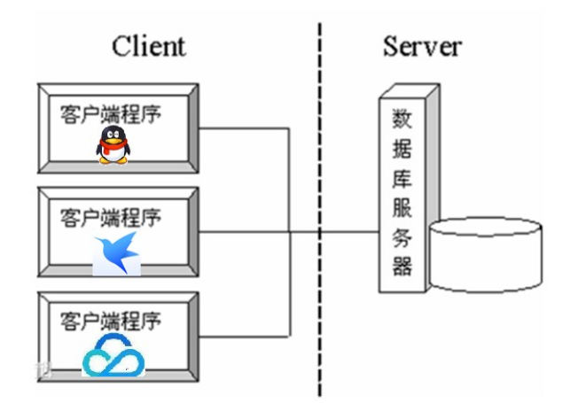

# day12【网络编程和NIO】

## 今日内容

- 网络编程
- 单例设计模式
- 多例设计模式


## 教学目标

- [ ] 能够辨别UDP和TCP协议特点
- [ ] 能够说出TCP协议下两个常用类名称
- [ ] 能够编写TCP协议下字符串数据传输程序
- [ ] 能够理解TCP协议下文件上传案例
- [ ] 能够理解TCP协议下BS案例
- [ ] 能够说出NIO的优点
- [ ] 能够使用单例设计模式创建对象
- [ ] 能够使用多例设计模式创建对象

# 第一章 网络编程入门

## 1.1 软件结构

- **C/S结构** ：全称为Client/Server结构，是指客户端和服务器结构。常见程序有ＱＱ、迅雷等软件。
- 特点: 客户端和服务器是分开的,需要下载客户端,对网络要求相对低,减少服务器压力,相对稳定, 开发和维护成本高



**B/S结构** ：全称为Browser/Server结构，是指浏览器和服务器结构。常见浏览器有谷歌、火狐等。

特点:没有客户端,只有服务器,不需要下载客户端,直接通过浏览器访问, 对网络要求相对高 ,服务器压力很大,相对不稳定,开发和维护成本低


两种架构各有优势，但是无论哪种架构，都离不开网络的支持。**网络编程**，就是在一定的协议下，编写代码实现两台计算机在网络中进行通信的程序。

## 1.2 网络编程三要素

#### 协议

**网络通信协议：**通信协议是计算机必须遵守的规则，只有遵守这些规则，计算机之间才能进行通信。这就好比在道路中行驶的汽车一定要遵守交通规则一样，协议中对数据的传输格式、传输速率、传输步骤等做了统一规定，通信双方必须同时遵守，最终完成数据交换。 

`java.net` 包中提供了两种常见的网络协议的支持：

- **TCP**：传输控制协议 (Transmission Control Protocol)。TCP协议是**面向连接**的通信协议，即传输数据之前，在发送端和接收端建立逻辑连接，然后再传输数据，它提供了两台计算机之间可靠无差错的数据传输。
- **TCP协议特点: 面向连接,传输数据安全,传输速度慢**
- 例如: 村长发现张三家的牛丢了    
- TCP协议:  村长一定要找到张三,面对面的告诉他他家的牛丢了    打电话: 电话一定要接通,并且是张三接的
  - 连接三次握手：TCP协议中，在发送数据的准备阶段，客户端与服务器之间的三次交互，以保证连接的可靠。
    - 第一次握手，客户端向服务器端发出连接请求，等待服务器确认。  你愁啥?
    - 第二次握手，服务器端向客户端回送一个响应，通知客户端收到了连接请求。我愁你咋地?
    - 第三次握手，客户端再次向服务器端发送确认信息，确认连接。整个交互过程如下图所示。你再愁试试


​    完成三次握手，连接建立后，客户端和服务器就可以开始进行数据传输了。由于这种面向连接的特性，TCP协议可以保证传输数据的安全，所以**应用十分广泛，例如下载文件、浏览网页等**。

- **UDP**：用户数据报协议(User Datagram Protocol)。UDP协议是一个**面向无连接**的协议。传输数据时，不需要建立连接，不管对方端服务是否启动，直接将数据、数据源和目的地都封装在数据包中，直接发送。每个数据包的大小限制在64k以内。它是不可靠协议，因为无连接，所以传输速度快，但是容易丢失数据。日常应用中**,例如视频会议、QQ聊天等。**
- **UDP特点: 面向无连接,传输数据不安全,传输速度快**
- 例如: 村长发现张三家的牛丢了
- UDP协议: 村长在村里的广播站广播一下张三家的牛丢了,信息丢失,信息发布速度快

#### IP地址

- **IP地址：指互联网协议地址（Internet Protocol Address）**，俗称IP。**IP地址用来给一个网络中的计算机设备做唯一的编号**。相当于每个人的身份证号码。

**IP地址分类 **

- IPv4：是一个32位的二进制数，通常被分为4个字节，表示成`a.b.c.d` 的形式，例如`192.168.65.100` 。其中a、b、c、d都是0~255之间的十进制整数，那么最多可以表示42亿个。

- IPv6：由于互联网的蓬勃发展，IP地址的需求量愈来愈大，但是网络地址资源有限，使得IP的分配越发紧张。有资料显示，全球IPv4地址在2011年2月分配完毕。

  为了扩大地址空间，拟通过IPv6重新定义地址空间，采用128位地址长度，每16个字节一组，分成8组十六进制数，表示成`ABCD:EF01:2345:6789:ABCD:EF01:2345:6789`，号称可以为全世界的每一粒沙子编上一个网址，这样就解决了网络地址资源数量不够的问题。

**常用命令**

- 查看本机IP地址，在控制台输入：

```java
ipconfig
```

- 检查网络是否连通，在控制台输入：

```java
ping 空格 IP地址
ping 220.181.57.216
ping www.baidu.com
```

**特殊的IP地址**

- 本机IP地址：`127.0.0.1`、`localhost` 。

#### 端口号

网络的通信，本质上是两个进程（应用程序）的通信。每台计算机都有很多的进程，那么在网络通信时，如何区分这些进程呢？

如果说**IP地址**可以唯一标识网络中的设备，那么**端口号**就可以唯一标识设备中的进程（应用程序）了。

- **端口号：用两个字节表示的整数，它的取值范围是0~65535**。其中，0~1023之间的端口号用于一些知名的网络服务和应用，普通的应用程序需要使用1024以上的端口号。**如果端口号被另外一个服务或应用所占用，会导致当前程序启动失败。**

利用`协议`+`IP地址`+`端口号` 三元组合，就可以标识网络中的进程了，那么进程间的通信就可以利用这个标识与其它进程进行交互。

#### 域名

- 域名----->绑定了ip地址
- 域名是唯一的

## 1.3 InetAddress类

#### InetAddress类的概述

- 一个该类的对象就代表一个IP地址对象。

#### InetAddress类的方法

* static InetAddress getLocalHost()   获得本地主机IP地址对象

* static InetAddress getByName(String host) 根据IP地址字符串或主机名获得对应的IP地址对象

* String getHostName();获得主机名

* String getHostAddress();获得IP地址字符串

  ```java
  public class Test {
      public static void main(String[] args) throws Exception {
          //- static InetAddress getLocalHost()   获得本地主机IP地址对象
          InetAddress ip1 = InetAddress.getLocalHost();
          System.out.println("ip1:" + ip1);// DESKTOP-U8Q5F96/10.254.4.12
  
          //- static InetAddress getByName(String host) 根据IP地址字符串或主机名获得对应的IP地址对象
          InetAddress ip2 = InetAddress.getByName("www.baidu.com");
          System.out.println("ip2:" + ip2);// www.baidu.com/14.215.177.38
  
          //- String getHostName();获得主机名
          System.out.println("ip1的主机名:"+ip1.getHostName());// DESKTOP-U8Q5F96
          System.out.println("ip2的主机名:"+ip2.getHostName());// www.baidu.com
  
          //- String getHostAddress();获得IP地址字符串
          System.out.println("ip1的ip地址:"+ip1.getHostAddress());// 10.254.4.12
          System.out.println("ip2的ip地址:"+ip2.getHostAddress());// 14.215.177.38
  
      }
  }
  
  ```

  

# 第二章 UDP通信程序

## 2.1 UDP协议概述

​       UDP是无连接通信协议，即在数据传输时，数据的发送端和接收端不建立逻辑连接。简单来说，当一台计算机向另外一台计算机发送数据时，发送端不会确认接收端是否存在，就会发出数据，同样接收端在收到数据时，也不会向发送端反馈是否收到数据。

​		由于使用UDP协议消耗资源小，通信效率高，所以通常都会用于音频、视频和普通数据的传输例如视频会议都使用UDP协议，因为这种情况即使偶尔丢失一两个数据包，也不会对接收结果产生太大影响。

​		但是在使用UDP协议传送数据时，由于UDP的面向无连接性，不能保证数据的完整性，因此在传输重要数据时不建议使用UDP协议。UDP通信过程如下图所示：


```java
UDP协议的特点
    * 面向无连接的协议
    * 发送端只管发送，不确认对方是否能收到。
    * 基于数据包进行数据传输。
    * 发送数据的大小限制64K以内
    * 因为面向无连接，速度快，但是不可靠。

UDP协议的使用场景
    * 即时通讯
    * 在线视频
    * 网络语音电话

UDP协议相关的两个类
    * DatagramPacket
        * 数据包对象
        * 作用：用来封装要发送或要接收的数据，比如：集装箱
    * DategramSocket
        * 发送对象
        * 作用：用来发送或接收数据包，比如：码头

DatagramPacket类构造方法
    * DatagramPacket(byte[] buf, int length, InetAddress address, int port)
        * 创建发送端数据包对象
        * buf：要发送的内容，字节数组
        * length：要发送内容的长度，单位是字节
        * address：接收端的IP地址对象
        * port：接收端的端口号
    * DatagramPacket(byte[] buf, int length)
        * 创建接收端的数据包对象
        * buf：用来存储接收到内容
        * length：能够接收内容的长度

DatagramPacket类常用方法
    * int getLength() 获得实际接收到的字节个数

DatagramSocket类构造方法
    * DatagramSocket() 创建发送端的Socket对象，系统会随机分配一个端口号。
    * DatagramSocket(int port) 创建接收端的Socket对象并指定端口号

DatagramSocket类成员方法
    * void send(DatagramPacket dp) 发送数据包
    * void receive(DatagramPacket p) 接收数据包
```

## 2.2 UDP通信案例

- 需求：教师的电脑的一个程序发送数据，一个程序接收数据，使用的教师本机的ip。

### 2.2.1 UDP发送端代码实现

```java
// UDP发送端代码实现
public class UDPSender {
    public static void main(String[] args)throws Exception{
        // 定义一个字符串：要发送的内容
        String message = "约吗";
        // 字符串转字节数组
        byte[] buf = message.getBytes();
        // 创建数据包对象
        DatagramPacket dp = new DatagramPacket(buf,buf.length,
                InetAddress.getLocalHost(),6666);
        // 创建发送端的发送对象
        DatagramSocket ds = new DatagramSocket(8888);
        // 发送数据包
        ds.send(dp);
        // 关闭发送对象释放端口号
        ds.close();
    }
}
```

### 2.2.2 UDP接收端代码实现

```java
/**
    UDP协议接收端代码实现
 */
public class UDPReceive {
    public static void main(String[] args)throws Exception{
        // 创建接收对象DatagramSocket
        DatagramSocket ds = new DatagramSocket(6666);
        // 创建字节数组用来存储接收接收到的内容
        byte[] buf = new byte[1024];
        // 创建数据包对象
        DatagramPacket dp = new DatagramPacket(buf,buf.length);
        // 接收数据包
        ds.receive(dp);

        // 获得实际接收到的字节个数
        int len = dp.getLength();
        System.out.println("len = " + len);
        // 将字节数组的内容转换为字符串输出
        System.out.println(new String(buf,0,len));

        // 获得发送端的ip地址
        String sendIp = dp.getAddress().getHostAddress();
        // 获得发送端的端口号
        int port  = dp.getPort();
        System.out.println(sendIp);
        System.out.println(port);

        // 关闭Socket对象
        ds.close();
    }
}
```


# 第三章 TCP通信程序

## 2.1 TCP

#### TCP通信的流程

- TCP协议是面向连接的通信协议，即在传输数据前先在发送端和接收器端**建立逻辑连接，然后再传输数据。**它提供了两台计算机之间可靠无差错的数据传输。TCP通信过程如下图所示：


#### TCP协议相关的类

* Socket : 一个该类的对象就代表一个客户端程序。
    * Socket(String host, int port)   根据ip地址字符串和端口号创建客户端Socket对象
           * 注意事项：只要执行该方法，就会立即连接指定的服务器程序，如果连接不成功，则会抛出异常。
               如果连接成功，则表示三次握手通过。
    * `OutputStream getOutputStream();` 获得字节输出流对象
    * `InputStream getInputStream();`获得字节输入流对象
    * `void close();`关闭Socket, 会自动关闭相关的流
    * 补充:关闭通过socket获得的流,会关闭socket,关闭socket,同时也会关闭通过socket获得的流
* ServerSocket : 一个该类的对象就代表一个服务器端程序。 
    * `ServerSocket(int port);` 根据指定的端口号开启服务器。
    * `Socket accept();` 等待客户端连接并获得与客户端关联的Socket对象  如果没有客户端连接,该方法会一直**阻塞**
    * `void close();`关闭ServerSocket

## 2.2 TCP通信案例1

### 需求

- 客户端向服务器发送字符串数据

### 分析

* 客户端实现步骤
    * 创建客户端Socket对象并指定服务器地址和端口号
    * 调用Socket对象的getOutputStream方法获得字节输出流对象
    * 使用字节输出流对象的write方法往服务器端输出数据
    * 关闭Socket对象断开连接。
* 服务器实现步骤
    * 创建ServerSocket对象并指定端口号(相当于开启了一个服务器)
    * 调用ServerSocket对象的accept方法等待客端户连接并获得对应Socket对象
    * 调用Socket对象的getInputStream方法获得字节输入流对象
    * 调用字节输入流对象的read方法读取客户端发送的数据

### 实现

- 客户端代码实现

  ```java
  public class Client {
      public static void main(String[] args) throws Exception{
          // 客户端:
          //1.创建Socket对象,指定要连接的服务器的ip地址和端口号
          Socket socket = new Socket("127.0.0.1",6666);
  
          //2.通过Socket对象获得输出流
          OutputStream os = socket.getOutputStream();
  
          //3.写出字符串数据
          byte[] bys = "服务器你好,今晚约吗?".getBytes();
          os.write(bys);
  
          //4.关闭流,释放资源
          os.close();
      }
  }
  
  ```
  
- 服务端代码实现

  ```java
  public class Server {
      public static void main(String[] args) throws Exception{
          // 服务器:
          //1.创建ServerSocket对象,指定端口号 6666
          ServerSocket ss = new ServerSocket(6666);
  
          //2.调用accept方法接收客户端请求,建立连接,返回Socket对象
          Socket socket = ss.accept(); // 会阻塞,直到客户端连接成功
  
          //3.使用Socket对象获得输入流
          InputStream is = socket.getInputStream();
  
          //4.读客户端写过来的数据
          byte[] bys = new byte[1024];
          int len = is.read(bys);
          System.out.println("服务器读到客户端的数据是:"+new String(bys,0,len));
  
          //5.关闭流,释放资源
          socket.close();
          ss.close();// 一般服务器是不关
      }
  }
  
  ```


## 2.3 TCP通信案例2

### 需求

 - 客户端向服务器发送字符串数据,**服务器回写字符串数据给客户端**(模拟聊天)

### 分析

* 客户端实现步骤
  * 创建客户端Socket对象并指定服务器地址和端口号
  * 调用Socket对象的getOutputStream方法获得字节输出流对象
  * 使用字节输出流对象的write方法往服务器端输出数据
  * 调用Socket对象的getInputStream方法获得字节输入流对象
  * 调用字节输入流对象的read方法读取服务器端返回的数据
  * 关闭Socket对象断开连接。
* 服务器实现步骤
  * 创建ServerSocket对象并指定端口号(相当于开启了一个服务器)
  * 调用ServerSocket对象的accept方法等待客端户连接并获得对应Socket对象
  * 调用Socket对象的getInputStream方法获得字节输入流对象
  * 调用字节输入流对象的read方法读取客户端发送的数据
  * 调用Socket对象的getOutputStream方法获得字节输出流对象
  * 调用字节输出流对象的write方法往客户端输出数据
  * 关闭Socket和ServerSocket对象

### 实现

- TCP客户端代码

```java
public class Client {
    public static void main(String[] args) throws Exception{
        // 客户端:
        //1.创建Socket对象,指定要连接的服务器的ip地址和端口号
        Socket socket = new Socket("127.0.0.1",6666);

        //2.通过Socket对象获得输出流
        OutputStream os = socket.getOutputStream();

        //3.写出字符串数据
        byte[] bytes = "服务器你好,今晚约吗?".getBytes();
        os.write(bytes);

        // 接收服务器回写的数据
        //4.通过Socket对象获得输入流
        InputStream is = socket.getInputStream();

        //5.读服务器回写的字符串数据
        byte[] bys = new byte[1024];
        int len = is.read(bys);
        System.out.println("客户端读到服务器端回写的数据:"+new String(bys,0,len));

        //6.关闭流,释放资源
        os.close();
    }
}

```

- 服务端代码实现

```java
public class Server {
    public static void main(String[] args) throws Exception{
        // 服务器:
        //1.创建ServerSocket对象,指定端口号 6666
        ServerSocket ss = new ServerSocket(6666);

        //2.调用accept方法接收客户端请求,建立连接,返回Socket对象
        Socket socket = ss.accept(); // 会阻塞,直到客户端连接成功

        //3.使用Socket对象获得输入流
        InputStream is = socket.getInputStream();

        //4.读客户端写过来的数据
        byte[] bys = new byte[1024];
        int len = is.read(bys);
        System.out.println("服务器读到客户端的数据是:"+new String(bys,0,len));

        // 服务器回写数据给客户端
        // 5.使用Socket对象获得输出流
        OutputStream os = socket.getOutputStream();

        // 6.写出数据
        os.write("客户端你好,今晚不约!".getBytes());

        // 7.关闭流,释放资源
        socket.close();
        ss.close();// 一般服务器是不关
    }
}

```


## 2.4 扩展模拟循环聊天

- 服务器

  ```java
  public class Server {
      public static void main(String[] args) throws Exception{
          // 服务器:
          //1.创建ServerSocket对象,指定端口号 6666
          ServerSocket ss = new ServerSocket(6666);
  
          //2.调用accept方法接收客户端请求,建立连接,返回Socket对象
          Socket socket = ss.accept(); // 会阻塞,直到客户端连接成功
  
          // 死循环
          while (true) {
              //3.使用Socket对象获得输入流
              InputStream is = socket.getInputStream();
  
              //4.读客户端写过来的数据
              byte[] bys = new byte[1024];
              int len = is.read(bys);
              System.out.println("服务器读到客户端的数据是:" + new String(bys, 0, len));
  
              // 服务器回写数据给客户端
              // 5.使用Socket对象获得输出流
              OutputStream os = socket.getOutputStream();
  
              // 6.写出数据
              Scanner sc = new Scanner(System.in);
              System.out.println("请输入一个字符串:");
              String msg = sc.nextLine();
              os.write(msg.getBytes());
  
              // 7.关闭流,释放资源
              // socket.close();
              // ss.close();// 一般服务器是不关
          }
      }
  }
  
  ```
  
  
  
- 客户端

  ```java
  public class Client {
      public static void main(String[] args) throws Exception{
          // 客户端:
          //1.创建Socket对象,指定要连接的服务器的ip地址和端口号
          Socket socket = new Socket("127.0.0.1",6666);
  
          // 死循环
          while (true) {
              //2.通过Socket对象获得输出流
              OutputStream os = socket.getOutputStream();
  
              //3.写出字符串数据
              Scanner sc = new Scanner(System.in);
              System.out.println("请输入一个字符串:");
              String msg = sc.nextLine();
              os.write(msg.getBytes());
  
  
              // 接收服务器回写的数据
              //4.通过Socket对象获得输入流
              InputStream is = socket.getInputStream();
  
              //5.读服务器回写的字符串数据
              byte[] bys = new byte[1024];
              int len = is.read(bys);
              System.out.println("客户端读到服务器端回写的数据:"+new String(bys,0,len));
  
              //6.关闭流,释放资源
              // os.close();
          }
      }
  }
  
  ```
  
  

# 第四章 综合案例

## 3.1 文件上传案例

### 需求

- 使用TCP协议, 通过客户端向服务器上传一个文件

### 分析

1. 【客户端】输入流，从硬盘读取文件数据到程序中。
2. 【客户端】输出流，写出文件数据到服务端。
3. 【服务端】输入流，读取文件数据到服务端程序。
4. 【服务端】输出流，写出文件数据到服务器硬盘中。

5. 【服务端】获取输出流，回写数据。
6. 【客户端】获取输入流，解析回写数据。


### 实现

#### 文件上传

- 服务器

  ```java
  public class Server {
      public static void main(String[] args) throws Exception {
          //服务器:
          //1.创建ServerSocket对象,指定端口号
          ServerSocket ss = new ServerSocket(7777);
  
          //2.调用accept方法接收请求,建立连接,返回Socket对象
          Socket socket = ss.accept();
  
          //4.通过Socket对象获得输入流,关联连接通道
          InputStream is = socket.getInputStream();
  
          //5.创建字节输出流,关联目的地文件路径
          FileOutputStream fos = new FileOutputStream("day12\\bbb\\mm1.jpg");
  
          //6.定义一个byte数组,用来存储读取到的字节数据
          byte[] bys = new byte[8192];
  
          //7.定义一个int变量,用来存储读取到的字节个数
          int len;
  
          //8.循环读数据
          while ((len = is.read(bys)) != -1) {
              //9.在循环中,写出数据
              fos.write(bys, 0, len);
          }
          //9.关闭流,释放资源
          fos.close();
          is.close();
          ss.close();
      }
  }
  
  ```

  

- 客户端

  ```java
  public class Client {
      public static void main(String[] args) throws Exception{
          //客户端:
          //1.创建Socket对象,指定要连接的服务器的ip地址和端口号
          Socket socket = new Socket("127.0.0.1",7777);
  
          //2.创建字节输入流,关联数据源文件路径
          FileInputStream fis = new FileInputStream("day12\\aaa\\mm.jpg");
  
          //3.通过Socket对象获得输出流,关联连接通道
          OutputStream os = socket.getOutputStream();
  
          //4.定义一个byte数组,用来存储读取到的字节数据
          byte[] bys = new byte[8192];
  
          //5.定义一个int变量,用来存储读取到的字节个数
          int len;
  
          //6.循环读数据
          while ((len = fis.read(bys)) != -1) {
              //7.在循环中,写出数据
              os.write(bys,0,len);
          }
          //8.关闭流,释放资源
          os.close();
          fis.close();
      }
  }
  
  ```
  
  

#### 文件上传成功后服务器回写字符串数据

- 服务器

  ```java
  public class Server {
      public static void main(String[] args) throws Exception {
          //服务器:
          //1.创建ServerSocket对象,指定端口号
          ServerSocket ss = new ServerSocket(7777);
  
          //2.调用accept方法接收请求,建立连接,返回Socket对象
          Socket socket = ss.accept();
  
          //4.通过Socket对象获得输入流,关联连接通道
          InputStream is = socket.getInputStream();
  
          //5.创建字节输出流,关联目的地文件路径
          FileOutputStream fos = new FileOutputStream("day12\\bbb\\mm6.jpg");
  
          //6.定义一个byte数组,用来存储读取到的字节数据
          byte[] bys = new byte[8192];
  
          //7.定义一个int变量,用来存储读取到的字节个数
          int len;
  
          System.out.println("服务开始接收文件...");
          //8.循环读数据--->连接通道
          while ((len = is.read(bys)) != -1) {// 卡住
              //9.在循环中,写出数据
              fos.write(bys, 0, len);
          }
  
          System.out.println("服务器接收文件完毕了!");
          //10.通过Socket对象获得输出流
          OutputStream os = socket.getOutputStream();
  
          //11.回写数据给客户端
          os.write("文件上传成功!".getBytes());
  
          //12.关闭流,释放资源
          fos.close();
          is.close();
          ss.close();
      }
  }
  
  ```
  
  
  
- 客户端

  ```java
  public class Client {
      public static void main(String[] args) throws Exception{
          //客户端:
          //1.创建Socket对象,指定要连接的服务器的ip地址和端口号
          Socket socket = new Socket("127.0.0.1",7777);
  
          //2.创建字节输入流,关联数据源文件路径
          FileInputStream fis = new FileInputStream("day12\\aaa\\mm.jpg");
  
          //3.通过Socket对象获得输出流,关联连接通道
          OutputStream os = socket.getOutputStream();
  
          //4.定义一个byte数组,用来存储读取到的字节数据
          byte[] bys = new byte[8192];
  
          //5.定义一个int变量,用来存储读取到的字节个数
          int len;
  
          System.out.println("客户端开始上传文件...");
          //6.循环读数据-->源文件
          while ((len = fis.read(bys)) != -1) {
              //7.在循环中,写出数据
              os.write(bys,0,len);// 最后文件中的字节数据
          }
          /*
              结束不了的原因: 服务器不知道客户端不再写数据过来了,所以服务器会一直等到读取数据
              解决办法: 客户端不再写数据了,就需要告诉服务器
           */
          socket.shutdownOutput();// 终止写出数据,但流没有关闭
  
          System.out.println("客户端上传文件完毕!");
  
          //8.通过Socket对象获得输入流
          InputStream is = socket.getInputStream();
  
          //9.读取服务器回写的数据
          int lens = is.read(bys);// 卡住
          System.out.println("服务器回写的数据:"+new String(bys,0,lens));
  
          //10.关闭流,释放资源
          os.close();
          fis.close();
      }
  }
  
  ```
  
  

#### 优化文件上传案例

- 需要优化的问题

  - 文件名----->目前是固定名称,改成自动生成名称
  - 服务器只能接收客户端上传一次文件---->改成服务器循环接收
  - 效率问题---->目前是单线程会影响效率,改成多线程
    - 张三先连接服务器,需要上传一个2GB的文件
    - 李四后连接服务器,需要上传一个2KB的文件
      - 单线程: 李四一定要等张三上传完毕才可以上传,所以李四需要等待的时间很长
      - 多线程: 张三,和李四就可以抢着执行,李四就有可能先执行完毕,就不需要等待

- 优化实现

  ```java
  public class Server {
      public static void main(String[] args) throws Exception {
          //服务器:
          //1.创建ServerSocket对象,指定端口号
          ServerSocket ss = new ServerSocket(7777);
  
          // 循环接收请求,建立连接
          while (true){
              //2.调用accept方法接收请求,建立连接,返回Socket对象
              Socket socket = ss.accept();
  
              // 建立连接之后,就开启线程上传文件
              new Thread(new Runnable() {
                  @Override
                  public void run() {
                      try {
                          //4.通过Socket对象获得输入流,关联连接通道
                          InputStream is = socket.getInputStream();
  
                          //5.创建字节输出流,关联目的地文件路径
                          FileOutputStream fos = new FileOutputStream("day12\\bbb\\"+System.currentTimeMillis()+".jpg");
  
                          //6.定义一个byte数组,用来存储读取到的字节数据
                          byte[] bys = new byte[8192];
  
                          //7.定义一个int变量,用来存储读取到的字节个数
                          int len;
  
                          System.out.println("服务开始接收文件...");
                          //8.循环读数据--->连接通道
                          while ((len = is.read(bys)) != -1) {// 卡住
                              //9.在循环中,写出数据
                              fos.write(bys, 0, len);
                          }
  
                          System.out.println("服务器接收文件完毕了!");
                          //10.通过Socket对象获得输出流
                          OutputStream os = socket.getOutputStream();
  
                          //11.回写数据给客户端
                          os.write("文件上传成功!".getBytes());
  
                          //12.关闭流,释放资源
                          fos.close();
                          is.close();
                          // ss.close();
                      }catch (Exception e){
  
                      }
                  }
              }).start();
  
          }
      }
  }
  
  ```

  

## 3.2 模拟B\S服务器  扩展

### 需求

- 模拟网站服务器，使用浏览器访问自己编写的服务端程序，查看网页效果。

### 分析

1. 准备页面数据，web文件夹。

2. 我们模拟服务器端，ServerSocket类监听端口，使用浏览器访问，查看网页效果

3. 注意:

   ```java
   // 1.浏览器工作原理是遇到图片会开启一个线程进行单独的访问,因此在服务器端加入线程技术。
   // 2. 响应页面的时候需要同时把以下信息响应过去给浏览器
   os.write("HTTP/1.1 200 OK\r\n".getBytes());
   os.write("Content-Type:text/html\r\n".getBytes());
   os.write("\r\n".getBytes());
   ```

### 实现

```java
public class Server {
    public static void main(String[] args) throws Exception {
        //1.创建ServerSocket对象,指定端口号为8888
        ServerSocket ss = new ServerSocket(8888);

        // 浏览器工作原理是遇到图片会开启一个线程进行单独的访问,因此在服务器端加入线程技术。
        while (true){
            //2.调用accept方法接收请求,建立连接,返回Socket对象
            Socket socket = ss.accept();

            new Thread(new Runnable() {
                @Override
                public void run() {
                    try {
                        //3.通过Socket对象获得输入流
                        InputStream is = socket.getInputStream();

                        //4.通过输入流读取连接通道中的请求数据(浏览器发过来)
                        // byte[] bys = new byte[8192];
                        // int len = is.read(bys);
                        // System.out.println(new String(bys,0,len));
                        InputStreamReader isr = new InputStreamReader(is);
                        BufferedReader br = new BufferedReader(isr);
                        String line = br.readLine();
                        System.out.println("line:" + line);

                        //5.通过请求数据筛选出要访问的页面的路径(day12\web\index.html)
                        String[] arr = line.split(" ");
                        String path = arr[1].substring(1);
                        System.out.println("path:"+path);

                        //6.创建字节输入流对象,关联需要访问的页面的路径
                        FileInputStream fis = new FileInputStream(path);

                        //7.通过Socket对象获得输出流,关联连接通道
                        OutputStream os = socket.getOutputStream();

                        //8.定义一个byte数组,用来存储读取到的字节数据
                        byte[] bys = new byte[8192];

                        //9.定义一个int变量,用来存储读取到的字节个数
                        int len;

                        //10.循环读取数据
                        // 响应页面的时候需要同时把以下信息响应过去给浏览器
                        os.write("HTTP/1.1 200 OK\r\n".getBytes());
                        os.write("Content-Type:text/html\r\n".getBytes());
                        os.write("\r\n".getBytes());

                        while ((len = fis.read(bys)) != -1) {
                            //11.在循环中,写数据给浏览器
                            os.write(bys,0,len);
                        }
                        //12.关闭流,释放资源
                        os.close();
                        fis.close();
                        //ss.close();
                    }catch (Exception e){

                    }
                }
            }).start();
        }


    }
}

```


**访问效果：**


# 第五章 单例设计模式

## 1.1 单例设计模式的概述

#### 引入

```java
public class Person{
    
}
public class Test{
    public static void main(String[] args){
        Person p1 = new Person();
        Person p2 = new Person();
        Person p3 = new Person();
        //...
    }
}
```


#### 单例设计模式的作用

单例模式，是一种常用的软件设计模式。通过单例模式可以保证系统中，应用该模式的这个类只有一个实例。即一个类只有一个对象实例。

#### 单例设计模式实现步骤

1. 将构造方法私有化，使其不能在类的外部通过new关键字实例化该类对象。
2. 在该类内部创建一个唯一的对象
3. 定义一个静态方法返回这个唯一对象。

#### 例设计模式的类型

根据实例化对象的时机单例设计模式又分为以下两种:

1. 饿汉单例设计模式
2. 懒汉单例设计模式


## 1.2 饿汉式单例设计模式

- 概述:  饿汉单例设计模式就是使用类的时候已经将对象创建完毕，不管以后会不会使用到该实例化对象，先创建了再说。很着急的样子，故被称为“饿汉模式”。

- 代码如下：

  ```java
  // 饿汉式单例设计模式:就是使用类的时候已经将对象创建完毕，不管以后会不会使用到该实例化对象，先创建了再说。
  // 很着急的样子，故被称为“饿汉模式”。
  public class Person {
      // 1.将构造方法私有化,防止在类的外部通过new调用构造方法创建对象
      private Person(){
  
      }
  
      // 2.在类的内部创建一个唯一的对象
      private static final Person p = new Person();
  
      // 3.提供公共的静态方法用来获取该类的唯一对象
      public static Person getInstance(){
          return p;
      }
      
      public static void method(){}
  }
  
  ```

  ```java
  public class Test {
      public static void main(String[] args) {
         // Person.method();// 已经创建了该类的唯一对象
  
          System.out.println(Person.getInstance());
          System.out.println(Person.getInstance());
          System.out.println(Person.getInstance());
          System.out.println(Person.getInstance());
          System.out.println(Person.getInstance());
      }
  }
  
  结果: 地址值相同
  com.itheima.demo1_饿汉式单例设计模式.Person@4554617c
  com.itheima.demo1_饿汉式单例设计模式.Person@4554617c
  com.itheima.demo1_饿汉式单例设计模式.Person@4554617c
  com.itheima.demo1_饿汉式单例设计模式.Person@4554617c
  com.itheima.demo1_饿汉式单例设计模式.Person@4554617c
  ```

  


## 1.3 懒汉式单例设计模式

- 概述:  懒汉单例设计模式就是调用getInstance()方法时对象才被创建，先不急着创建出对象，等要用的时候才创建对象。不着急，故称为“懒汉模式”。

- 代码如下：

  ```java
  // 懒汉式单例设计模式: 就是调用getInstance()方法时对象才被创建，先不急着创建出对象，等要用的时候才创建对象。
  // 不着急，故称为“懒汉模式”。
  public class Person {
      // 1.将构造方法私有化,防止在类的外部通过new调用构造方法创建对象
      private Person() {
  
      }
  
      // 2.定义一个静态的成员变量,用来存储创建的该类的唯一对象
      private static Person p;
  
      // 3.在该类的内部创建该类的唯一对象
      public static synchronized Person getInstance() {
          // 判断
          // 如果是第一次调用该方法,就创建该类的对象
          if (p == null) {
              p = new Person();
          }
          // 如果不是第一次调用该方法,就返回第一次调用的时候创建的对象
          return p;
      }
  
      public static void method(){}
  }
  
  ```

  ```java
  public class Test {
      public static void main(String[] args) {
          //Person.method();
           System.out.println(Person.getInstance());
           System.out.println(Person.getInstance());
           System.out.println(Person.getInstance());
           System.out.println(Person.getInstance());
           System.out.println(Person.getInstance());
      }
  }
  执行结果:
  com.itheima.demo2_懒汉式单例设计模式.Person@4554617c
  com.itheima.demo2_懒汉式单例设计模式.Person@4554617c
  com.itheima.demo2_懒汉式单例设计模式.Person@4554617c
  com.itheima.demo2_懒汉式单例设计模式.Person@4554617c
  com.itheima.demo2_懒汉式单例设计模式.Person@4554617c
  
  ```

- **注意:**  懒汉式单列设计模式在多线程的情况下很容易出现创建多个对象,所以getInstance方法需要加锁

# 第六章 多例设计模式

## 2.1 多例设计模式

#### 多例设计模式的作用

多例模式，是一种常用的软件设计模式。通过多例模式可以保证系统中，应用该模式的类有**固定数量**的对象产生。

**说白了,多例设计模式就是保证使用该模式的类会有固定数量的该类对象产生**

#### 实现步骤

​	1.创建一个类,  将构造方法私有化，使其不能在类的外部通过new关键字实例化该类对象。

​	2.在该类内部产生固定数量的对象 

​    3.提供一个静态方法来随机获取一个该类的对象

#### 实现代码

```java
// 多例设计模式: 保证使用该模式的类有固定数量的对象产生
public class Person {

    // 1.将构造方法私有化,防止外界通过new调用构造方法创建对象
    private Person(){

    }

    // 2.定义一个ArrayList集合,用来存储Person对象
    private static ArrayList<Person> list = new ArrayList<>();

    // 3.在类的内部创建固定数量的对象--->静态代码块
    static {
        for (int i = 0; i < 3; i++) {
            // 创建Person对象
            Person p = new Person();
            // 存储Person对象
            list.add(p);
        }
    }


    // 3.提供一个公共的静态方法用来随机获取一个该类的对象
    public static Person getInstance(){
        // 创建Random对象
        Random r = new Random();
        // 生成随机数--->集合索引的范围
        int index = r.nextInt(list.size());
        // 根据索引获取元素
        Person p = list.get(index);
        // 返回
        return p;
    }

}

```

```java
public class Test {
    public static void main(String[] args) {
        System.out.println(Person.getInstance());
        System.out.println(Person.getInstance());
        System.out.println(Person.getInstance());
        System.out.println(Person.getInstance());
        System.out.println(Person.getInstance());
        System.out.println(Person.getInstance());
        System.out.println(Person.getInstance());
        System.out.println(Person.getInstance());
        System.out.println(Person.getInstance());
        System.out.println(Person.getInstance());
        System.out.println(Person.getInstance());
    }
}
执行结果:
com.itheima.demo3_多例设计模式.Person@74a14482
com.itheima.demo3_多例设计模式.Person@74a14482
com.itheima.demo3_多例设计模式.Person@1540e19d
com.itheima.demo3_多例设计模式.Person@677327b6
com.itheima.demo3_多例设计模式.Person@74a14482
com.itheima.demo3_多例设计模式.Person@677327b6
com.itheima.demo3_多例设计模式.Person@677327b6
com.itheima.demo3_多例设计模式.Person@677327b6
com.itheima.demo3_多例设计模式.Person@677327b6
com.itheima.demo3_多例设计模式.Person@677327b6
com.itheima.demo3_多例设计模式.Person@1540e19d
```
